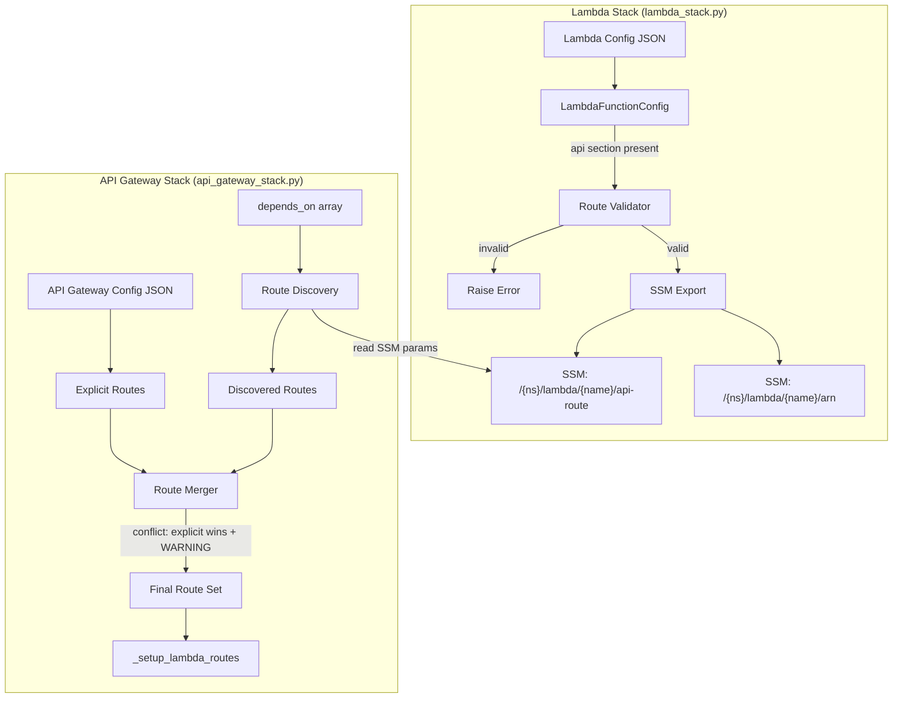

# Design Document: API Gateway Route Discovery

## Overview

This feature eliminates route duplication by making Lambda resource configs the single source of truth for API Gateway routes. The Lambda_Stack exports route metadata to SSM Parameter Store alongside existing ARN exports, and the API_Gateway_Stack discovers those routes at synth time by reading SSM parameters from Lambda stacks listed in its `depends_on` array. The two route sources (explicit config + discovered SSM) are always merged, with explicit routes winning on path+method conflicts.

The design follows the existing SQS pattern: Lambda configs declare their routes inline, and the consuming stack auto-wires them. No new config fields are introduced — `depends_on` already provides the scoping mechanism.

### Key Design Decisions

1. **Always-merge, no mode switch** — The API Gateway stack always merges explicit routes with discovered routes. This allows incremental migration: routes can be removed from `api-gateway-primary.json` one at a time while the discovery mechanism picks them up.

2. **Explicit routes win on conflict** — When the same path+method exists in both sources, the explicit route definition takes precedence and a WARNING is logged. This prevents accidental behavior changes during migration.

3. **SSM as the cross-stack communication channel** — Route metadata is serialized as JSON into SSM parameters, consistent with how Lambda ARNs are already exported. No CDK cross-stack references or CloudFormation exports are needed.

4. **Validation at both ends** — The Lambda_Stack validates route metadata at export time, and the API_Gateway_Stack validates at import time. Invalid routes fail fast during `cdk synth`.

## Architecture



### Data Flow

1. **Export phase** (Lambda_Stack): For each Lambda resource with an `api` section, serialize the route metadata to JSON and write it to SSM at `/{namespace}/lambda/{lambda-name}/api-route`.

2. **Discovery phase** (API_Gateway_Stack): For each entry in `depends_on`, attempt to read `/{namespace}/lambda/{lambda-name}/api-route` from SSM. Non-existent parameters are silently skipped (the dependency may be a non-Lambda stack or a Lambda without routes).

3. **Merge phase** (API_Gateway_Stack): Combine explicit routes from the config's `routes` array with discovered routes. On path+method conflict, keep the explicit route and log a WARNING.

4. **Wiring phase** (API_Gateway_Stack): Pass the merged route set to the existing `_setup_lambda_routes` method, which already handles `lambda_name`-based SSM ARN lookups and integration creation.

## Components and Interfaces

### 1. Route Metadata Validator (`RouteMetadataValidator`)

New utility class in `cdk-factory` that validates route metadata at both export and import time.

```python
# cdk_factory/utilities/route_metadata_validator.py

VALID_HTTP_METHODS = {"GET", "POST", "PUT", "DELETE", "PATCH", "OPTIONS", "HEAD"}

class RouteMetadataValidator:
    @staticmethod
    def validate_route(route: str, lambda_name: str) -> None:
        """Validate a single route path. Raises ValueError if invalid."""
        if not route or not isinstance(route, str):
            raise ValueError(
                f"Lambda '{lambda_name}': route must be a non-empty string, got: {route!r}"
            )
        if not route.startswith("/"):
            raise ValueError(
                f"Lambda '{lambda_name}': route must start with '/', got: '{route}'"
            )

    @staticmethod
    def validate_method(method: str, lambda_name: str) -> None:
        """Validate an HTTP method. Raises ValueError if invalid."""
        if not method or method.upper() not in VALID_HTTP_METHODS:
            raise ValueError(
                f"Lambda '{lambda_name}': method must be one of {VALID_HTTP_METHODS}, got: '{method}'"
            )

    @staticmethod
    def validate_route_metadata(metadata: dict, lambda_name: str) -> None:
        """Validate a complete route metadata dict."""
        RouteMetadataValidator.validate_route(metadata.get("route", ""), lambda_name)
        RouteMetadataValidator.validate_method(metadata.get("method", ""), lambda_name)
        for sub_route in metadata.get("routes", []):
            RouteMetadataValidator.validate_route(sub_route.get("route", ""), lambda_name)
            RouteMetadataValidator.validate_method(sub_route.get("method", ""), lambda_name)
```

### 2. Route SSM Exporter (in `LambdaStack`)

New method `__export_route_metadata_to_ssm` added to `LambdaStack`, called from `build()` after `__export_lambda_arns_to_ssm()`.

```python
def __export_route_metadata_to_ssm(self) -> None:
    """Export route metadata to SSM for each Lambda with an api section."""
    ssm_config = self.stack_config.dictionary.get("ssm", {})
    if not ssm_config.get("auto_export", False):
        return

    namespace = ssm_config.get("namespace")
    # ... build prefix same as ARN export ...

    for lambda_name, lambda_info in self.exported_lambda_arns.items():
        config: LambdaFunctionConfig = lambda_info["config"]
        if not config.api or not config.api.route:
            continue

        # Validate before export
        api_dict = config.api._config
        RouteMetadataValidator.validate_route_metadata(api_dict, lambda_name)

        # Serialize route metadata
        route_metadata = {
            "route": api_dict.get("route", ""),
            "method": api_dict.get("method", "GET"),
            "skip_authorizer": api_dict.get("skip_authorizer", False),
            "authorization_type": api_dict.get("authorization_type", ""),
            "routes": api_dict.get("routes", []),
        }

        param_path = f"{prefix}/{lambda_name}/api-route"
        ssm.StringParameter(
            self,
            f"ssm-export-{lambda_name}-api-route",
            parameter_name=param_path,
            string_value=json.dumps(route_metadata),
            description=f"API route metadata for {lambda_name}",
            tier=ssm.ParameterTier.STANDARD,
        )
```

### 3. Route Discovery (in `ApiGatewayStack`)

New method `_discover_routes_from_dependencies` added to `ApiGatewayStack`, called from `_build()` before route setup.

```python
def _discover_routes_from_dependencies(self) -> list[dict]:
    """Discover routes from Lambda stacks listed in depends_on."""
    discovered = []
    depends_on = self.stack_config.dependencies

    ssm_imports = self.stack_config.ssm_config.get("imports", {})
    namespace = ssm_imports.get("namespace")
    # ... build prefix ...

    for dep_name in depends_on:
        # Try to read route SSM params for each lambda in the dependency
        # The dep_name is a stack config name like "lambda-app-settings"
        # We need to discover which lambdas it contains by reading SSM
        self._discover_routes_for_dependency(dep_name, prefix, discovered)

    return discovered
```

### 4. Route Merger (in `ApiGatewayStack`)

New method `_merge_routes` that combines explicit and discovered routes.

```python
def _merge_routes(self, explicit: list[dict], discovered: list[dict]) -> list[dict]:
    """Merge explicit and discovered routes. Explicit wins on conflict."""
    # Index explicit routes by (path, method)
    explicit_keys = {}
    for route in explicit:
        key = (route["path"], route.get("method", "GET").upper())
        explicit_keys[key] = route

    merged = list(explicit)  # Start with all explicit routes

    for route in discovered:
        key = (route["path"], route.get("method", "GET").upper())
        if key in explicit_keys:
            logger.warning(
                f"Route conflict: {key[1]} {key[0]} exists in both explicit config "
                f"and discovered routes. Using explicit route definition."
            )
        else:
            merged.append(route)
            logger.info(f"Discovered route: {key[1]} {key[0]} -> {route.get('lambda_name')}")

    return merged
```

### 5. Updated `_build` Flow

```python
def _build(self, stack_config, deployment, workload) -> None:
    # ... existing setup ...

    # Discover routes from dependencies
    discovered_routes = self._discover_routes_from_dependencies()

    # Get explicit routes from config
    explicit_routes = self.api_config.routes or []

    # Merge routes
    routes = self._merge_routes(explicit_routes, discovered_routes)

    # Fall back to default health route if nothing found
    if not routes:
        routes = [{"path": "/health", "method": "GET", "src": None, "handler": None}]

    # ... rest of existing build logic using merged routes ...
```

## Data Models

### Route Metadata SSM Parameter

Stored at `/{namespace}/lambda/{lambda-name}/api-route` as a JSON string:

```json
{
  "route": "/app/configuration",
  "method": "get",
  "skip_authorizer": true,
  "authorization_type": "",
  "routes": []
}
```

For multi-route lambdas:

```json
{
  "route": "/tenants/{tenant-id}/users/{user-id}/validations/trigger",
  "method": "post",
  "skip_authorizer": false,
  "authorization_type": "",
  "routes": [
    { "route": "/v3/validations/trigger", "method": "post" },
    { "route": "/tenants/{tenant-id}/validations/trigger", "method": "post" }
  ]
}
```

### Discovered Route (internal representation)

After discovery, each route is converted to the same dict format used by explicit routes:

```python
{
    "path": "/app/configuration",       # mapped from "route"
    "method": "GET",
    "lambda_name": "app-configurations", # from SSM parameter path
    "skip_authorizer": True,
    "authorization_type": "NONE",        # derived from skip_authorizer
}
```

### Merge Conflict Key

Routes are keyed by `(path, method.upper())` for conflict detection. Example conflict:
- Explicit: `{"path": "/app/configuration", "method": "GET", "lambda_name": "app-configurations"}`
- Discovered: `{"path": "/app/configuration", "method": "GET", "lambda_name": "app-configurations"}`
- Result: Explicit route used, WARNING logged.

## Correctness Properties

*A property is a characteristic or behavior that should hold true across all valid executions of a system — essentially, a formal statement about what the system should do. Properties serve as the bridge between human-readable specifications and machine-verifiable correctness guarantees.*

### Property 1: Route metadata serialization round-trip

*For any* valid Lambda config with an `api` section containing a non-empty route, method, skip_authorizer, authorization_type, and optionally a `routes` array, serializing the route metadata to JSON and deserializing it back should produce an equivalent metadata dict with all fields preserved.

**Validates: Requirements 1.1, 1.2, 1.5**

### Property 2: No api section produces no route export

*For any* Lambda config without an `api` section (or with an empty route field), the route export function should produce no SSM parameter entry for that Lambda.

**Validates: Requirements 1.3**

### Property 3: SSM path follows naming convention

*For any* valid namespace string and lambda name, the generated SSM parameter path for route metadata should equal `/{namespace}/lambda/{lambda-name}/api-route`, consistent with the existing `/{namespace}/lambda/{lambda-name}/arn` pattern.

**Validates: Requirements 1.4, 6.1**

### Property 4: Merge produces union minus conflicts

*For any* set of explicit routes and any set of discovered routes with no path+method overlaps, the merged route set should contain exactly the union of both sets.

**Validates: Requirements 2.1, 2.2, 2.3, 2.4**

### Property 5: Explicit routes win on path+method conflict

*For any* explicit route and discovered route sharing the same path and HTTP method, the merged route set should contain the explicit route's definition (not the discovered one) for that path+method combination, and the total count of routes with that key should be exactly one.

**Validates: Requirements 2.5**

### Property 6: Authorization mapping from skip_authorizer

*For any* discovered route metadata, if `skip_authorizer` is `true` then the constructed route definition should have `authorization_type` set to `NONE`; if `skip_authorizer` is `false` or absent, the route should retain the default authorization behavior (Cognito if configured).

**Validates: Requirements 2.7, 2.8**

### Property 7: Multi-route expansion

*For any* route metadata containing a primary route and N entries in the `routes` array, the route expansion function should produce exactly N+1 route definitions, each with the same `lambda_name` and each with a distinct path+method combination drawn from the metadata.

**Validates: Requirements 2.9, 4.2**

### Property 8: Route validation accepts valid and rejects invalid

*For any* string, the route validator should accept it if and only if it is a non-empty string starting with `/`. *For any* string, the method validator should accept it if and only if it is one of GET, POST, PUT, DELETE, PATCH, OPTIONS, HEAD (case-insensitive).

**Validates: Requirements 5.1, 5.2, 5.3, 5.4**

### Property 9: Discovery scoped to depends_on

*For any* set of available Lambda stacks with route exports and any `depends_on` array, the discovered routes should include only routes from Lambda stacks whose names appear in the `depends_on` array.

**Validates: Requirements 7.1, 7.2**

## Error Handling

| Scenario | Behavior | Severity |
|---|---|---|
| Invalid route path (empty or missing `/` prefix) | `ValueError` raised during `cdk synth` in Lambda_Stack | Fatal |
| Invalid HTTP method | `ValueError` raised during `cdk synth` in Lambda_Stack | Fatal |
| Malformed JSON in SSM route parameter | `ValueError` raised during `cdk synth` in API_Gateway_Stack with descriptive message | Fatal |
| SSM parameter not found for a `depends_on` entry | Silently skipped — the dependency may be a non-Lambda stack | Info log |
| Lambda stack has no route exports | Silently skipped — the Lambda may not have API routes | Info log |
| Path+method conflict between explicit and discovered | Explicit route used, WARNING logged identifying the conflict | Warning |
| `ssm.auto_export` is `false` | No route SSM parameters written; discovery finds nothing for that stack | Silent |
| Discovered route references a Lambda whose ARN SSM param is missing | Existing `_get_lambda_arn_from_ssm` raises `ValueError` (unchanged behavior) | Fatal |

## Testing Strategy

### Property-Based Tests (PBT)

The feature's core logic — serialization, validation, merging, expansion — consists of pure functions with clear input/output behavior, making it well-suited for property-based testing.

- **Library**: [Hypothesis](https://hypothesis.readthedocs.io/) (Python)
- **Minimum iterations**: 100 per property
- **Tag format**: `Feature: api-gateway-route-discovery, Property {N}: {title}`

Each correctness property (1–9) maps to a single property-based test. Generators will produce:
- Random valid route paths (strings starting with `/`, containing path segments and `{param}` placeholders)
- Random HTTP methods from the valid set
- Random boolean `skip_authorizer` values
- Random `routes` arrays of varying length (0–10)
- Random namespace strings and lambda names
- Random explicit + discovered route sets with controlled overlap

### Unit Tests (Example-Based)

- Verify `ssm.auto_export=false` suppresses route export (Req 6.2)
- Verify SSM parameter tier is STANDARD (Req 6.3)
- Verify non-Lambda `depends_on` entries are silently skipped (Req 7.3)
- Verify Lambda stacks without routes are silently skipped (Req 7.4)
- Verify INFO logging for each discovered route (Req 2.10)
- Verify WARNING logging on path+method conflict (Req 2.5)
- Verify gateway-level settings applied regardless of route source (Req 3.2)

### Integration Tests

- End-to-end `cdk synth` with a Lambda stack exporting routes and an API Gateway stack discovering them
- Verify the synthesized CloudFormation template contains the expected API Gateway resources, Lambda permissions, and SSM parameters
- Verify migration scenario: routes in both explicit config and discovery produce correct merged output with warnings
