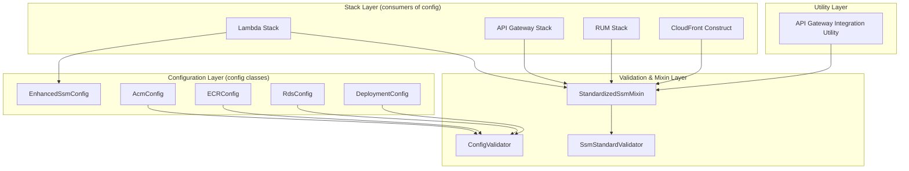

# Design Document: Config-Driven Naming

## Overview

This feature eliminates all hardcoded SSM path construction patterns and resource naming fallbacks across cdk-factory, ensuring every SSM path and resource name is derived exclusively from the stack's JSON configuration. When a required config value is missing, the system fails fast with a clear, actionable error message instead of silently constructing a wrong path.

The changes span 10+ source files across stack implementations, configuration classes, utilities, and validation logic. The core architectural principle is: **config is the single source of truth for all naming — no silent defaults, no deployment-property fallbacks**.

### Design Rationale

cdk-factory is an open-source library intended to work for any organization. Hardcoded fallback patterns like `/{deployment.workload_name}/{deployment.environment}/...` embed org-specific assumptions into library code. When a consumer's config is incomplete, these fallbacks silently produce wrong SSM paths — a class of bug that's invisible at synth time and only surfaces as missing/wrong cross-stack references at deploy time (or worse, never).

The fix follows a consistent pattern across all affected code:

1. Check for the config-driven value (`ssm.namespace`, explicit path, etc.)
2. If present, use it
3. If absent, raise `ValueError` with the stack name, missing field path, and corrective action
4. Remove all fallback code paths that derive values from `deployment.workload_name` / `deployment.environment`

## Architecture

The changes are organized into three layers:



### Change Strategy

Each file follows one of two patterns:

**Pattern A — Namespace-based stacks** (Lambda, API Gateway, RUM, API Gateway Integration Utility):
- Replace `workload`/`environment` fallback with a check for `ssm.namespace` (or `ssm.imports.namespace`)
- If namespace is missing and `auto_export` is true (or auto-discovery is needed), raise `ValueError`

**Pattern B — Explicit config fields** (CloudFront, ACM, ECR, RDS, DeploymentConfig):
- Require the specific config field (e.g., `ip_gate_function_ssm_path`, `secret_name`, `ecr_ssm_path`)
- Remove auto-derivation from `deployment.workload_name` / `deployment.environment`
- Raise `ValueError` when the required field is missing

**Pattern C — Validation relaxation** (SsmStandardValidator, StandardizedSsmMixin):
- Remove hardcoded environment allowlists and template variable requirements
- Accept any valid SSM path structure (leading `/`, minimum segments)
- Remove fallback defaults like `"test"`, `"test-workload"`, `"default"`

## Components and Interfaces

### 1. Lambda Stack (`lambda_stack.py`)

**Methods affected:**
- `__export_lambda_arns_to_ssm()` — Lines ~504-540
- `__export_route_metadata_to_ssm()` — Lines ~583-630

**Current behavior:** Falls back to `ssm.workload` → `ssm.organization` → `deployment.workload_name` and `ssm.environment` → `deployment.environment` when `ssm.namespace` is not set.

**New behavior:**
```python
def __export_lambda_arns_to_ssm(self) -> None:
    ssm_config = self.stack_config.dictionary.get("ssm", {})
    if not ssm_config.get("auto_export", False):
        return

    namespace = ssm_config.get("namespace")
    if not namespace:
        raise ValueError(
            f"Stack '{self.stack_config.name}': "
            f"'ssm.namespace' is required when 'ssm.auto_export' is true. "
            f"Add 'ssm.namespace' to your stack config."
        )
    prefix = f"/{namespace}/lambda"
    # ... rest unchanged
```

Same pattern applies to `__export_route_metadata_to_ssm()`.

### 2. API Gateway Stack (`api_gateway_stack.py`)

**Method affected:** `_get_lambda_arn_from_ssm()` — auto-discovery via `lambda_name`

**Current behavior:** Falls back to `ssm.imports.workload` → `ssm.imports.organization` → `deployment.workload_name` when `ssm.imports.namespace` is not set.

**New behavior:**
```python
# In the lambda_name auto-discovery branch:
namespace = ssm_imports_config.get("namespace")
if not namespace:
    raise ValueError(
        f"Stack '{self.stack_config.name}': "
        f"'ssm.imports.namespace' is required for Lambda auto-discovery "
        f"(route references lambda_name='{lambda_name}'). "
        f"Add 'ssm.imports.namespace' to your stack config."
    )
ssm_path = f"/{namespace}/lambda/{lambda_name}/arn"
```

### 3. API Gateway Integration Utility (`api_gateway_integration_utility.py`)

**Current behavior:** Falls back to `deployment.workload_name` / `deployment.environment` when `ssm.imports.namespace` is missing.

**New behavior:**
```python
if ssm_path == "auto":
    ssm_imports_ns = stack_config.ssm_config.get("imports", {}).get("namespace")
    if not ssm_imports_ns:
        raise ValueError(
            f"Stack '{stack_config.name}': "
            f"'ssm.imports.namespace' is required when ssm_path is 'auto'. "
            f"Add 'ssm.imports.namespace' to your stack config."
        )
    cognito_ssm_path = f"/{ssm_imports_ns}/cognito/user-pool/arn"
```

### 4. RUM Stack (`rum_stack.py`)

**Current behavior:** Already fixed — uses `setup_ssm_integration()` with explicit config. No auto-injection of SSM imports.

**Validation needed:** Ensure that if SSM imports reference a cognito identity pool and `ssm.namespace` is not defined, the mixin raises an error (handled by StandardizedSsmMixin changes).

### 5. CloudFront Distribution Construct (`cloudfront_distribution_construct.py`)

**Method affected:** `__get_lambda_edge_associations()`

**Current behavior:** Auto-derives `/{environment}/{workload_name}/lambda-edge/version-arn` when `ip_gate_function_ssm_path` is not provided.

**New behavior:**
```python
if enable_ip_gating:
    ip_gate_ssm_path = cloudfront_config.get("ip_gate_function_ssm_path")
    if not ip_gate_ssm_path:
        raise ValueError(
            f"Stack '{self.stack_config.name}': "
            f"'cloudfront.ip_gate_function_ssm_path' is required when "
            f"'enable_ip_gating' is true. "
            f"Provide the SSM path to the Lambda@Edge version ARN."
        )
```

### 6. ACM Config (`configurations/resources/acm.py`)

**Property affected:** `ssm_exports`

**Current behavior:** Auto-generates `/{workload_env}/{workload_name}/certificate/arn` from deployment properties when no exports are configured.

**New behavior:**
```python
@property
def ssm_exports(self) -> Dict[str, str]:
    exports = self.ssm.get("exports", {})
    if not exports:
        # Check if auto_export is enabled and namespace is available
        ssm_config = self.__config.get("ssm", {})
        namespace = ssm_config.get("namespace")
        if ssm_config.get("auto_export", False):
            if not namespace:
                raise ValueError(
                    "'ssm.namespace' is required for ACM SSM exports when "
                    "'ssm.auto_export' is enabled. Add 'ssm.namespace' to "
                    "your ACM stack config, or define explicit 'ssm.exports'."
                )
            exports = {"certificate_arn": f"/{namespace}/certificate/arn"}
    return exports
```

### 7. ECR Config (`configurations/resources/ecr.py`)

**Property affected:** `ecr_ssm_path`

**Current behavior:** Auto-derives `/{workload}/{environment}/ecr/{ecr_ref}` from deployment context.

**New behavior:**
```python
@property
def ecr_ssm_path(self) -> str | None:
    if self.__config and isinstance(self.__config, dict):
        explicit = self.__config.get("ecr_ssm_path")
        if explicit:
            return explicit

        ref = self.__config.get("ecr_ref")
        if ref:
            # Try SSM namespace from stack config
            ssm_ns = self.__config.get("ssm", {}).get("namespace")
            ssm_imports_ns = self.__config.get("ssm", {}).get("imports", {}).get("namespace")
            ns = ssm_ns or ssm_imports_ns
            if ns:
                return f"/{ns}/ecr/{ref}"
            raise ValueError(
                f"'ssm.namespace' or 'ssm.imports.namespace' is required "
                f"when using 'ecr_ref' ('{ref}') without an explicit 'ecr_ssm_path'. "
                f"Add a namespace to your stack config."
            )
    return None
```

### 8. RDS Config (`configurations/resources/rds.py`)

**Property affected:** `secret_name`

**Current behavior:** Auto-generates `/{environment}/{workload_name}/rds/credentials` from deployment properties.

**New behavior:**
```python
@property
def secret_name(self) -> str:
    if "secret_name" in self.__config:
        return self.__config["secret_name"]
    raise ValueError(
        "'secret_name' is required in RDS configuration. "
        "Add 'secret_name' to your RDS config block. "
        "Example: \"secret_name\": \"/my-namespace/rds/credentials\""
    )
```

### 9. Enhanced SSM Config (`configurations/enhanced_ssm_config.py`)

**Property affected:** `workload`

**Current behavior:** Falls back to `"default"` when neither `ssm.workload` nor `ssm.organization` is defined.

**New behavior:**
```python
@property
def workload(self) -> str:
    value = self.config.get("workload", self.config.get("organization"))
    if not value:
        raise ValueError(
            "'ssm.workload' (or 'ssm.organization') is required in SSM config. "
            "Cannot fall back to 'default'. "
            "Add 'workload' to your ssm config block."
        )
    return value
```

### 10. StandardizedSsmMixin (`interfaces/standardized_ssm_mixin.py`)

**Method affected:** `_resolve_template_variables()`

**Current behavior:** Falls back to `"test"`, `"test-workload"`, `"us-east-1"` when no config provides the values.

**New behavior:**
```python
def _resolve_template_variables(self, template_string: str) -> str:
    if not template_string:
        return template_string

    # Only resolve variables that actually appear in the template
    needed_vars = re.findall(r"\{\{([^}]+)\}\}", template_string)
    if not needed_vars:
        return template_string

    variables = {}
    if self.workload:
        variables["ENVIRONMENT"] = self.workload.dictionary.get("environment")
        variables["WORKLOAD_NAME"] = self.workload.dictionary.get("name")
        variables["AWS_REGION"] = os.getenv("AWS_REGION")
    elif self.deployment:
        variables["ENVIRONMENT"] = self.deployment.environment
        variables["WORKLOAD_NAME"] = self.deployment.workload_name
        variables["AWS_REGION"] = getattr(self.deployment, "region", None) or os.getenv("AWS_REGION")

    # Check that all needed variables are resolved (no silent defaults)
    for var in needed_vars:
        if var in variables and not variables[var]:
            raise ValueError(
                f"Template variable '{{{{{var}}}}}' could not be resolved. "
                f"No value found in workload or deployment config. "
                f"Provide '{var}' in your config or use 'ssm.namespace' instead of template variables."
            )

    resolved = template_string
    for key, value in variables.items():
        if value:
            pattern = r"\{\{" + re.escape(key) + r"\}\}"
            resolved = re.sub(pattern, str(value), resolved)

    unresolved_vars = re.findall(r"\{\{([^}]+)\}\}", resolved)
    if unresolved_vars:
        raise ValueError(
            f"Unresolved template variables: {unresolved_vars}. "
            f"Provide values in your config or use 'ssm.namespace' instead."
        )

    return resolved
```

**Method affected:** `_validate_ssm_path()`

Remove the hardcoded environment allowlist warning:
```python
def _validate_ssm_path(self, path: str, context: str) -> None:
    if not path:
        raise ValueError(f"{context}: SSM path cannot be empty")
    if not path.startswith("/"):
        raise ValueError(f"{context}: SSM path must start with '/': {path}")
    segments = path.split("/")
    if len(segments) < 4:
        raise ValueError(
            f"{context}: SSM path must have at least 4 segments: {path}"
        )
    # No environment allowlist check — accept any valid string
```

### 11. SsmStandardValidator (`interfaces/standardized_ssm_mixin.py`)

**Method affected:** `_validate_ssm_path()`

**Current behavior:** Requires `{{ENVIRONMENT}}` or `{{WORKLOAD_NAME}}` template variables in every SSM path.

**New behavior:**
```python
def _validate_ssm_path(self, path: str, context: str) -> List[str]:
    errors = []
    if not path:
        errors.append(f"{context}: SSM path cannot be empty")
    elif not path.startswith("/"):
        errors.append(f"{context}: SSM path must start with '/': {path}")
    else:
        segments = path.split("/")
        if len(segments) < 4:
            errors.append(
                f"{context}: SSM path must have at least 4 segments: {path}"
            )
    # Removed: template variable requirement check
    return errors
```

### 12. DeploymentConfig (`configurations/deployment.py`)

**Method affected:** `get_ssm_parameter_name()`

**Current behavior:** Hardcodes `/{environment}/{workload_name}/{resource_type}/{resource_name}` pattern.

**New behavior:** Accept an optional `ssm_namespace` parameter; if not provided, raise an error instead of using the hardcoded pattern:
```python
def get_ssm_parameter_name(
    self,
    resource_type: str,
    resource_name: str,
    resource_property: Optional[str] = None,
    ssm_namespace: Optional[str] = None,
) -> str:
    if ssm_namespace:
        parameter_name = f"/{ssm_namespace}/{resource_type}/{resource_name}"
    else:
        raise ValueError(
            f"'ssm_namespace' is required for get_ssm_parameter_name(). "
            f"Pass the stack's ssm.namespace or define SSM paths explicitly. "
            f"Cannot auto-derive from deployment.environment/workload_name."
        )
    if resource_property:
        parameter_name = f"{parameter_name}/{resource_property}"
    return parameter_name.lower()
```


## Data Models

No new data models are introduced. The changes modify behavior of existing configuration classes and stack implementations. The key configuration structures remain the same JSON format — the difference is that previously-optional fields become required in specific contexts.

### Configuration Field Requirements (Changed)

| Component | Field | Was | Becomes |
|-----------|-------|-----|---------|
| Lambda Stack | `ssm.namespace` | Optional (fallback to deployment) | Required when `ssm.auto_export: true` |
| API Gateway Stack | `ssm.imports.namespace` | Optional (fallback to deployment) | Required when routes use `lambda_name` |
| API GW Integration Utility | `ssm.imports.namespace` | Optional (fallback to deployment) | Required when `ssm_path: "auto"` |
| CloudFront | `cloudfront.ip_gate_function_ssm_path` | Optional (auto-derived) | Required when `enable_ip_gating: true` |
| ACM Config | `ssm.exports` or `ssm.namespace` | Optional (auto-derived) | Required when `ssm.auto_export: true` |
| ECR Config | `ecr_ssm_path` or `ssm.namespace` | Optional (auto-derived from deployment) | Required when `ecr_ref` is used |
| RDS Config | `secret_name` | Optional (auto-derived) | Required always |
| Enhanced SSM Config | `ssm.workload` or `ssm.organization` | Optional (fallback to `"default"`) | Required when SSM pattern uses workload |
| StandardizedSsmMixin | `ENVIRONMENT` / `WORKLOAD_NAME` | Optional (fallback to `"test"`) | Required when template variables are used |
| DeploymentConfig | `ssm_namespace` param | N/A (hardcoded pattern) | Required parameter |
| SsmStandardValidator | Template variables in paths | Required | Not required |
| SSM path validation | Environment segment | Allowlisted | Any valid string accepted |

### Example Stack Config (Before vs After)

**Before** (worked silently with wrong paths):
```json
{
  "name": "my-lambda-stack",
  "module": "lambda",
  "ssm": {
    "auto_export": true
  },
  "resources": [...]
}
```

**After** (explicit, correct):
```json
{
  "name": "my-lambda-stack",
  "module": "lambda",
  "ssm": {
    "auto_export": true,
    "namespace": "my-app/dev"
  },
  "resources": [...]
}
```


## Correctness Properties

*A property is a characteristic or behavior that should hold true across all valid executions of a system — essentially, a formal statement about what the system should do. Properties serve as the bridge between human-readable specifications and machine-verifiable correctness guarantees.*

### Property 1: Lambda SSM export paths use configured namespace

*For any* valid namespace string and any set of Lambda function names, when `ssm.auto_export` is true and `ssm.namespace` is defined, all SSM export paths produced by the Lambda stack (both ARN exports and route metadata exports) SHALL start with `/{namespace}/lambda/`.

**Validates: Requirements 1.1, 2.1**

### Property 2: API Gateway Lambda discovery uses imports namespace

*For any* valid imports namespace string and any lambda_name, when `ssm.imports.namespace` is defined, the Lambda ARN SSM path constructed by the API Gateway stack SHALL equal `/{namespace}/lambda/{lambda_name}/arn`.

**Validates: Requirements 3.1**

### Property 3: API Gateway Integration Utility Cognito path uses imports namespace

*For any* valid imports namespace string, when `ssm_path` is `"auto"` and `ssm.imports.namespace` is defined, the Cognito user pool ARN SSM path SHALL equal `/{namespace}/cognito/user-pool/arn`.

**Validates: Requirements 4.1**

### Property 4: CloudFront IP gate uses explicitly provided SSM path

*For any* valid SSM path string provided as `ip_gate_function_ssm_path`, when IP gating is enabled, the CloudFront construct SHALL use that exact path without modification.

**Validates: Requirements 6.1**

### Property 5: Explicit config values are returned unchanged

*For any* valid string value provided as an explicit config field (`ssm.exports` paths in ACM, `ecr_ssm_path` in ECR, `secret_name` in RDS), the config class SHALL return that exact value without modification or derivation.

**Validates: Requirements 7.1, 8.1, 9.1**

### Property 6: ECR SSM path derivation from namespace and ecr_ref

*For any* valid namespace string and any `ecr_ref` string, when `ecr_ref` is provided and a namespace is available, the ECR config SHALL derive the SSM path as `/{namespace}/ecr/{ecr_ref}`.

**Validates: Requirements 8.2**

### Property 7: Enhanced SSM Config workload resolution

*For any* valid workload string provided as `ssm.workload` or `ssm.organization`, the Enhanced SSM Config `workload` property SHALL return that exact value. It SHALL never return `"default"`.

**Validates: Requirements 10.1, 10.3**

### Property 8: Template variable resolution uses config values

*For any* valid environment string and workload_name string provided in workload config, resolving a template string containing `{{ENVIRONMENT}}` and `{{WORKLOAD_NAME}}` SHALL produce a string where those placeholders are replaced with the provided values. The resolved string SHALL never contain `"test"`, `"test-workload"` as substitution artifacts.

**Validates: Requirements 11.1, 11.3**

### Property 9: SSM path validation accepts any structurally valid path

*For any* string that starts with `/` and has at least 4 path segments, the SSM path validator SHALL accept it as valid — regardless of the environment segment value and regardless of whether the path contains `{{ENVIRONMENT}}` or `{{WORKLOAD_NAME}}` template variables.

**Validates: Requirements 12.1, 12.2, 12.3, 13.1, 13.2, 13.3**

### Property 10: Error messages contain required diagnostic components

*For any* stack name and any missing config field path, when a configuration error is raised due to a missing SSM-related config value, the error message SHALL contain the stack name (or component name), the missing field path, and a corrective action suggestion.

**Validates: Requirements 14.2**

### Property 11: DeploymentConfig SSM path uses provided namespace

*For any* valid namespace string, resource_type, resource_name, and optional resource_property, `get_ssm_parameter_name()` SHALL construct the path as `/{namespace}/{resource_type}/{resource_name}[/{resource_property}]` (lowercased).

**Validates: Requirements 15.1**

## Error Handling

All error handling follows a consistent pattern across the codebase:

### Error Type

All configuration errors raise `ValueError` — this is consistent with the existing cdk-factory codebase (see `ConfigValidator`, `RdsConfig._sanitize_instance_identifier`, etc.).

### Error Message Format

Every error message includes three components:

1. **Component identifier**: Stack name or class name (e.g., `"Stack 'my-lambda-stack':"`)
2. **Missing field path**: The exact config path that's missing (e.g., `"'ssm.namespace'"`)
3. **Corrective action**: What the user should do (e.g., `"Add 'ssm.namespace' to your stack config."`)

### Error Timing

Errors are raised at the earliest possible point:
- **Config property access**: For config classes (RDS `secret_name`, Enhanced SSM `workload`, ECR `ecr_ssm_path`), errors raise when the property is first accessed
- **Stack build()**: For stack-level validation (Lambda SSM export, API Gateway Lambda discovery), errors raise during `build()` before any CDK constructs are created
- **Utility invocation**: For utilities (API Gateway Integration), errors raise when the utility method is called

### Error Propagation

`ValueError` propagates up through CDK synthesis, causing `cdk synth` to exit with a non-zero code. This is the existing behavior for all `ValueError` raises in cdk-factory — no additional error handling infrastructure is needed.

### Backward Compatibility

These changes are **intentionally breaking** for consumers who relied on silent fallback behavior. The migration path is:

1. Run `cdk synth` — it will fail with a clear error message identifying the missing config field
2. Add the required field to the stack's JSON config
3. Re-run `cdk synth` — it succeeds with the correct, explicit paths

This is the desired behavior: consumers who had silently wrong paths will now get an explicit error telling them exactly what to fix.

## Testing Strategy

### Testing Framework

- **pytest** (already used by the project)
- **hypothesis** for property-based testing (Python PBT library)
- **aws_cdk.assertions.Template** for CDK synthesis verification

### Unit Tests (Example-Based)

Each "missing config raises error" scenario gets an example-based unit test:

- Lambda stack: `auto_export=true` without `namespace` → `ValueError`
- API Gateway: route with `lambda_name` without `imports.namespace` → `ValueError`
- API GW Integration: `ssm_path="auto"` without `imports.namespace` → `ValueError`
- CloudFront: `enable_ip_gating=true` without `ip_gate_function_ssm_path` → `ValueError`
- ACM: `auto_export=true` without `namespace` or explicit exports → `ValueError`
- ECR: `ecr_ref` without namespace → `ValueError`
- RDS: no `secret_name` → `ValueError`
- Enhanced SSM: no `workload`/`organization` → `ValueError`
- Mixin: template with `{{ENVIRONMENT}}` but no config → `ValueError`
- DeploymentConfig: `get_ssm_parameter_name()` without namespace → `ValueError`

### Property-Based Tests

Property-based tests use **hypothesis** with minimum 100 iterations per property. Each test is tagged with the property it validates.

```python
# Tag format example:
# Feature: config-driven-naming, Property 1: Lambda SSM export paths use configured namespace
```

Properties to implement:
1. Lambda SSM export namespace prefix (Property 1)
2. API Gateway Lambda discovery path construction (Property 2)
3. API GW Integration Cognito path construction (Property 3)
4. CloudFront IP gate explicit path pass-through (Property 4)
5. Explicit config value pass-through for ACM/ECR/RDS (Property 5)
6. ECR namespace-based path derivation (Property 6)
7. Enhanced SSM Config workload resolution (Property 7)
8. Template variable resolution (Property 8)
9. SSM path validation structural acceptance (Property 9)
10. Error message diagnostic components (Property 10)
11. DeploymentConfig namespace path construction (Property 11)

### Integration Tests

CDK synthesis tests using `Template.from_stack()` to verify:
- Lambda stack with valid namespace produces correct SSM parameters in CloudFormation template
- API Gateway stack with valid imports namespace resolves Lambda ARNs correctly
- RUM stack with explicit SSM imports synthesizes without errors
- CloudFront stack with `ip_gate_function_ssm_path` produces correct Lambda@Edge associations

### Test Organization

```
tests/unit/
  test_config_driven_naming_properties.py   # All property-based tests (hypothesis)
  test_config_driven_naming_errors.py       # All missing-config error tests
  test_lambda_ssm_exports.py               # Updated existing tests
  test_api_gateway_ssm_fallback.py         # Updated existing tests
  test_rum_stack.py                        # Updated existing tests
```
