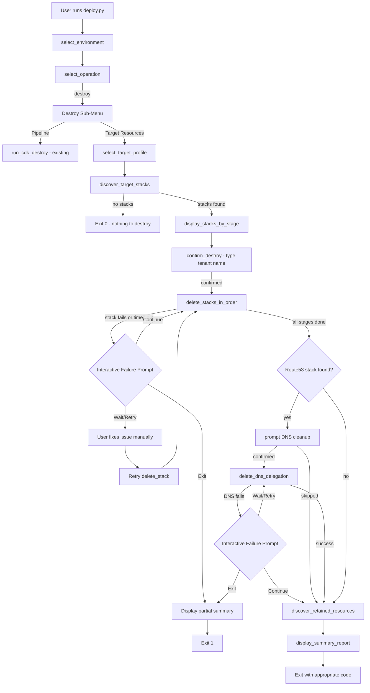
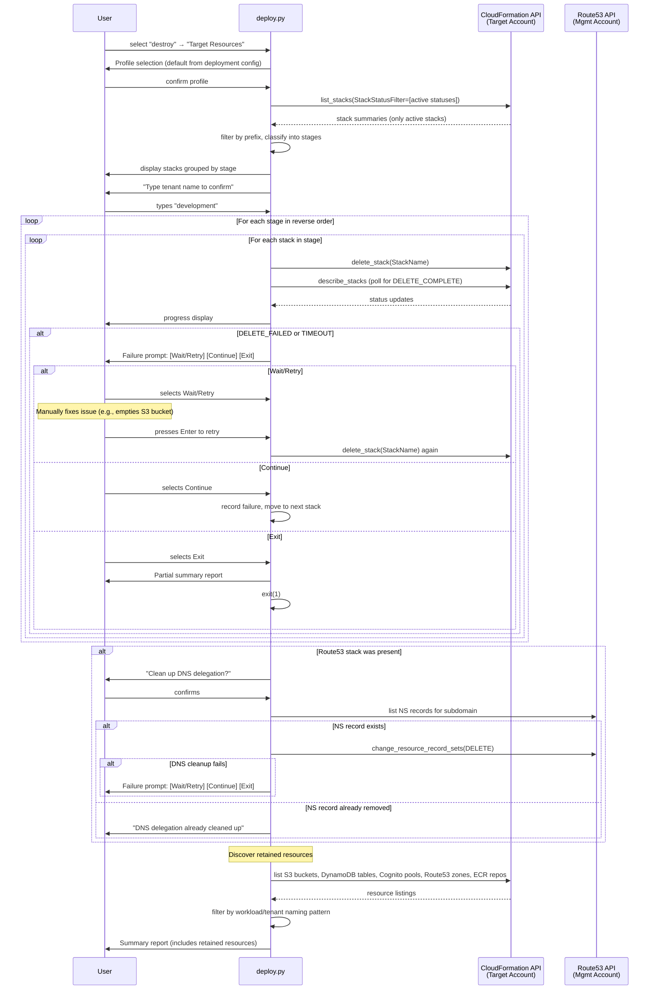

# Design Document: Cross-Account Destroy

## Overview

This feature extends the NCA SaaS IaC deployment CLI to support destroying CloudFormation stacks in target AWS accounts. The current `destroy` operation only removes the pipeline stack in the DevOps account. This design adds target account stack discovery via the CloudFormation API, reverse-dependency-order deletion, DNS delegation cleanup in the management account, safety confirmation prompts, interactive failure handling (wait/retry, continue, exit), and idempotent re-run support so partial failures can be resumed cleanly.

The implementation spans two files:
- `cdk-factory/src/cdk_factory/commands/deployment_command.py` — base class gets new reusable methods
- `Acme-SaaS-IaC/cdk/deploy.py` — subclass overrides `select_operation` and `run` to wire in the target destroy flow

## Architecture



### Sequence: Target Resource Destruction



## Components and Interfaces

### 1. Base Class Changes (`CdkDeploymentCommand`)

No changes to the base class. All new functionality lives in the `NcaSaasDeployment` subclass since the target destroy flow is specific to this project's multi-account topology (DevOps → Target → Management).

### 2. Subclass Changes (`NcaSaasDeployment` in `deploy.py`)

#### New Methods

```python
def select_operation(self) -> str:
    """Override: adds destroy sub-menu when 'destroy' is selected."""

def run(self, config_file, environment_name, operation, dry_run,
        destroy_target, target_profile, confirm_destroy, skip_dns_cleanup,
        no_interactive_failures) -> None:
    """Override: dispatches to run_target_destroy when appropriate."""

def run_target_destroy(self, env_config: EnvironmentConfig,
                       target_profile: str,
                       confirm_destroy: bool,
                       skip_dns_cleanup: bool,
                       no_interactive_failures: bool) -> None:
    """Orchestrates the full target resource destruction flow.
    Steps: profile selection → stack discovery → confirmation → deletion →
    DNS cleanup → retained resources discovery → summary report."""

def _select_target_profile(self, env_config: EnvironmentConfig) -> str:
    """Interactive profile selection. Returns the AWS profile name."""

def _create_target_session(self, profile_name: str) -> boto3.Session:
    """Creates a boto3 Session using the selected profile. Validates the profile exists."""

def _discover_target_stacks(self, session: boto3.Session,
                            stack_prefix: str) -> List[dict]:
    """Calls CloudFormation list_stacks, filters by prefix and status.
    Returns list of stack summary dicts. Only returns active stacks,
    so already-deleted stacks from a previous run are naturally excluded."""

def _classify_stacks_by_stage(self, stacks: List[dict]) -> Dict[str, List[dict]]:
    """Classifies stack names into stage groups based on known keywords.
    Returns ordered dict: unknown, network, compute, queues, persistent-resources."""

def _get_deletion_order(self, classified: Dict[str, List[dict]]) -> List[Tuple[str, List[dict]]]:
    """Returns stages in reverse dependency order for deletion:
    unknown → network → compute → queues → persistent-resources."""

def _delete_stage_stacks(self, session: boto3.Session, stage_name: str,
                         stacks: List[dict], timeout: int,
                         no_interactive_failures: bool) -> Tuple[List[dict], bool]:
    """Deletes all stacks in a stage group, waits for completion.
    On failure/timeout, presents interactive prompt (Wait/Retry, Continue, Exit).
    Returns (list of result dicts, should_exit). should_exit is True if user chose Exit."""

def _wait_for_stack_delete(self, cf_client, stack_name: str,
                           timeout: int) -> Tuple[str, Optional[str]]:
    """Polls describe_stacks until DELETE_COMPLETE, DELETE_FAILED, or timeout.
    Handles DELETE_IN_PROGRESS from previous runs by waiting instead of re-issuing delete.
    Returns (final_status, error_reason)."""

def _prompt_failure_action(self, stack_name: str, status: str,
                           error_reason: str,
                           no_interactive_failures: bool) -> str:
    """Presents the interactive failure prompt with three options:
    Wait/Retry, Continue, Exit. Returns 'retry', 'continue', or 'exit'.
    When no_interactive_failures is True, automatically returns 'continue'."""

def _prompt_dns_cleanup(self, env_config: EnvironmentConfig,
                        skip_dns_cleanup: bool) -> bool:
    """Prompts user for DNS cleanup confirmation. Returns True if confirmed."""

def _delete_dns_delegation(self, env_config: EnvironmentConfig,
                           no_interactive_failures: bool) -> Tuple[bool, str]:
    """Deletes NS records from management account's parent zone.
    First checks if the record exists (idempotent). If deletion fails,
    presents interactive failure prompt. Returns (success, message)."""

def _confirm_destruction(self, tenant_name: str, stacks_by_stage: Dict,
                         confirm_destroy: bool) -> bool:
    """Displays warning and stacks, prompts user to type tenant name.
    Returns True if confirmed."""

def _discover_retained_resources(self, session: boto3.Session,
                                    env_config: EnvironmentConfig) -> List[dict]:
    """Queries the target account for resources that survived stack deletion.
    Checks S3 buckets, DynamoDB tables, Cognito user pools, Route53 hosted zones,
    and ECR repositories matching the workload/tenant naming pattern.
    Returns list of dicts: {type, name}. Informational only — does not delete anything.
    Handles API errors gracefully, logging warnings and returning partial results."""

def _display_summary_report(self, results: List[dict],
                            dns_result: Optional[Tuple[bool, str]],
                            retained_resources: Optional[List[dict]] = None,
                            partial: bool = False) -> int:
    """Prints summary table and returns exit code (0 = all success, 1 = any failure).
    When partial=True, indicates the operation was aborted early by the user.
    When retained_resources is provided, displays a Retained Resources section."""
```

#### Updated `main()` / argparse

New CLI arguments added to the existing `argparse.ArgumentParser`:

| Flag | Type | Description |
|------|------|-------------|
| `--destroy-target` | `store_true` | Skip destroy sub-menu, go directly to target destroy |
| `--target-profile` | `str` | AWS profile for target account (skips profile prompt) |
| `--confirm-destroy` | `store_true` | Skip confirmation prompt (for CI/CD) |
| `--skip-dns-cleanup` | `store_true` | Skip DNS delegation cleanup prompt |
| `--stack-delete-timeout` | `int` | Per-stack deletion timeout in seconds (default 1800) |
| `--no-interactive-failures` | `store_true` | Disable interactive failure prompts; auto-continue on failures (for CI/CD) |

### 3. Stack Discovery and Classification

#### Discovery: `_discover_target_stacks`

Uses the CloudFormation `list_stacks` API with `StackStatusFilter` to get active stacks, then filters by the stack prefix pattern.

```python
def _discover_target_stacks(self, session, stack_prefix):
    cf = session.client("cloudformation")
    paginator = cf.get_paginator("list_stacks")
    allowed_statuses = [
        "CREATE_COMPLETE",
        "UPDATE_COMPLETE", 
        "UPDATE_ROLLBACK_COMPLETE",
        "ROLLBACK_COMPLETE",
    ]
    stacks = []
    for page in paginator.paginate(StackStatusFilter=allowed_statuses):
        for s in page["StackSummaries"]:
            if s["StackName"].startswith(stack_prefix):
                stacks.append(s)
    return stacks
```

The `stack_prefix` is built from the deployment config: `f"{workload_name}-{deployment_namespace}-"` (e.g., `acme-saas-development-`).

#### Classification: `_classify_stacks_by_stage`

Maps stack names to pipeline stages using keyword matching against the stack name suffix (the part after the prefix). The stage keywords are derived from the `config.json` pipeline stage definitions:

| Stage | Stack name keywords |
|-------|-------------------|
| `persistent-resources` | `dynamodb`, `s3-`, `cognito`, `route53` |
| `queues` | `sqs` |
| `compute` | `lambda`, `docker` |
| `network` | `api-gateway`, `cloudfront` |
| `unknown` | anything not matching above |

The classification is a pure function: `stack_name → stage_name`.

#### Deletion Order

Reverse of pipeline deployment order:

```
Pipeline deploys:  persistent-resources → queues → compute → network
Destroy deletes:   unknown → network → compute → queues → persistent-resources
```

`unknown` stacks are deleted first since they have no known dependencies.

### 4. Stack Deletion Execution

For each stage group (in reverse order):
1. Call `delete_stack` for each stack in the group (unless already `DELETE_IN_PROGRESS`)
2. Poll `describe_stacks` every 10 seconds until `DELETE_COMPLETE` or `DELETE_FAILED`
3. If timeout (default 30 min) is exceeded, trigger failure handling
4. On `DELETE_FAILED` or timeout, present the interactive failure prompt
5. Collect results: `{stack_name, status, error_reason}`
6. If user chose "Exit" at any point, stop immediately and show partial summary

#### Idempotent Re-Run: DELETE_IN_PROGRESS Handling

When re-running after a partial failure, some stacks may still be in `DELETE_IN_PROGRESS` from the previous run. The CLI detects this and waits for the in-progress deletion to complete rather than issuing a redundant `delete_stack` call.

```python
def _delete_single_stack(self, cf_client, stack_name, timeout):
    """Delete a single stack, handling DELETE_IN_PROGRESS from previous runs."""
    # Check current status first
    try:
        resp = cf_client.describe_stacks(StackName=stack_name)
        current_status = resp["Stacks"][0]["StackStatus"]
        if current_status == "DELETE_IN_PROGRESS":
            self._print(f"  {stack_name}: already DELETE_IN_PROGRESS, waiting...", "blue")
            return self._wait_for_stack_delete(cf_client, stack_name, timeout)
    except cf_client.exceptions.ClientError as e:
        if "does not exist" in str(e):
            return ("DELETE_COMPLETE", None)  # Already deleted
        raise

    # Issue delete
    cf_client.delete_stack(StackName=stack_name)
    return self._wait_for_stack_delete(cf_client, stack_name, timeout)
```

```python
def _wait_for_stack_delete(self, cf_client, stack_name, timeout):
    import time
    deadline = time.time() + timeout
    while time.time() < deadline:
        try:
            resp = cf_client.describe_stacks(StackName=stack_name)
            status = resp["Stacks"][0]["StackStatus"]
            if status == "DELETE_COMPLETE":
                return ("DELETE_COMPLETE", None)
            if status == "DELETE_FAILED":
                reason = resp["Stacks"][0].get("StackStatusReason", "Unknown")
                return ("DELETE_FAILED", reason)
            self._print(f"  {stack_name}: {status}...", "white")
        except cf_client.exceptions.ClientError as e:
            # Stack no longer exists — treat as DELETE_COMPLETE
            if "does not exist" in str(e):
                return ("DELETE_COMPLETE", None)
            raise
        time.sleep(10)
    return ("TIMEOUT", f"Exceeded {timeout}s timeout")
```

#### Interactive Failure Prompt

When a stack deletion fails or times out, the CLI presents a three-option prompt instead of silently continuing:

```python
def _prompt_failure_action(self, stack_name, status, error_reason, no_interactive_failures):
    """Present failure options to the user. Returns 'retry', 'continue', or 'exit'."""
    if no_interactive_failures:
        self._print(f"  {stack_name}: {status} — {error_reason} (auto-continuing)", "yellow")
        return "continue"

    self._print(f"", "white")
    self._print(f"  Stack deletion failed: {stack_name}", "red")
    self._print(f"  Status: {status}", "red")
    self._print(f"  Reason: {error_reason}", "red")
    self._print(f"", "white")

    options = [
        "Wait/Retry — pause so you can fix the issue, then retry",
        "Continue — skip this stack and move on",
        "Exit — stop the entire destroy operation",
    ]
    idx = self._interactive_select("How would you like to proceed?", options)
    return ["retry", "continue", "exit"][idx]
```

The retry loop in `_delete_stage_stacks`:

```python
def _delete_stage_stacks(self, session, stage_name, stacks, timeout, no_interactive_failures):
    cf = session.client("cloudformation")
    results = []
    for stack in stacks:
        stack_name = stack["StackName"]
        while True:  # retry loop
            status, reason = self._delete_single_stack(cf, stack_name, timeout)
            if status == "DELETE_COMPLETE":
                results.append({"stack_name": stack_name, "stage": stage_name,
                                "status": status, "error_reason": None})
                break
            # Failure or timeout — prompt user
            action = self._prompt_failure_action(
                stack_name, status, reason, no_interactive_failures)
            if action == "retry":
                self._print(f"  Press Enter when ready to retry {stack_name}...", "blue")
                if not no_interactive_failures:
                    input()
                continue  # retry the deletion
            elif action == "exit":
                results.append({"stack_name": stack_name, "stage": stage_name,
                                "status": status, "error_reason": reason})
                return results, True  # signal to abort
            else:  # continue
                results.append({"stack_name": stack_name, "stage": stage_name,
                                "status": status, "error_reason": reason})
                break
    return results, False  # no abort
```

### 5. DNS Delegation Cleanup

Reuses the existing `Route53Delegation` utility class. A new `delete_ns_records` method is added to `Route53Delegation` alongside the existing `upsert_ns_records`:

```python
# In cdk_factory/utilities/route53_delegation.py
def delete_ns_records(
    self,
    hosted_zone_id: str,
    record_name: str,
    role_arn: Optional[str] = None,
) -> bool:
    """Delete NS delegation records from a hosted zone.
    Returns True if deleted, False if record not found (idempotent)."""
    client = self._get_client("route53", role_arn)
    # First, check if the NS record exists (idempotency check)
    records = client.list_resource_record_sets(
        HostedZoneId=hosted_zone_id,
        StartRecordName=record_name,
        StartRecordType="NS",
        MaxItems="1",
    )
    # Find matching NS record
    for rs in records["ResourceRecordSets"]:
        if rs["Name"].rstrip(".") == record_name.rstrip(".") and rs["Type"] == "NS":
            client.change_resource_record_sets(
                HostedZoneId=hosted_zone_id,
                ChangeBatch={
                    "Changes": [{
                        "Action": "DELETE",
                        "ResourceRecordSet": rs,
                    }]
                },
            )
            return True
    return False  # Record not found — already cleaned up
```

The `_delete_dns_delegation` method in `deploy.py` orchestrates this:
1. Read `MANAGEMENT_ACCOUNT_ROLE_ARN` and `MGMT_R53_HOSTED_ZONE_ID` from config.json defaults (already loaded into env vars)
2. Read `HOSTED_ZONE_NAME` from the deployment config
3. Call `Route53Delegation().delete_ns_records(...)` with the management role ARN
4. If the record doesn't exist, log an informational message ("DNS delegation already cleaned up") and return success
5. If deletion fails, present the interactive failure prompt (Wait/Retry, Continue, Exit)
6. Wrap in try/except to handle role assumption failures — on failure, present the interactive prompt rather than silently continuing

```python
def _delete_dns_delegation(self, env_config, no_interactive_failures):
    zone_name = os.environ.get("HOSTED_ZONE_NAME", "")
    mgmt_role = os.environ.get("MANAGEMENT_ACCOUNT_ROLE_ARN", "")
    mgmt_zone_id = os.environ.get("MGMT_R53_HOSTED_ZONE_ID", "")

    while True:  # retry loop
        try:
            delegation = Route53Delegation()
            deleted = delegation.delete_ns_records(
                hosted_zone_id=mgmt_zone_id,
                record_name=zone_name,
                role_arn=mgmt_role,
            )
            if deleted:
                return (True, f"Removed {zone_name} from parent zone")
            else:
                self._print(f"  DNS delegation for {zone_name} already cleaned up", "blue")
                return (True, f"{zone_name} already removed (idempotent)")
        except Exception as e:
            action = self._prompt_failure_action(
                f"DNS cleanup ({zone_name})", "FAILED", str(e),
                no_interactive_failures)
            if action == "retry":
                self._print("  Press Enter when ready to retry DNS cleanup...", "blue")
                if not no_interactive_failures:
                    input()
                continue
            elif action == "exit":
                return (False, f"DNS cleanup aborted: {e}")
            else:  # continue
                return (False, f"DNS cleanup skipped: {e}")
```

### 6. Retained Resources Discovery

After all stack deletions complete (and before the final summary), the CLI queries the target account for resources that may have survived deletion due to `DeletionPolicy: Retain` or `USE_EXISTING: true` configurations.

```python
def _discover_retained_resources(self, session, env_config):
    """Check for resources that survived stack deletion."""
    config = env_config.extra
    params = config.get("parameters", {})
    prefix = f"{params.get('WORKLOAD_NAME', '')}-{params.get('TENANT_NAME', '')}"
    retained = []

    # 1. S3 Buckets — check known names from deployment config + prefix scan
    known_buckets = [v for k, v in params.items()
                     if k.startswith("S3_") and k.endswith("_BUCKET_NAME")]
    try:
        s3 = session.client("s3")
        resp = s3.list_buckets()
        for bucket in resp.get("Buckets", []):
            name = bucket["Name"]
            if name in known_buckets or name.startswith(prefix):
                retained.append({"type": "S3 Bucket", "name": name})
    except Exception as e:
        self._print(f"  Warning: could not check S3 buckets: {e}", "yellow")

    # 2. DynamoDB Tables — check known names + prefix scan
    known_tables = [v for k, v in params.items()
                    if k.startswith("DYNAMODB_") and k.endswith("_TABLE_NAME")]
    try:
        dynamodb = session.client("dynamodb")
        paginator = dynamodb.get_paginator("list_tables")
        for page in paginator.paginate():
            for table_name in page.get("TableNames", []):
                if table_name in known_tables or table_name.startswith(prefix):
                    retained.append({"type": "DynamoDB Table", "name": table_name})
    except Exception as e:
        self._print(f"  Warning: could not check DynamoDB tables: {e}", "yellow")

    # 3. Cognito User Pools — prefix scan on pool name
    try:
        cognito = session.client("cognito-idp")
        paginator = cognito.get_paginator("list_user_pools")
        for page in paginator.paginate(MaxResults=60):
            for pool in page.get("UserPools", []):
                if pool["Name"].startswith(prefix):
                    retained.append({"type": "Cognito User Pool",
                                     "name": pool["Name"]})
    except Exception as e:
        self._print(f"  Warning: could not check Cognito user pools: {e}", "yellow")

    # 4. Route53 Hosted Zones — check for tenant subdomain zone
    hosted_zone_name = params.get("HOSTED_ZONE_NAME", "")
    if hosted_zone_name:
        try:
            r53 = session.client("route53")
            resp = r53.list_hosted_zones_by_name(
                DNSName=hosted_zone_name, MaxItems="1")
            for zone in resp.get("HostedZones", []):
                if zone["Name"].rstrip(".") == hosted_zone_name.rstrip("."):
                    retained.append({"type": "Route53 Hosted Zone",
                                     "name": hosted_zone_name})
        except Exception as e:
            self._print(f"  Warning: could not check Route53: {e}", "yellow")

    # 5. ECR Repositories — prefix scan
    try:
        ecr = session.client("ecr")
        paginator = ecr.get_paginator("describe_repositories")
        for page in paginator.paginate():
            for repo in page.get("repositories", []):
                if repo["repositoryName"].startswith(prefix):
                    retained.append({"type": "ECR Repository",
                                     "name": repo["repositoryName"]})
    except Exception as e:
        self._print(f"  Warning: could not check ECR repositories: {e}", "yellow")

    return retained
```

This method is called in `run_target_destroy` after all stack deletions and DNS cleanup complete, but before the summary report is displayed. The results are passed to `_display_summary_report` for inclusion.

Key design decisions:
- Uses both **known resource names** from the deployment config (e.g., `DYNAMODB_APP_TABLE_NAME`, `S3_WORKLOAD_BUCKET_NAME`) and **prefix scanning** to catch resources not explicitly named in the config
- Each resource type check is wrapped in its own try/except so a failure checking one type doesn't prevent checking others
- Purely informational — never attempts to delete anything
- Handles missing permissions gracefully (e.g., if the profile doesn't have `s3:ListBuckets`)

### 7. Confirmation Flow

```
⚠  WARNING: This operation is IRREVERSIBLE
⚠  You are about to destroy resources in account 959096737760

  Stacks to be deleted (in order):

  [network]
    - acme-saas-development-api-gateway-primary

  [compute]
    - acme-saas-development-lambda-app-settings
    - acme-saas-development-lambda-file-system
    ...

  [queues]
    - acme-saas-development-sqs-consumer-queues

  [persistent-resources]
    - acme-saas-development-dynamodb-app-table
    - acme-saas-development-route53
    ...

  Type the tenant name "development" to confirm: _
```

### 8. Summary Report

```
  Destruction Summary
  ─────────────────────────────────────────
  ✓ acme-saas-development-api-gateway-primary    DELETE_COMPLETE
  ✓ acme-saas-development-lambda-app-settings    DELETE_COMPLETE
  ✗ acme-saas-development-s3-workload            DELETE_FAILED (bucket not empty)
  ✓ acme-saas-development-route53                DELETE_COMPLETE
  ─────────────────────────────────────────
  DNS Delegation: ✓ Removed development.acme.com from parent zone
  ─────────────────────────────────────────
  Retained Resources:
    ⚠ S3 Bucket         acme-saas-development-v3-user-files
    ⚠ S3 Bucket         acme-saas-development-v3-upload-files
    ⚠ S3 Bucket         acme-saas-development-v3-transient-files
    ⚠ DynamoDB Table    acme-saas-development-v3-app-database
    ⚠ DynamoDB Table    acme-saas-development-audit-logger-database
    ⚠ DynamoDB Table    acme-saas-development-v3-transient-database
  These resources were not destroyed and may require manual cleanup.
  ─────────────────────────────────────────
  Result: 1 failure(s) — exit code 1
```

When the user selects "Exit" during an interactive failure prompt, a partial summary is shown:

```
  ⚠ Destruction ABORTED by user
  ─────────────────────────────────────────
  Partial Destruction Summary
  ─────────────────────────────────────────
  ✓ acme-saas-development-api-gateway-primary    DELETE_COMPLETE
  ✓ acme-saas-development-lambda-app-settings    DELETE_COMPLETE
  ✗ acme-saas-development-s3-workload            DELETE_FAILED (bucket not empty)
  ─ acme-saas-development-sqs-consumer-queues    NOT ATTEMPTED
  ─ acme-saas-development-dynamodb-app-table     NOT ATTEMPTED
  ─────────────────────────────────────────
  DNS Delegation: not attempted
  ─────────────────────────────────────────
  Retained Resources: not checked (operation aborted)
  ─────────────────────────────────────────
  Re-run the destroy command to resume from where you left off.
  Result: aborted — exit code 1
```

When re-running after a partial failure, the confirmation prompt shows only remaining stacks:

```
  ⚠  WARNING: This operation is IRREVERSIBLE
  ⚠  You are about to destroy resources in account 959096737760

  Stacks to be deleted (in order):

  [queues]
    - acme-saas-development-sqs-consumer-queues

  [persistent-resources]
    - acme-saas-development-s3-workload
    - acme-saas-development-dynamodb-app-table
    ...

  Type the tenant name "development" to confirm: _
```

## Data Models

### Stack Discovery Result

```python
@dataclass
class StackInfo:
    """Represents a discovered CloudFormation stack."""
    name: str
    status: str
    stage: str  # classified stage: network, compute, queues, persistent-resources, unknown
```

### Deletion Result

```python
@dataclass
class DeletionResult:
    """Result of a single stack deletion attempt."""
    stack_name: str
    stage: str
    status: str  # DELETE_COMPLETE, DELETE_FAILED, TIMEOUT, SKIPPED (user chose Continue)
    error_reason: Optional[str] = None
```

### DNS Cleanup Result

```python
@dataclass
class DnsCleanupResult:
    """Result of DNS delegation cleanup."""
    attempted: bool
    success: bool
    zone_name: str
    message: str
```

### Retained Resource Entry

```python
@dataclass
class RetainedResource:
    """A resource that survived stack deletion."""
    resource_type: str  # "S3 Bucket", "DynamoDB Table", "Cognito User Pool",
                        # "Route53 Hosted Zone", "ECR Repository"
    name: str
```

### Stage Classification Constants

```python
STAGE_KEYWORDS = {
    "persistent-resources": ["dynamodb", "s3-", "cognito", "route53"],
    "queues": ["sqs"],
    "compute": ["lambda", "docker"],
    "network": ["api-gateway", "cloudfront"],
}

# Reverse of pipeline deploy order. Unknown first since no known dependencies.
DELETION_ORDER = ["unknown", "network", "compute", "queues", "persistent-resources"]
```

## Correctness Properties

*A property is a characteristic or behavior that should hold true across all valid executions of a system — essentially, a formal statement about what the system should do. Properties serve as the bridge between human-readable specifications and machine-verifiable correctness guarantees.*

### Property 1: Stack discovery filter correctness

*For any* list of CloudFormation stack summaries with arbitrary names and statuses, and *for any* valid stack prefix string, the `_discover_target_stacks` filter SHALL return only stacks whose name starts with the given prefix AND whose status is one of `CREATE_COMPLETE`, `UPDATE_COMPLETE`, `UPDATE_ROLLBACK_COMPLETE`, or `ROLLBACK_COMPLETE`. No other stacks shall be included, and no matching stacks shall be excluded. This also guarantees idempotent re-run behavior: stacks with `DELETE_COMPLETE` status (from a previous run) are naturally excluded from discovery.

**Validates: Requirements 3.1, 3.2, 3.3, 11.1**

### Property 2: Stage classification and deletion ordering

*For any* set of stack names matching the `{prefix}{suffix}` pattern, `_classify_stacks_by_stage` SHALL assign each stack to exactly one stage group based on keyword matching, and `_get_deletion_order` SHALL always return stages in the order: unknown → network → compute → queues → persistent-resources. Stacks whose suffix does not contain any known stage keyword SHALL be assigned to the `unknown` group.

**Validates: Requirements 4.2, 4.3**

## Error Handling

| Scenario | Behavior | Exit Code |
|----------|----------|-----------|
| Invalid AWS profile | Display error with profile name, suggest `aws configure` | 1 |
| No stacks found matching prefix | Informational message, clean exit | 0 |
| User cancels sub-menu (Esc/Ctrl-C) | Cancellation message | 1 |
| User types wrong tenant name | Abort message | 1 |
| Individual stack DELETE_FAILED | Display failure reason, present interactive prompt (Wait/Retry, Continue, Exit) | — |
| Stack deletion timeout | Display timeout warning, present interactive prompt (Wait/Retry, Continue, Exit) | — |
| User selects "Wait/Retry" on failure | Pause for manual fix, then retry the failed operation | — |
| User selects "Continue" on failure | Skip the failed stack, record as failed, proceed to next | — |
| User selects "Exit" on failure | Stop immediately, display partial summary | 1 |
| DNS role assumption fails | Present interactive prompt (Wait/Retry, Continue, Exit) | — |
| DNS record not found in parent zone | Log info "already cleaned up", continue (idempotent) | — |
| DNS deletion API error | Present interactive prompt (Wait/Retry, Continue, Exit) | — |
| Re-run after partial failure | Stack discovery returns only remaining active stacks; DNS checks if record exists first | — |
| Stack in DELETE_IN_PROGRESS (from previous run) | Wait for completion instead of re-issuing delete | — |
| Retained resource API check fails (e.g., missing permissions) | Log warning for that resource type, continue checking others | — |
| All stacks deleted successfully | Success message | 0 |
| Any stack deletion failed/timed out (user chose Continue) | Failure details in summary | 1 |
| `--destroy-target` without `--confirm-destroy` | Still requires interactive confirmation | — |
| `--no-interactive-failures` flag set | Auto-continue on all failures (log and continue) | — |

Key design decisions:
- The destroy operation supports **interactive failure recovery** — when a stack fails, the user can fix the issue (e.g., empty an S3 bucket) and retry without restarting the entire process.
- The operation is **idempotent** — re-running after a partial failure cleanly picks up where it left off. Stack discovery only returns active stacks, DNS cleanup checks for record existence, and stacks in `DELETE_IN_PROGRESS` are waited on rather than re-deleted.
- The `--no-interactive-failures` flag provides backward-compatible "log and continue" behavior for CI/CD pipelines.

## Testing Strategy

### Property-Based Tests

Property-based testing applies to the two pure-logic functions: stack filtering and stage classification/ordering. These are the core correctness guarantees of the feature. The new requirements (interactive failure handling, idempotent re-run) are primarily interactive UI flows and conditional logic best covered by example-based tests.

- Library: `hypothesis` (Python)
- Minimum 100 iterations per property
- Tag format: `Feature: cross-account-destroy, Property {N}: {title}`

| Property | Function Under Test | What Varies |
|----------|-------------------|-------------|
| 1: Stack discovery filter | `_discover_target_stacks` (filter logic extracted) | Stack names, statuses, prefix strings |
| 2: Stage classification and ordering | `_classify_stacks_by_stage` + `_get_deletion_order` | Stack name suffixes, mix of known/unknown keywords |

### Unit Tests (Example-Based)

| Test | Validates |
|------|-----------|
| Destroy sub-menu presents Pipeline and Target Resources options | Req 1.1 |
| Pipeline selection calls `run_cdk_destroy` | Req 1.2 |
| Target Resources selection enters target destroy flow | Req 1.3 |
| Cancel sub-menu exits with code 1 | Req 1.4 |
| Default profile shown from deployment config | Req 2.1 |
| Custom profile used for boto3 session | Req 2.4 |
| Invalid profile raises descriptive error | Req 2.5 |
| No stacks found exits gracefully with code 0 | Req 3.4 |
| Stacks displayed before deletion | Req 3.5 |
| DNS cleanup prompt shown when route53 stack present | Req 6.1 |
| DNS cleanup checks record existence before deleting | Req 6.2 |
| DNS record not found logs "already cleaned up" message | Req 6.7 |
| Role assumption failure triggers interactive prompt | Req 6.8, 10.6 |
| Correct tenant name proceeds with deletion | Req 7.3 |
| Wrong tenant name aborts with code 1 | Req 7.4 |
| Summary report includes all stacks and statuses | Req 8.1 |
| All success → exit code 0 | Req 8.2 |
| Any failure → exit code 1 | Req 8.3 |
| DNS status included in summary | Req 8.4 |
| `--destroy-target` flag accepted | Req 9.1 |
| `--target-profile` argument accepted | Req 9.2 |
| `--confirm-destroy` flag accepted | Req 9.3 |
| `--skip-dns-cleanup` flag accepted | Req 9.4 |
| `--destroy-target` without `--confirm-destroy` still prompts | Req 9.5 |
| `--no-interactive-failures` flag accepted | Req 9.6 |
| DELETE_FAILED presents three-option prompt (Wait/Retry, Continue, Exit) | Req 10.1 |
| Timeout presents three-option prompt | Req 10.2 |
| Wait/Retry pauses then retries delete_stack | Req 10.3 |
| Continue skips failed stack and records failure | Req 10.4 |
| Exit stops immediately and shows partial summary | Req 10.5 |
| DNS failure presents three-option prompt | Req 10.6 |
| `--no-interactive-failures` auto-continues on all failures | Req 10.7 |
| Re-run after partial failure shows only remaining stacks in confirmation | Req 11.2 |
| DNS cleanup on re-run detects already-removed record | Req 11.3 |
| DELETE_IN_PROGRESS stack is waited on, not re-deleted | Req 11.4 |
| Retained resources discovered after stack deletion | Req 12.1 |
| S3 buckets, DynamoDB tables, Cognito pools, Route53 zones, ECR repos checked | Req 12.2 |
| Known resource names from deployment config used for matching | Req 12.3 |
| Retained resources displayed in summary report | Req 12.4 |
| No retained resources shows clean message | Req 12.5 |
| Retained resources check is informational only (no deletions) | Req 12.6 |
| API error during retained resource check logs warning and continues | Req 12.7 |

### Integration Tests

| Test | Validates |
|------|-----------|
| End-to-end target destroy with mocked CloudFormation and Route53 | Reqs 5.1, 5.2, 6.3–6.6 |
| Full CLI invocation with `--destroy-target --confirm-destroy` flags | Req 9 |
| End-to-end re-run scenario: first run partially fails, second run resumes | Req 11.1, 11.2, 11.3, 11.4 |
| Interactive failure prompt with Wait/Retry completing successfully after manual fix | Req 10.3 |
