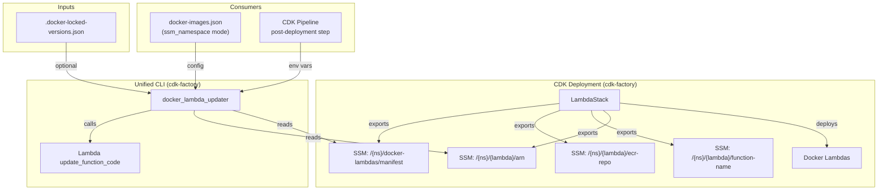
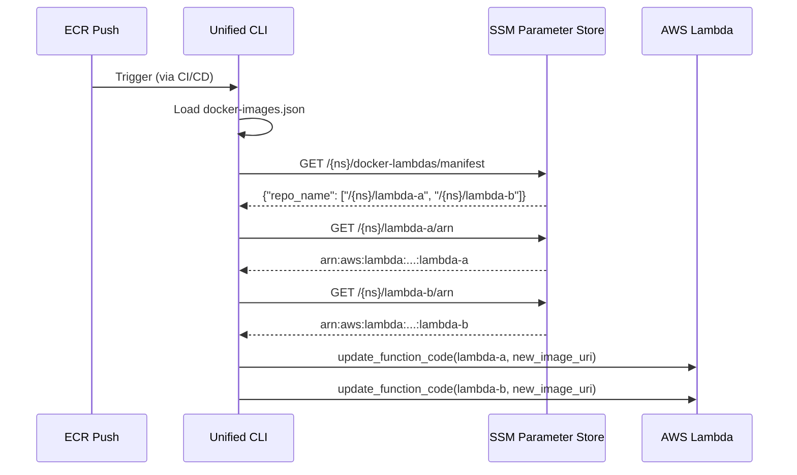
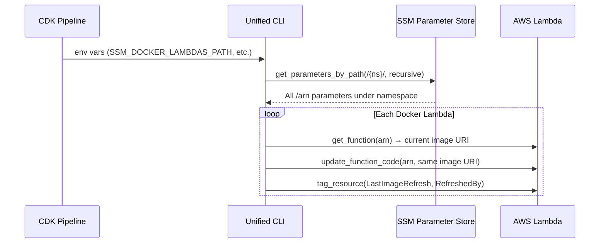

# Design Document: Docker Lambda Auto-Discovery

## Overview

This design replaces the fragmented Docker Lambda image update tooling with a unified auto-discovery framework centered in cdk-factory. The solution has two main components:

1. **Discovery Manifest Export** — The `LambdaStack` in cdk-factory exports a JSON manifest SSM parameter during CDK deployment that maps ECR repo names to Docker Lambda SSM path prefixes. This enables consumers to discover all Docker Lambdas for a given ECR repo without hardcoded paths.

2. **Unified CLI (`docker_lambda_updater`)** — A single Python CLI utility in `cdk_factory.utilities` that replaces both `LambdaImageUpdater` (Acme-SaaS-DevOps-CDK) and the `lambda_boto3_utilities.py` pattern (Acme-SaaS-Application). It supports repo-triggered updates, post-deployment refresh, locked version tags, multi-account targeting, and dry-run mode — all driven by SSM auto-discovery or legacy `ssm_parameter` paths.

### Design Rationale

- **Single source of truth**: The CDK stack that creates Docker Lambdas also publishes the manifest. No external config can drift.
- **Zero-config scaling**: Adding a new Docker Lambda to a stack config automatically includes it in the manifest — no `docker-images.json` edits needed in consuming projects.
- **Backward compatible**: The `ssm_parameter` legacy format continues to work, enabling incremental migration.
- **Reusable**: Living in cdk-factory means any project that depends on cdk-factory gets the CLI for free.

## Architecture

### High-Level Architecture



### Data Flow: Repo-Triggered Update



### Data Flow: Post-Deployment Refresh



## Components and Interfaces

### Component 1: Discovery Manifest Export (LambdaStack)

**Location**: `cdk-factory/src/cdk_factory/stack_library/aws_lambdas/lambda_stack.py`

**Modification**: Extend `__export_lambda_arns_to_ssm()` to also export:
1. An `ecr-repo` SSM parameter per Docker Lambda
2. A `docker-lambdas/manifest` SSM parameter per stack

#### Interface: Manifest SSM Parameter

- **Path**: `/{namespace}/docker-lambdas/manifest`
- **Type**: SSM StringParameter, STANDARD tier
- **Value**: JSON string

```json
{
  "acme-analytics/v3/acme-saas-core-services": [
    "/{namespace}/user-create",
    "/{namespace}/user-get",
    "/{namespace}/tenant-create"
  ],
  "acme-analytics/v3/acme-orchestration-services": [
    "/{namespace}/analysis-send-to-queue",
    "/{namespace}/workflow-step-processor"
  ]
}
```

#### Interface: ECR Repo SSM Parameter

- **Path**: `/{namespace}/{lambda-name}/ecr-repo`
- **Type**: SSM StringParameter, STANDARD tier
- **Value**: Raw ECR repository name string (e.g., `acme-analytics/v3/acme-saas-core-services`)

#### Implementation Details

The manifest is built by iterating `self.exported_lambda_arns` after all lambdas are set up. For each entry where `function_config.docker.file` or `function_config.docker.image` is truthy, the raw ECR repo name is extracted from the resource config dict (`config.get("ecr", {}).get("name", "")`). This avoids using `ECRConfig.name` which runs the value through `build_resource_name()`.

```python
def __export_discovery_manifest_to_ssm(self) -> None:
    """Export a discovery manifest mapping ECR repos to Docker Lambda paths."""
    ssm_config = self.stack_config.dictionary.get("ssm", {})
    if not ssm_config.get("auto_export", False):
        return

    namespace = ssm_config.get("namespace")
    if not namespace:
        return  # Already validated in __export_lambda_arns_to_ssm

    prefix = f"/{namespace}"
    manifest: Dict[str, List[str]] = {}

    for lambda_name, lambda_info in self.exported_lambda_arns.items():
        function_config = lambda_info.get("config")
        if not function_config:
            continue
        if not (function_config.docker.file or function_config.docker.image):
            continue

        # Get raw ECR repo name from the resource config dict
        raw_ecr_name = function_config._LambdaFunctionConfig__config.get(
            "ecr", {}
        ).get("name", "")
        if not raw_ecr_name:
            continue

        path_prefix = f"{prefix}/{lambda_name}"
        manifest.setdefault(raw_ecr_name, []).append(path_prefix)

    if not manifest:
        return  # No Docker Lambdas — skip manifest creation

    # Also export ecr-repo per Docker Lambda
    for lambda_name, lambda_info in self.exported_lambda_arns.items():
        function_config = lambda_info.get("config")
        if not function_config:
            continue
        if not (function_config.docker.file or function_config.docker.image):
            continue

        raw_ecr_name = function_config._LambdaFunctionConfig__config.get(
            "ecr", {}
        ).get("name", "")
        if not raw_ecr_name:
            continue

        ssm.StringParameter(
            self,
            f"ssm-docker-{lambda_name}-ecr-repo",
            parameter_name=f"{prefix}/{lambda_name}/ecr-repo",
            string_value=raw_ecr_name,
            description=f"ECR repo name for Docker Lambda {lambda_name}",
            tier=ssm.ParameterTier.STANDARD,
        )

    import json
    ssm.StringParameter(
        self,
        "ssm-docker-lambdas-manifest",
        parameter_name=f"{prefix}/docker-lambdas/manifest",
        string_value=json.dumps(manifest),
        description="Discovery manifest mapping ECR repos to Docker Lambda paths",
        tier=ssm.ParameterTier.STANDARD,
    )
```

**Note on raw ECR name access**: The `LambdaFunctionConfig` stores the raw config dict in `self.__config`. To access the raw `ecr.name` without `build_resource_name()` transformation, we need to either:
- (Preferred) Add a `raw_ecr_name` property to `LambdaFunctionConfig` that returns `self.__config.get("ecr", {}).get("name", "")`
- Or access the private attribute via name mangling

The preferred approach is to add a clean property:

```python
# In LambdaFunctionConfig
@property
def raw_ecr_name(self) -> str:
    """Raw ECR repository name from config, without build_resource_name transformation."""
    return self.__config.get("ecr", {}).get("name", "")
```

### Component 2: Unified CLI (`docker_lambda_updater`)

**Location**: `cdk-factory/src/cdk_factory/utilities/docker_lambda_updater.py`

**Purpose**: Single CLI tool replacing both `LambdaImageUpdater` and `lambda_boto3_utilities.py` patterns.

#### Class: `DockerLambdaUpdater`

```python
class DockerLambdaUpdater:
    """Unified Docker Lambda update tool with SSM auto-discovery."""

    def __init__(
        self,
        config_path: Optional[str] = None,
        ssm_namespace: Optional[str] = None,
        account: Optional[str] = None,
        region: Optional[str] = None,
        dry_run: bool = False,
        refresh: bool = False,
        image_name: Optional[str] = None,
        locked_versions_path: Optional[str] = None,
        cross_account_role: Optional[str] = None,
    ): ...

    def run(self) -> int: ...
```

#### CLI Arguments

| Argument | Type | Required | Description |
|----------|------|----------|-------------|
| `--config` | str | No* | Path to docker-images.json |
| `--ssm-namespace` | str | No* | Direct SSM namespace for post-deployment mode |
| `--account` | str | No | Target AWS account ID |
| `--region` | str | No | Target AWS region |
| `--refresh` | flag | No | Enable Refresh_Mode (re-deploy with current image) |
| `--locked-versions` | str | No | Path to .docker-locked-versions.json |
| `--dry-run` | flag | No | Preview mode — no changes |
| `--image-name` | str | No | Filter to specific ECR repo name |
| `--cross-account-role` | str | No | IAM role name for cross-account access |

*At least one of `--config` or `--ssm-namespace` is required (or equivalent env vars).

#### Environment Variable Fallbacks

| Env Var | Maps To | Notes |
|---------|---------|-------|
| `SSM_DOCKER_LAMBDAS_PATH` | `--ssm-namespace` | Pipeline integration |
| `AWS_ACCOUNT_NUMBER` | `--account` | Pipeline integration |
| `AWS_REGION` | `--region` | Pipeline integration |
| `CROSS_ACCOUNT_ROLE_ARN` | `--cross-account-role` | Full ARN, not just name |

When env vars are set and no CLI args provided, the tool operates in direct namespace Refresh_Mode.

#### Operating Modes

**Config-Driven Mode** (`--config`):
1. Load `docker-images.json`
2. For each image entry, iterate `lambda_deployments`
3. Per deployment: if `ssm_namespace`/`ssm_namespaces` → auto-discovery; if `ssm_parameter` → legacy direct resolution
4. Update each discovered Lambda

**Direct Namespace Mode** (`--ssm-namespace`):
1. Discover all Docker Lambdas under the namespace via `get_parameters_by_path` (recursive, filter `/arn` suffixes)
2. If `--refresh`: re-deploy with current image URI
3. If not `--refresh`: requires `--image-name` to build new image URI

#### Discovery Logic

```python
def _discover_from_manifest(
    self,
    ssm_client,
    namespace: str,
    repo_name: str,
) -> List[str]:
    """
    Read manifest from /{namespace}/docker-lambdas/manifest,
    return list of Lambda path prefixes for the given repo_name.
    """
    manifest_path = f"/{namespace}/docker-lambdas/manifest"
    # GET SSM parameter → parse JSON → lookup repo_name key
    # Returns: ["/{namespace}/lambda-a", "/{namespace}/lambda-b"]

def _discover_from_path(
    self,
    ssm_client,
    namespace: str,
) -> List[str]:
    """
    Fallback: use get_parameters_by_path to discover all /arn params
    under the namespace. Used in refresh mode.
    """
    # Paginate get_parameters_by_path(Path=f"/{namespace}", Recursive=True)
    # Filter params ending with "/arn"
    # Return list of ARN values
```

#### Locked Versions Resolution

```python
def _resolve_tag(
    self,
    lambda_name: str,
    deployment_tag: str,
    locked_versions: Optional[List[Dict]],
) -> Tuple[str, str]:
    """
    Returns (resolved_tag, source) where source is 'locked' or 'deployment'.
    If locked entry has empty tag, returns (None, 'skipped').
    """
```

The locked versions config is the existing `.docker-locked-versions.json` format:
```json
[
  {"name": "user-create", "tag": "3.3.29", "ecr": "acme-analytics/v3/acme-saas-core-services"},
  {"name": "user-throttle-status", "tag": "", "ecr": "non-docker (zip deploy)"}
]
```

#### Update Logic

```python
def _update_lambda(
    self,
    lambda_client,
    function_arn: str,
    new_image_uri: str,
) -> bool:
    """Update Lambda function code with new image URI. Includes retry with backoff for ECR propagation delays."""

def _refresh_lambda(
    self,
    lambda_client,
    function_arn: str,
) -> bool:
    """Re-deploy Lambda with its current image URI (cold-start refresh)."""

def _tag_lambda_refresh(
    self,
    lambda_client,
    function_arn: str,
) -> None:
    """Tag Lambda with LastImageRefresh timestamp and RefreshedBy=deployment-pipeline."""
```

#### Cross-Account Session Management

Reuses the same pattern as the existing `LambdaImageUpdater`:
- Detect caller account via STS
- Cache assumed-role sessions keyed by account ID
- Per-deployment `role_name` override support

### Component 3: Updated docker-images.json Schema

**New fields** (backward compatible — old format still works):

```json
{
  "images": [
    {
      "repo_name": "acme-analytics/v3/acme-saas-core-services",
      "dockerfile": "Dockerfile",
      "lambda_deployments": [
        {
          "account": "959096737760",
          "region": "us-east-1",
          "ssm_namespace": "acme-saas/dev/lambda/core-services",
          "tag": "dev"
        },
        {
          "account": "123456789012",
          "region": "us-east-1",
          "ssm_namespaces": [
            "acme-saas/prod/lambda/core-services",
            "acme-saas/prod/lambda/api-services"
          ],
          "tag": "latest",
          "locked_versions": "path/to/.docker-locked-versions.json",
          "role_name": "devops-cross-account-lambda-updater"
        },
        {
          "account": "959096737760",
          "region": "us-east-1",
          "ssm_parameter": "/acme-saas/dev/docker-lambdas/user-metrics-v3/arn",
          "tag": "dev"
        }
      ]
    }
  ]
}
```

### Component 4: Migration Documentation

**Location**: `cdk-factory/docs/migration-docker-lambda-auto-discovery.md`

Covers:
1. Enabling `ssm.auto_export` on lambda stack configs
2. Updating `docker-images.json` from `ssm_parameter` to `ssm_namespace`
3. Replacing `LambdaImageUpdater` invocations with `docker_lambda_updater`
4. Wiring the Unified CLI into CDK pipeline post-deployment steps
5. Configuring `--locked-versions` for production environments

## Data Models

### Discovery Manifest (SSM Parameter Value)

```json
{
  "<ecr_repo_name>": ["/<namespace>/<lambda_name>", ...],
  ...
}
```

- **Key**: Raw ECR repository name (e.g., `acme-analytics/v3/acme-saas-core-services`)
- **Value**: Array of SSM path prefixes. Each prefix has `/arn`, `/function-name`, and `/ecr-repo` sub-parameters.

### SSM Parameter Tree (per Lambda Stack)

```
/{namespace}/
├── {lambda-name-1}/
│   ├── arn                    # Lambda function ARN (existing)
│   ├── function-name          # Lambda function name (existing)
│   └── ecr-repo               # Raw ECR repo name (NEW)
├── {lambda-name-2}/
│   ├── arn
│   ├── function-name
│   └── ecr-repo
└── docker-lambdas/
    └── manifest               # JSON manifest (NEW)
```

### docker-images.json Deployment Entry Schema

```typescript
interface DeploymentEntry {
  account: string;                    // AWS account ID
  region: string;                     // AWS region (default: "us-east-1")
  tag: string;                        // Image tag (default: "latest")

  // Discovery mode (new — pick one):
  ssm_namespace?: string;             // Single namespace
  ssm_namespaces?: string[];          // Multiple namespaces

  // Legacy mode:
  ssm_parameter?: string;             // Direct SSM path to Lambda ARN

  // Optional overrides:
  locked_versions?: string;           // Path to locked versions config
  role_name?: string;                 // IAM role for cross-account access
  ecr_account?: string;               // ECR account (defaults to caller)
}
```

### Locked Versions Config Schema

```typescript
interface LockedVersionEntry {
  name: string;     // Docker Lambda name (matches SSM lambda-name)
  tag: string;      // Pinned version tag ("3.3.29") or empty string (skip)
  ecr: string;      // ECR repo name or "non-docker (zip deploy)"
}
```

### CLI Output Model

```typescript
interface UpdateResult {
  repo_name: string;
  deployments: DeploymentResult[];
}

interface DeploymentResult {
  account: string;
  region: string;
  namespace?: string;
  discovered_lambdas: number;
  updated: number;
  failed: number;
  skipped: number;
  details: LambdaUpdateDetail[];
}

interface LambdaUpdateDetail {
  lambda_name: string;
  function_arn: string;
  tag: string;
  tag_source: "locked" | "deployment" | "current";
  status: "success" | "failed" | "skipped" | "dry_run";
  error?: string;
}
```


## Correctness Properties

*A property is a characteristic or behavior that should hold true across all valid executions of a system — essentially, a formal statement about what the system should do. Properties serve as the bridge between human-readable specifications and machine-verifiable correctness guarantees.*

### Property 1: Manifest builder completeness and correctness

*For any* set of lambda configs containing a mix of Docker and non-Docker lambdas with varying ECR repo names, the manifest builder SHALL produce a JSON object where: (a) every Docker lambda with a valid `ecr.name` appears exactly once in the path prefix list under its ECR repo key, (b) no non-Docker lambda appears in any path prefix list, (c) each distinct ECR repo name has exactly one key, and (d) the manifest is empty (not created) when no Docker lambdas exist.

**Validates: Requirements 1.1, 1.2, 1.3, 1.4, 7.1, 7.2**

### Property 2: ECR repo metadata round-trip

*For any* Docker lambda config with a non-empty `ecr.name` field, the value stored in the `ecr-repo` SSM export SHALL exactly equal the raw `ecr.name` value from the resource config (i.e., the value is preserved without transformation by `build_resource_name`).

**Validates: Requirements 2.1, 2.4**

### Property 3: Manifest-based discovery correctness

*For any* valid discovery manifest JSON and any ECR repo name, the discovery function SHALL return exactly the set of path prefixes listed under that repo name key in the manifest, and for a repo name not present in the manifest, SHALL return an empty list.

**Validates: Requirements 3.1, 3.2**

### Property 4: Deployment entry validation

*For any* deployment entry dict that contains neither `ssm_parameter` nor `ssm_namespace` nor `ssm_namespaces`, the validation function SHALL report a validation error identifying the image and deployment index.

**Validates: Requirements 4.4**

### Property 5: Multi-namespace aggregation

*For any* list of namespaces and a given ECR repo name, the aggregated discovery result SHALL equal the union of path prefixes from each individual namespace's manifest lookup for that repo name, with no duplicates and no omissions.

**Validates: Requirements 5.2**

### Property 6: Dry-run safety

*For any* configuration (config-driven or direct namespace, with or without locked versions), when the Unified CLI runs in dry-run mode, the Lambda `update_function_code` API SHALL never be called.

**Validates: Requirements 6.3**

### Property 7: Tag resolution correctness

*For any* Docker lambda name, deployment-level tag, and optional locked versions config: (a) if a matching locked version entry exists with a non-empty tag, the resolved tag SHALL equal the locked version tag; (b) if no matching entry exists, the resolved tag SHALL equal the deployment-level tag; (c) if a matching entry exists with an empty tag, the lambda SHALL be marked as skipped.

**Validates: Requirements 8.2, 8.3, 8.5**

### Property 8: Refresh mode image round-trip

*For any* Docker lambda in refresh mode (without locked versions), the image URI passed to `update_function_code` SHALL exactly equal the current image URI retrieved from `get_function` for that lambda.

**Validates: Requirements 9.3**

### Property 9: Deployment failure resilience

*For any* set of deployment entries where a subset fails (account unreachable, role assumption fails, SSM errors), the Unified CLI SHALL still attempt processing of all remaining deployment entries — the count of attempted deployments SHALL equal the total count of deployment entries.

**Validates: Requirements 11.5**

### Property 10: CLI argument precedence over environment variables

*For any* combination where both a CLI argument and its corresponding environment variable are set to different values, the Unified CLI SHALL use the CLI argument value.

**Validates: Requirements 12.3**

## Error Handling

### Lambda Stack (Manifest Export)

| Error Condition | Handling |
|----------------|----------|
| `ssm.auto_export` enabled but `ssm.namespace` missing | Raise `ValueError` with stack name and missing config (existing behavior) |
| Docker lambda has no `ecr.name` | Skip `ecr-repo` SSM parameter for that lambda; exclude from manifest |
| No Docker lambdas in stack | Skip manifest creation entirely (no SSM parameter created) |
| Manifest JSON exceeds SSM 4KB STANDARD tier limit | Unlikely for typical stacks (~50 lambdas). If hit, log warning and consider ADVANCED tier or splitting stacks |

### Unified CLI

| Error Condition | Handling | Exit Code |
|----------------|----------|-----------|
| Neither `--config` nor `--ssm-namespace` provided (and no env vars) | Print usage error to stderr | 1 |
| Config file not found | Print error with path | 1 |
| Config file missing `images` array | Print validation error | 1 |
| Deployment entry missing both `ssm_parameter` and `ssm_namespace` | Print validation error per entry, continue others | 1 (at end) |
| Discovery manifest SSM parameter not found | Log error with path, account, region; skip deployment | Continue |
| ECR repo not in manifest | Log warning; skip deployment without failing | Continue |
| Cross-account role assumption fails | Log error with role ARN and account; skip deployment | Continue |
| Lambda ARN SSM parameter not found | Log warning; skip that lambda | Continue |
| `get_function` fails (refresh mode) | Log error; skip that lambda | Continue |
| `update_function_code` fails | Log error; mark as failed; continue others | 1 (at end) |
| ECR image not yet accessible (AccessDeniedException with ECR) | Retry with exponential backoff (3 retries, 2s base) | Fail after retries |
| Locked versions file not found | Print error with path | 1 |
| Locked versions entry has empty tag | Log info; skip that lambda | Continue |

### Exit Code Strategy

- **0**: All attempted updates succeeded (or dry-run completed)
- **1**: One or more updates failed, or fatal configuration error
- Partial failures (some succeed, some fail) still exit with 1 to signal pipeline failure

## Testing Strategy

### Unit Tests

Focus on specific examples, edge cases, and error conditions:

- **Manifest builder**: Empty stack, all non-Docker lambdas, single Docker lambda, mixed lambdas
- **Config parsing**: Legacy `ssm_parameter` format, new `ssm_namespace` format, `ssm_namespaces` array, both fields present, neither field present
- **Tag resolution**: No locked versions file, matching entry, non-matching entry, empty tag entry
- **Mode selection**: Config-driven vs direct namespace, refresh mode, env var fallback
- **Error paths**: Missing config file, missing manifest, failed role assumption, failed Lambda update
- **Dry-run**: Verify no mutations occur, verify output format

### Property-Based Tests

Property-based testing is appropriate for this feature because the core logic involves pure functions (manifest building, discovery lookup, tag resolution, config validation) with clear input/output behavior and large input spaces.

**Library**: [hypothesis](https://hypothesis.readthedocs.io/) (Python)

**Configuration**: Minimum 100 iterations per property test.

**Tag format**: `Feature: docker-lambda-auto-discovery, Property {number}: {property_text}`

Each correctness property from the design maps to a single property-based test:

1. **Property 1** — Generate random lambda config sets (varying Docker/non-Docker mix, ECR repo names), run manifest builder, verify completeness and correctness invariants.
2. **Property 2** — Generate random ECR repo name strings, pass through the ecr-repo export logic, verify output equals input.
3. **Property 3** — Generate random manifest dicts and repo name queries, verify lookup returns exact match or empty list.
4. **Property 4** — Generate deployment entry dicts missing both `ssm_parameter` and `ssm_namespace`, verify validation error.
5. **Property 5** — Generate lists of namespace→manifest mappings, verify aggregated result equals union.
6. **Property 6** — Generate random configs, run in dry-run mode with mocked clients, verify `update_function_code` call count is zero.
7. **Property 7** — Generate random (lambda_name, deployment_tag, locked_versions_list) tuples, verify tag resolution rules.
8. **Property 8** — Generate random image URIs, mock `get_function` to return them, verify `update_function_code` receives the same URI.
9. **Property 9** — Generate deployment entry lists with random failure injection, verify all entries are attempted.
10. **Property 10** — Generate random (cli_value, env_value) pairs, verify CLI value wins.

### Integration Tests

- CDK synth test: Verify `cdk synth` produces the expected SSM parameters (manifest, ecr-repo) in the CloudFormation template
- End-to-end with LocalStack or mocked AWS: Full discovery → update flow with mocked SSM and Lambda services
- Pipeline integration: Verify the CLI works when invoked as a shell step with environment variables
