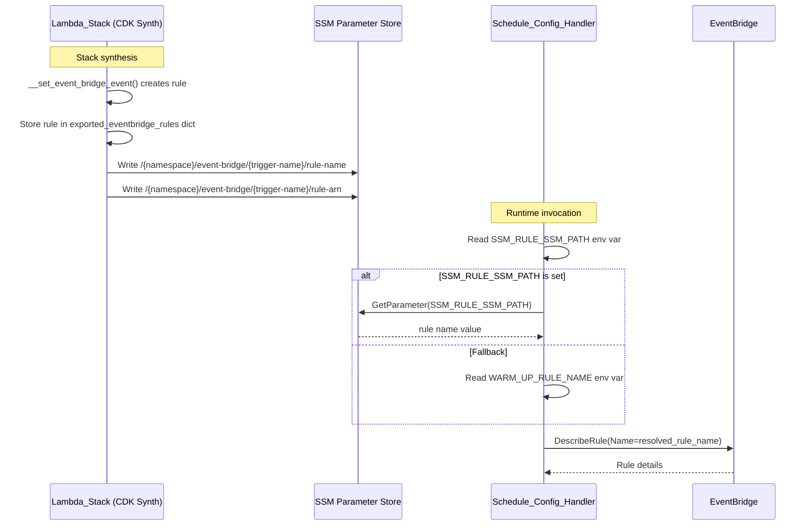

# Design Document: EventBridge Rule SSM Registration

## Overview

This feature adds automatic SSM Parameter Store registration for EventBridge rules created by the CDK Lambda stack. Currently, EventBridge rules receive CloudFormation-generated physical names (e.g., `acme-saas-dev-lambda-warmuporchestrator1eventb-oBsgLBL1cHvc`) because no explicit `rule_name` is passed to the `events.Rule` construct. Consuming Lambdas that need to interact with these rules (like the warm-up schedule config handler) cannot predict the actual name.

The solution follows the existing Lambda ARN export pattern: during stack synthesis, the CDK stack writes the rule's physical name and ARN to SSM under predictable paths. Consuming handlers discover the rule name at runtime by reading from SSM instead of relying on hardcoded environment variables.

### Design Decisions

1. **Follow existing export pattern** — The `__export_lambda_arns_to_ssm()` method already establishes the pattern of collecting resources during setup and exporting them to SSM after all lambdas are created. EventBridge registration follows the same lifecycle.
2. **Collect rules during trigger setup** — The `__set_event_bridge_event()` method returns the created rule, which is stored in a dict (similar to `exported_lambda_arns`) for later SSM export.
3. **Backward compatibility via fallback** — The handler checks `SSM_RULE_SSM_PATH` first, falls back to `WARM_UP_RULE_NAME` if not set. This allows gradual migration without breaking existing deployments.
4. **Trigger name normalization** — Underscores in trigger config names are replaced with hyphens for the SSM path segment, producing clean URL-safe paths.

## Architecture



### Cross-Repository Changes

| Repository | Change | Purpose |
|---|---|---|
| `cdk-factory` | Modify `lambda_stack.py` | Collect and export EventBridge rules to SSM |
| `Acme-Services` | Modify `schedule_config/app.py` | Read rule name from SSM with fallback |
| `Acme-SaaS-IaC` | Modify `warm-up-schedule-config.json` | Add SSM permission and `SSM_RULE_SSM_PATH` env var |

## Components and Interfaces

### Component 1: EventBridge Rule Collection (cdk-factory)

**File:** `cdk-factory/src/cdk_factory/stack_library/aws_lambdas/lambda_stack.py`

**Changes to `__set_event_bridge_event()`:**
- Return the created `events.Rule` object
- Store the rule along with the trigger config in `self.exported_eventbridge_rules`

**New method `__export_eventbridge_rules_to_ssm()`:**
- Mirrors the structure of `__export_lambda_arns_to_ssm()`
- Checks `ssm_config.get("auto_export", False)`
- Gets `namespace` from `ssm_config.get("namespace")`
- Iterates over `self.exported_eventbridge_rules`
- Creates `ssm.StringParameter` for `rule-name` and `rule-arn`

**New instance variable:**
```python
self.exported_eventbridge_rules: dict = {}
# Structure: {
#   "warm-up-orchestrator-schedule": {
#       "rule": events.Rule,
#       "trigger_name": "warm-up-orchestrator-schedule"
#   }
# }
```

**Trigger name derivation:**
```python
trigger_name = trigger.name.replace("_", "-")
# "warm_up_orchestrator_schedule" → "warm-up-orchestrator-schedule"
```

**SSM paths created:**
- `/{namespace}/event-bridge/{trigger-name}/rule-name` → rule's physical name
- `/{namespace}/event-bridge/{trigger-name}/rule-arn` → rule's ARN

### Component 2: SSM-Based Rule Discovery (Acme-Services)

**File:** `Acme-Services/src/aplos_nca_services/handlers/warm_up/schedule_config/app.py`

**Modified `get_schedule_config()` function:**
```python
def get_schedule_config(...) -> ServiceResult:
    ssm_path = os.environ.get("SSM_RULE_SSM_PATH")
    
    if ssm_path:
        # SSM-based discovery
        rule_name = _read_rule_name_from_ssm(ssm_path)
    else:
        # Backward-compatible fallback
        rule_name = os.environ.get("WARM_UP_RULE_NAME")
    
    if not rule_name:
        return ServiceResult.error_result(...)
    
    # ... existing DescribeRule logic
```

**New helper `_read_rule_name_from_ssm(ssm_path: str) -> str | None`:**
- Calls `ssm_client.get_parameter(Name=ssm_path)`
- Returns the parameter value on success
- Returns `None` on `ParameterNotFound` or other errors
- Logs the SSM path and resolved value

### Component 3: IaC Configuration (Acme-SaaS-IaC)

**File:** `Acme-SaaS-IaC/cdk/configs/stacks/lambdas/resources/warm-up/warm-up-schedule-config.json`

**Changes:**
1. Add SSM read permission for EventBridge paths
2. Add `SSM_RULE_SSM_PATH` environment variable
3. Keep `WARM_UP_RULE_NAME` for backward compatibility during transition (can be removed later)

```json
{
  "permissions": [
    { "events": "read" },
    {
      "parameter_store": "read",
      "path": "/{{WORKLOAD_NAME}}/{{DEPLOYMENT_NAMESPACE}}/event-bridge/*"
    }
  ],
  "environment_variables": [
    {
      "name": "SSM_RULE_SSM_PATH",
      "value": "/acme-saas/{{DEPLOYMENT_NAMESPACE}}/lambda/event-bridge/warm-up-orchestrator-schedule/rule-name"
    },
    {
      "name": "WARM_UP_RULE_NAME",
      "value": "{{WORKLOAD_NAME}}-{{DEPLOYMENT_NAMESPACE}}-warm-up-orchestrator-schedule"
    }
  ]
}
```

## Data Models

### SSM Parameter Structure

```
/{namespace}/event-bridge/{trigger-name}/rule-name  →  "physical-rule-name-from-cfn"
/{namespace}/event-bridge/{trigger-name}/rule-arn   →  "arn:aws:events:region:account:rule/physical-rule-name"
```

**Example with real values:**
```
/acme-saas/dev/lambda/event-bridge/warm-up-orchestrator-schedule/rule-name
  → "acme-saas-dev-lambda-warmuporchestrator1eventb-oBsgLBL1cHvc"

/acme-saas/dev/lambda/event-bridge/warm-up-orchestrator-schedule/rule-arn
  → "arn:aws:events:us-east-1:123456789012:rule/acme-saas-dev-lambda-warmuporchestrator1eventb-oBsgLBL1cHvc"
```

### Internal Data Structures

**`exported_eventbridge_rules` dict (LambdaStack instance):**

| Key | Type | Description |
|---|---|---|
| `rule` | `events.Rule` | The CDK Rule construct |
| `trigger_name` | `str` | Normalized trigger name (hyphens, no underscores) |

**Trigger name normalization mapping:**

| Input (config `name` field) | Output (SSM path segment) |
|---|---|
| `warm_up_orchestrator_schedule` | `warm-up-orchestrator-schedule` |
| `my-already-hyphenated-name` | `my-already-hyphenated-name` |
| `mixed_and-combined` | `mixed-and-combined` |

## Correctness Properties

*A property is a characteristic or behavior that should hold true across all valid executions of a system — essentially, a formal statement about what the system should do. Properties serve as the bridge between human-readable specifications and machine-verifiable correctness guarantees.*

### Property 1: Trigger name normalization is underscore-free and idempotent

*For any* trigger name string containing alphanumeric characters, underscores, and hyphens, the normalization function SHALL produce a string that contains no underscores, and applying the normalization a second time SHALL produce the same result as applying it once (idempotence).

**Validates: Requirements 1.3**

## Error Handling

### CDK Stack (Synthesis Time)

| Condition | Behavior |
|---|---|
| `ssm.auto_export` is `False` | Skip silently, log info message |
| `ssm.namespace` is missing when `auto_export` is `True` | Raise `ValueError` (existing behavior) |
| Trigger has no `name` field | Skip that trigger, log warning |
| Rule creation fails | Propagate CDK synthesis error (existing behavior) |

### Schedule Config Handler (Runtime)

| Condition | Behavior |
|---|---|
| `SSM_RULE_SSM_PATH` not set | Fall back to `WARM_UP_RULE_NAME` |
| Both env vars missing | Return `ServiceResult.error_result` with `CONFIGURATION_ERROR` |
| SSM `GetParameter` fails (ParameterNotFound) | Return `ServiceResult.error_result` with `RULE_DISCOVERY_ERROR` |
| SSM `GetParameter` fails (AccessDenied) | Return `ServiceResult.error_result` with `RULE_DISCOVERY_ERROR` |
| `DescribeRule` returns ResourceNotFoundException | Return error with `RULE_NOT_FOUND` (existing behavior) |
| `DescribeRule` fails with other error | Return `ServiceResult.exception_result` (existing behavior) |

## Testing Strategy

### Unit Tests

**cdk-factory (CDK assertion tests):**
- Verify synthesized template contains `AWS::SSM::Parameter` resources for EventBridge rule-name and rule-arn
- Verify SSM parameter paths follow the expected pattern
- Verify parameters use `Standard` tier
- Verify no EventBridge SSM parameters when `auto_export` is `False`
- Verify skip behavior when trigger has no `name` field
- Verify trigger name normalization (underscore → hyphen)

**Acme-Services (handler unit tests):**
- Verify handler reads from SSM when `SSM_RULE_SSM_PATH` is set
- Verify handler falls back to `WARM_UP_RULE_NAME` when `SSM_RULE_SSM_PATH` is not set
- Verify `RULE_DISCOVERY_ERROR` returned when SSM parameter doesn't exist
- Verify logging includes SSM path and resolved rule name
- Verify `DescribeRule` is called with the SSM-resolved name

### Property-Based Tests

**Trigger name normalization (cdk-factory):**
- Library: `hypothesis` (Python)
- Minimum 100 iterations
- Property: For any string of `[a-z0-9_-]` characters, `name.replace("_", "-")` produces a string with no underscores and is idempotent
- Tag: `Feature: eventbridge-rule-ssm-registration, Property 1: Trigger name normalization is underscore-free and idempotent`

### Integration Tests

- Deploy stack with EventBridge trigger, verify SSM parameters exist with correct values
- Invoke schedule config handler, verify it resolves the rule name from SSM and returns valid response
