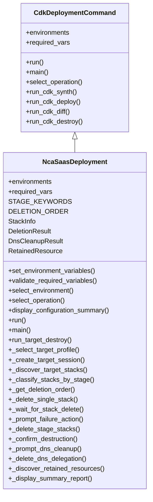
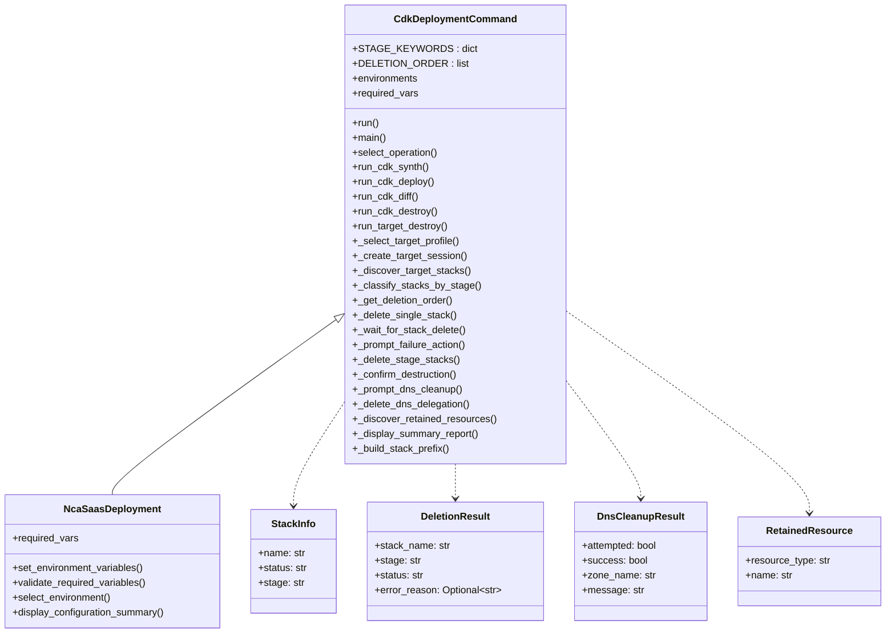

# Design Document: Extract Deployment to CdkFactory

## Overview

This feature extracts the cross-account target resource destruction logic from `Acme-SaaS-IaC/cdk/deploy.py` into the `CdkDeploymentCommand` base class in `cdk-factory/src/cdk_factory/commands/deployment_command.py`. After extraction, any project subclassing `CdkDeploymentCommand` inherits cross-account destroy, interactive failure handling, DNS cleanup, retained resource scanning, and summary reporting. The Acme SaaS `deploy.py` shrinks from ~1,177 lines to ~150 lines — a thin wrapper providing only project-specific configuration.

### Key Design Decisions

1. **Data models live in the deployment_command module** — `StackInfo`, `DeletionResult`, `DnsCleanupResult`, `RetainedResource` are defined alongside `EnvironmentConfig` in `deployment_command.py` so consumers import from a single module.
2. **Stage classification is configurable via class attributes** — `STAGE_KEYWORDS` and `DELETION_ORDER` are class-level attributes on `CdkDeploymentCommand`. Subclasses override them for project-specific stage naming.
3. **boto3/botocore become explicit dependencies** — They're already used transitively (via `boto3_assist` and `route53_delegation.py`) but must be declared in `pyproject.toml` for the new CloudFormation, S3, DynamoDB, Cognito, Route53, and ECR client calls.
4. **Hook methods for extensibility** — Methods like `_build_stack_prefix()` and `_get_retained_resource_checks()` allow subclasses to customize behavior without overriding the entire destroy flow.
5. **CLI arguments move to base `main()`** — The six cross-account destroy flags (`--destroy-target`, `--target-profile`, `--confirm-destroy`, `--skip-dns-cleanup`, `--stack-delete-timeout`, `--no-interactive-failures`) are added to the base `main()` method.

## Architecture

### Before Extraction



### After Extraction




## Components and Interfaces

### Method-by-Method Migration Map

The following table shows exactly what moves from `NcaSaasDeployment` (deploy.py) to `CdkDeploymentCommand` (deployment_command.py):

| Method / Artifact | Source (deploy.py) | Destination (deployment_command.py) | Notes |
|---|---|---|---|
| `StackInfo` dataclass | Module-level | Module-level export | No changes |
| `DeletionResult` dataclass | Module-level | Module-level export | No changes |
| `DnsCleanupResult` dataclass | Module-level | Module-level export | No changes |
| `RetainedResource` dataclass | Module-level | Module-level export | No changes |
| `STAGE_KEYWORDS` dict | Module-level constant | `CdkDeploymentCommand.STAGE_KEYWORDS` class attribute | Subclass-overridable |
| `DELETION_ORDER` list | Module-level constant | `CdkDeploymentCommand.DELETION_ORDER` class attribute | Subclass-overridable |
| `select_operation()` | Override in subclass | Override in base class | Adds destroy sub-menu |
| `run()` | Override in subclass | Modify base class | Adds destroy-target dispatch |
| `run_target_destroy()` | Subclass method | Base class method | Orchestrator — no changes |
| `_select_target_profile()` | Subclass method | Base class method | No changes |
| `_create_target_session()` | Subclass method | Base class method | No changes |
| `_discover_target_stacks()` | Subclass method | Base class method | No changes |
| `_classify_stacks_by_stage()` | Subclass method | Base class method | Uses `self.STAGE_KEYWORDS` |
| `_get_deletion_order()` | Subclass method | Base class method | Uses `self.DELETION_ORDER` |
| `_delete_single_stack()` | Subclass method | Base class method | No changes |
| `_wait_for_stack_delete()` | Subclass method | Base class method | No changes |
| `_prompt_failure_action()` | Subclass method | Base class method | No changes |
| `_delete_stage_stacks()` | Subclass method | Base class method | No changes |
| `_confirm_destruction()` | Subclass method | Base class method | No changes |
| `_prompt_dns_cleanup()` | Subclass method | Base class method | No changes |
| `_delete_dns_delegation()` | Subclass method | Base class method | No changes |
| `_discover_retained_resources()` | Subclass method | Base class method | No changes |
| `_display_summary_report()` | Subclass method | Base class method | No changes |
| `main()` | Override in subclass | Modify base class | Adds 6 CLI flags |

### What Stays in NcaSaasDeployment (Thin Wrapper)

After extraction, `NcaSaasDeployment` retains only project-specific behavior:

| Method | Purpose |
|---|---|
| `__init__()` | Calls `super().__init__(script_dir=Path(__file__).parent)` |
| `required_vars` property | Project-specific required env vars (8 vars including CODE_REPOSITORY_NAME, CODE_REPOSITORY_ARN) |
| `set_environment_variables()` | Loads env vars from deployment JSON: parameters, standard fields, code_repository, management account, config.json defaults, placeholder resolution |
| `validate_required_variables()` | Adds `<TODO>` placeholder detection on top of base validation |
| `select_environment()` | Shows deployment descriptions alongside names |
| `display_configuration_summary()` | Shows project-specific fields (Profile, Workload, etc.) |
| `load_env_file()` | Returns empty dict (env vars come from JSON, not .env files) |
| `STANDARD_ENV_VARS` | Class constant mapping JSON keys to env var names |

### New Hook Methods on CdkDeploymentCommand

To support extensibility without requiring subclasses to override large methods:

```python
def _build_stack_prefix(self, env_config: EnvironmentConfig) -> str:
    """Build the CloudFormation stack name prefix for discovery.
    
    Default: "{WORKLOAD_NAME}-{DEPLOYMENT_NAMESPACE}-"
    Subclasses override for different naming conventions.
    """
    workload_name = os.environ.get("WORKLOAD_NAME", "")
    deployment_namespace = os.environ.get("DEPLOYMENT_NAMESPACE", "")
    return f"{workload_name}-{deployment_namespace}-"
```

### Modified `select_operation()` in Base Class

The base class `select_operation()` gains the destroy sub-menu:

```python
def select_operation(self) -> str:
    ops = ["synth", "deploy", "diff", "destroy"]
    idx = self._interactive_select("Select operation:", ops)
    op = ops[idx]
    self._print(f"Using {op.upper()}...", "blue")
    
    if op != "destroy":
        return op
    
    # Destroy sub-menu
    destroy_options = ["Pipeline", "Target Resources"]
    idx = self._interactive_select("Select destroy target:", destroy_options)
    if idx == 0:
        self._print("Using PIPELINE destroy...", "blue")
        return "destroy"
    else:
        self._print("Using TARGET RESOURCES destroy...", "blue")
        return "destroy-target"
```

### Modified `run()` in Base Class

The base class `run()` adds dispatch for `destroy-target`:

```python
def run(self, config_file=None, environment_name=None, operation=None, dry_run=False):
    # ... existing env selection, env loading, config selection ...
    
    # If --destroy-target flag was set, force the operation
    if getattr(self, "_destroy_target", False):
        selected_op = "destroy-target"
    
    # For non-destroy operations, existing flow
    if selected_op not in ("destroy", "destroy-target"):
        # ... existing synth/deploy/diff flow ...
        return
    
    # Validate and display summary for destroy operations
    self.validate_required_variables()
    self.display_configuration_summary(selected_config)
    
    if dry_run:
        self._print("Dry run — skipping CDK execution.", "yellow")
        return
    
    if selected_op == "destroy-target":
        self.run_target_destroy(
            env_config=env_config,
            target_profile=getattr(self, "_target_profile", None),
            confirm_destroy=getattr(self, "_confirm_destroy", False),
            skip_dns_cleanup=getattr(self, "_skip_dns_cleanup", False),
            no_interactive_failures=getattr(self, "_no_interactive_failures", False),
            stack_delete_timeout=getattr(self, "_stack_delete_timeout", 1800),
        )
    elif selected_op == "destroy":
        self.run_cdk_destroy(selected_config)
```

### Modified `main()` in Base Class

The base class `main()` adds the six cross-account destroy CLI arguments:

```python
@classmethod
def main(cls) -> None:
    instance = cls()
    # ... existing parser setup ...
    
    # Cross-account destroy arguments
    parser.add_argument("--destroy-target", action="store_true")
    parser.add_argument("--target-profile", type=str, default=None)
    parser.add_argument("--confirm-destroy", action="store_true")
    parser.add_argument("--skip-dns-cleanup", action="store_true")
    parser.add_argument("--stack-delete-timeout", type=int, default=1800)
    parser.add_argument("--no-interactive-failures", action="store_true")
    
    args = parser.parse_args()
    
    # Store on instance for run() to access
    instance._destroy_target = args.destroy_target
    instance._target_profile = args.target_profile
    instance._confirm_destroy = args.confirm_destroy
    instance._skip_dns_cleanup = args.skip_dns_cleanup
    instance._stack_delete_timeout = args.stack_delete_timeout
    instance._no_interactive_failures = args.no_interactive_failures
    
    instance.run(...)
```

### Import Changes

**cdk-factory `deployment_command.py`** — new imports:
```python
import time
from typing import Any, Dict, List, Optional, Tuple

import boto3
from botocore.exceptions import ClientError, ProfileNotFound

from cdk_factory.utilities.route53_delegation import Route53Delegation
```

**Acme SaaS `deploy.py`** — simplified imports:
```python
import json
import os
import sys
from pathlib import Path
from typing import Dict, List, Tuple

from cdk_factory.commands.deployment_command import (
    CdkDeploymentCommand,
    EnvironmentConfig,
)
```

The subclass no longer needs `argparse`, `time`, `boto3`, `botocore`, `Route53Delegation`, or the data model imports.

### Dependency Changes

**`cdk-factory/pyproject.toml`** — add `boto3` and `botocore` as explicit dependencies:

```toml
dependencies = [
  "aws-lambda-powertools>=2.38.1",
  "aws-cdk-lib==2.202.0",
  "constructs",
  "boto3_assist>=0.10.0",
  "boto3",
  "botocore",
  "PyYAML",
  "cdk_nag",
  "jsonschema"
]
```

While `boto3` is already available transitively through `boto3_assist`, the base class now uses it directly for CloudFormation, S3, DynamoDB, Cognito, Route53, and ECR API calls. Making it explicit prevents breakage if `boto3_assist` changes its dependency chain.


## Data Models

All four dataclasses move from `deploy.py` to `deployment_command.py` with no structural changes:

```python
@dataclass
class StackInfo:
    """Represents a discovered CloudFormation stack."""
    name: str
    status: str
    stage: str  # classified stage: network, compute, queues, persistent-resources, unknown


@dataclass
class DeletionResult:
    """Result of a single stack deletion attempt."""
    stack_name: str
    stage: str
    status: str  # DELETE_COMPLETE, DELETE_FAILED, TIMEOUT, SKIPPED
    error_reason: Optional[str] = None


@dataclass
class DnsCleanupResult:
    """Result of DNS delegation cleanup."""
    attempted: bool
    success: bool
    zone_name: str
    message: str


@dataclass
class RetainedResource:
    """A resource that survived stack deletion."""
    resource_type: str  # "S3 Bucket", "DynamoDB Table", "Cognito User Pool",
                        # "Route53 Hosted Zone", "ECR Repository"
    name: str
```

These are exported from the module alongside `EnvironmentConfig`:

```python
from cdk_factory.commands.deployment_command import (
    CdkDeploymentCommand,
    EnvironmentConfig,
    StackInfo,
    DeletionResult,
    DnsCleanupResult,
    RetainedResource,
)
```

### Class Attributes (Constants)

`STAGE_KEYWORDS` and `DELETION_ORDER` become class attributes on `CdkDeploymentCommand`:

```python
class CdkDeploymentCommand:
    DEPLOYMENTS_DIR = "deployments"
    
    STAGE_KEYWORDS: dict = {
        "persistent-resources": ["dynamodb", "s3-", "cognito", "route53"],
        "queues": ["sqs"],
        "compute": ["lambda", "docker"],
        "network": ["api-gateway", "cloudfront"],
    }
    
    DELETION_ORDER: list = [
        "unknown", "network", "compute", "queues", "persistent-resources"
    ]
```

Subclasses override these for different stage naming:

```python
class MyProjectDeployment(CdkDeploymentCommand):
    STAGE_KEYWORDS = {
        "data": ["rds", "aurora", "dynamodb"],
        "compute": ["ecs", "fargate", "lambda"],
        "network": ["alb", "cloudfront", "api-gateway"],
    }
    DELETION_ORDER = ["unknown", "network", "compute", "data"]
```


## Correctness Properties

*A property is a characteristic or behavior that should hold true across all valid executions of a system — essentially, a formal statement about what the system should do. Properties serve as the bridge between human-readable specifications and machine-verifiable correctness guarantees.*

### Property 1: Stack classification respects active STAGE_KEYWORDS

*For any* STAGE_KEYWORDS mapping (dict of stage name → keyword list) and *for any* list of CloudFormation stack dicts with names formed as `{prefix}{suffix}`, calling `_classify_stacks_by_stage` SHALL assign each stack to the first stage whose keyword list contains a substring match against the lowercased suffix, or to `"unknown"` if no keyword matches. The classification SHALL use the instance's `STAGE_KEYWORDS` attribute (supporting subclass overrides), not a module-level constant.

**Validates: Requirements 2.3, 4.3, 4.4**

### Property 2: Deletion ordering follows active DELETION_ORDER

*For any* DELETION_ORDER list and *for any* classified stacks dict (mapping stage names to stack lists), calling `_get_deletion_order` SHALL return a list of `(stage_name, stacks)` tuples in the exact order specified by the instance's `DELETION_ORDER` attribute, including only stages that appear in both the classified dict and the DELETION_ORDER. Stages in the classified dict but not in DELETION_ORDER SHALL be excluded.

**Validates: Requirements 2.4, 4.5**

### Property 3: Summary report exit code correctness

*For any* list of `DeletionResult` objects and *for any* optional `DnsCleanupResult`, calling `_display_summary_report` SHALL return exit code 0 if and only if every `DeletionResult.status` equals `"DELETE_COMPLETE"` AND the `DnsCleanupResult` is either `None` or has `success=True`. Otherwise it SHALL return exit code 1.

**Validates: Requirements 9.5**

### Property 4: Summary report shows correct indicators for each result

*For any* list of `DeletionResult` objects, calling `_display_summary_report` SHALL include a `✓` indicator for each result with status `"DELETE_COMPLETE"` and a `✗` indicator for each result with a non-complete status, and each result's `stack_name` SHALL appear in the output.

**Validates: Requirements 9.1**


## Error Handling

### AWS API Errors

| Error | Source | Handling |
|---|---|---|
| `ProfileNotFound` | `boto3.Session(profile_name=...)` | Print error referencing `~/.aws/config` and `~/.aws/credentials`, `sys.exit(1)` |
| `ClientError("does not exist")` | `describe_stacks` during deletion | Treat as `DELETE_COMPLETE` (stack already gone) |
| `ClientError` (other) | Any CloudFormation call | Re-raise (unhandled) |
| Any exception | `delete_ns_records` (DNS cleanup) | Present interactive failure menu (Wait/Retry, Continue, Exit) |
| Any exception | Retained resource checks (S3, DynamoDB, Cognito, Route53, ECR) | Log warning via `_print(..., "yellow")`, continue checking other resource types |

### Timeout Handling

- Per-stack deletion timeout defaults to 1800 seconds (configurable via `--stack-delete-timeout`)
- When timeout is exceeded, `_wait_for_stack_delete` returns `("TIMEOUT", "Exceeded {timeout}s timeout")`
- Timeout triggers the same interactive failure menu as `DELETE_FAILED`

### Interactive Failure Handling

When a stack deletion or DNS cleanup fails, the user is presented with three options:

1. **Wait/Retry** — Pauses execution (user can fix the issue externally), then retries the same operation
2. **Continue** — Records the failure in results, moves to the next stack/operation
3. **Exit** — Stops all further operations, jumps to summary report with `partial=True`

When `--no-interactive-failures` is set, all failures auto-continue without prompting.

### Confirmation Safety

- `_confirm_destruction` requires the user to type the exact tenant name
- Mismatched input causes `sys.exit(1)` — no retry
- `--confirm-destroy` flag bypasses the prompt (for CI/CD pipelines)

## Testing Strategy

### Property-Based Tests (Hypothesis)

The project uses Python, so **Hypothesis** is the property-based testing library. Each property test runs a minimum of 100 iterations.

| Property | Test Description | Tag |
|---|---|---|
| Property 1 | Generate random STAGE_KEYWORDS dicts and stack name lists, verify classification correctness | `Feature: extract-deployment-to-cdk-factory, Property 1: Stack classification respects active STAGE_KEYWORDS` |
| Property 2 | Generate random DELETION_ORDER lists and classified stack dicts, verify ordering | `Feature: extract-deployment-to-cdk-factory, Property 2: Deletion ordering follows active DELETION_ORDER` |
| Property 3 | Generate random DeletionResult lists and optional DnsCleanupResult, verify exit code | `Feature: extract-deployment-to-cdk-factory, Property 3: Summary report exit code correctness` |
| Property 4 | Generate random DeletionResult lists, capture _print output, verify ✓/✗ indicators | `Feature: extract-deployment-to-cdk-factory, Property 4: Summary report shows correct indicators` |

### Unit Tests (Example-Based)

| Area | Tests |
|---|---|
| Data models | Verify all four dataclasses can be instantiated, have correct fields, and support default values |
| Class attributes | Verify default STAGE_KEYWORDS and DELETION_ORDER values match expected constants |
| Profile selection | Mock `_interactive_select` and `input()` — test default profile, custom profile, and CLI override paths |
| Session creation | Mock `boto3.Session` — test success and `ProfileNotFound` error |
| Destroy sub-menu | Mock `_interactive_select` — test Pipeline vs Target Resources selection |
| CLI arguments | Parse `--destroy-target`, `--target-profile`, `--confirm-destroy`, `--skip-dns-cleanup`, `--stack-delete-timeout`, `--no-interactive-failures` |
| Confirmation flow | Mock `input()` — test correct match, incorrect match, and `--confirm-destroy` bypass |
| DNS cleanup prompt | Test with/without route53 stacks, `--skip-dns-cleanup` bypass |
| Failure handling | Mock `_interactive_select` — test Wait/Retry, Continue, Exit paths and `--no-interactive-failures` auto-continue |

### Integration Tests (Mock-Based)

| Area | Tests |
|---|---|
| Stack discovery | Mock CloudFormation paginator — verify prefix filtering and status filtering |
| Stack deletion | Mock CloudFormation client — verify delete_stack call, polling, DELETE_IN_PROGRESS handling, "does not exist" handling |
| DNS delegation | Mock `Route53Delegation.delete_ns_records` — verify correct parameters from env vars |
| Retained resources | Mock S3, DynamoDB, Cognito, Route53, ECR clients — verify prefix/name matching and error resilience |
| End-to-end flow | Mock all AWS clients — verify `run_target_destroy` orchestrates the full flow correctly |

### Thin Wrapper Verification

| Test | Description |
|---|---|
| Method resolution | Verify `NcaSaasDeployment` does NOT define any destroy-related methods (they resolve to `CdkDeploymentCommand`) |
| Inheritance | Verify `NcaSaasDeployment` inherits `run_target_destroy`, `_delete_single_stack`, etc. from base class |
| Overrides only | Verify `NcaSaasDeployment` only overrides: `set_environment_variables`, `validate_required_variables`, `display_configuration_summary`, `select_environment`, `load_env_file`, `required_vars` |

