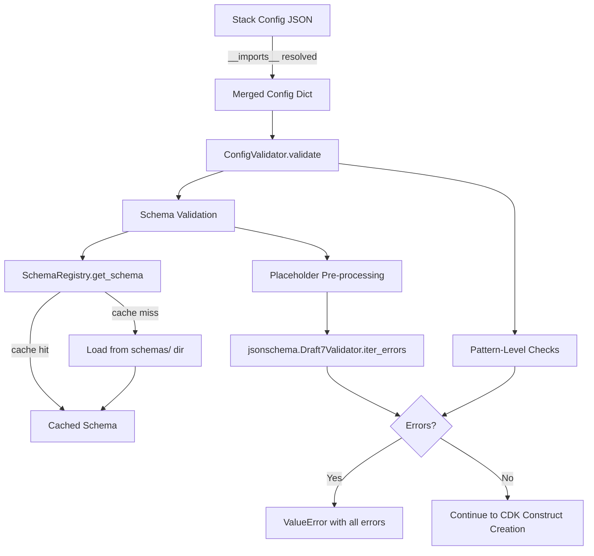

# Design Document: JSON Schema Validation

## Overview

This design adds JSON Schema-based validation to cdk-factory's config loading pipeline. Today, `configurations/config_validator.py` performs pattern-level checks (deprecated keys, structural rules) but cannot catch typos in field names, wrong types, or missing required properties inside resource blocks. A second, broken validator at `validation/config_validator.py` attempted JSON Schema validation but has import errors and is unused in production.

This design reconciles the two validators into a single `ConfigValidator` at `configurations/config_validator.py`, adds a `SchemaRegistry` that loads `.schema.json` files from a `schemas/` directory, and introduces a `SchemaValidator` that runs `jsonschema.validate()` with placeholder-aware type coercion. Validation runs on the merged config dict (after `__imports__`/`__inherits__` resolution) inside the existing `ConfigValidator.validate()` call in `WorkloadFactory.__build_stacks()` — before any CDK constructs are created.

### Key Design Decisions

1. **Single ConfigValidator** — Keep the existing `configurations/config_validator.py` as the canonical location. Delete `validation/config_validator.py`. The pattern-level checks remain as-is; schema validation is added as a new step in `validate()`.

2. **Placeholder handling via pre-processing** — Rather than customizing the jsonschema validator class, we pre-process the config dict before validation: any value matching `{{PLACEHOLDER}}` regex is replaced with a type-appropriate sentinel (e.g., `"__placeholder__"` for strings, `True` for booleans, `0` for integers). This keeps schema files standard JSON Schema with no custom keywords.

3. **Schemas as JSON files** — Stored in `src/cdk_factory/schemas/` as `common.schema.json`, `dynamodb.schema.json`, etc. Shipped as package data. Each schema validates only its resource block, not the full stack config.

4. **Opt-in strictness** — Schemas use `additionalProperties: true` to avoid breaking configs with fields the schema doesn't yet know about. Required fields are enforced. This lets schemas be adopted incrementally.

5. **All errors collected** — Uses `jsonschema.Draft7Validator` with `iter_errors()` to collect all validation errors in a single pass rather than failing on the first one.

## Architecture



### Validation Flow

1. `WorkloadFactory.__build_stacks()` calls `ConfigValidator.validate(stack.dictionary)` (existing call site — no change needed).
2. `ConfigValidator.validate()` runs existing pattern checks first.
3. `ConfigValidator.validate()` then calls `SchemaValidator.validate(config)`.
4. `SchemaValidator` asks `SchemaRegistry` for the common schema and the module-specific schema (keyed by the resource block name found in the config).
5. `SchemaValidator` pre-processes the config to replace `{{PLACEHOLDER}}` tokens with type-safe sentinels.
6. `SchemaValidator` validates the pre-processed config against the common schema, then validates the resource block against the module schema.
7. All errors (pattern + schema) are collected and raised as a single `ValueError`.

## Components and Interfaces

### SchemaRegistry

**Location:** `src/cdk_factory/configurations/schema_registry.py`

```python
class SchemaRegistry:
    """Loads, caches, and provides JSON schema definitions."""

    _cache: dict[str, dict] = {}

    @classmethod
    def get_schema(cls, schema_name: str) -> dict | None:
        """Return cached schema or load from schemas/ directory.
        
        Args:
            schema_name: e.g. "common", "dynamodb", "s3"
        Returns:
            Parsed JSON schema dict, or None if no schema file exists.
        """

    @classmethod
    def get_module_schema(cls, config: dict) -> tuple[str, dict] | None:
        """Detect the resource key in config and return (key, schema).
        
        Inspects config for known resource keys (dynamodb, bucket, sqs, etc.)
        and returns the matching schema.
        """

    @classmethod
    def clear_cache(cls) -> None:
        """Clear the schema cache (useful for testing)."""
```

**Schema file resolution:** `Path(__file__).parent.parent / "schemas" / f"{schema_name}.schema.json"`

**Known resource keys** (maps config key → schema file name):
| Config Key | Schema File | Resource Config Class |
|---|---|---|
| `dynamodb` | `dynamodb.schema.json` | `DynamoDBConfig` |
| `bucket` | `s3.schema.json` | `S3BucketConfig` |
| `api_gateway` | `api_gateway.schema.json` | (inline in stack) |
| `sqs` | `sqs.schema.json` | `SQS` |
| `cognito` | `cognito.schema.json` | `CognitoConfig` |
| `route53` | `route53.schema.json` | `Route53Config` |
| `monitoring` | `monitoring.schema.json` | `MonitoringConfig` |
| `state_machine` | `state_machine.schema.json` | `StepFunctionConfig` |
| `resources` | `lambda.schema.json` | `LambdaFunctionConfig` |

### SchemaValidator

**Location:** `src/cdk_factory/configurations/schema_validator.py`

```python
import re
from typing import Any
from jsonschema import Draft7Validator

PLACEHOLDER_RE = re.compile(r"\{\{[A-Z_][A-Z0-9_]*\}\}")

class SchemaValidator:
    """Validates config dicts against JSON schemas with placeholder awareness."""

    @staticmethod
    def validate(config: dict) -> list[str]:
        """Validate a stack config dict against common + module schemas.
        
        Returns:
            List of error message strings. Empty list means valid.
        """

    @staticmethod
    def _preprocess_for_placeholders(value: Any, schema_property: dict | None = None) -> Any:
        """Replace {{PLACEHOLDER}} tokens with type-appropriate sentinels.
        
        - String fields: leave as-is (placeholder is a valid string)
        - Boolean fields: replace with True
        - Integer fields: replace with 0
        - Nested dicts/arrays: recurse
        """

    @staticmethod
    def _format_error(error) -> str:
        """Format a jsonschema.ValidationError into a readable string.
        
        Includes: JSON path, error message, expected type/values.
        Example: "dynamodb.gsi_count: 'abc' is not of type 'integer' (expected: integer)"
        """
```

### ConfigValidator (Updated)

**Location:** `src/cdk_factory/configurations/config_validator.py` (existing file, extended)

```python
class ConfigValidator:
    """Validates stack config dicts against canonical patterns and JSON schemas."""

    # ... existing pattern checks unchanged ...

    @staticmethod
    def validate(stack_config: dict) -> None:
        """Run all validations on a stack config dict."""
        # Existing pattern checks
        ConfigValidator._validate_name_present(stack_config)
        ConfigValidator._validate_no_nested_ssm(stack_config)
        ConfigValidator._validate_no_ssm_enabled(stack_config)
        ConfigValidator._validate_no_deprecated_exists(stack_config)
        ConfigValidator._validate_single_dependency_key(stack_config)
        ConfigValidator._validate_use_existing_has_name(stack_config)
        ConfigValidator._validate_no_stack_name_key(stack_config)
        
        # NEW: Schema validation
        from cdk_factory.configurations.schema_validator import SchemaValidator
        errors = SchemaValidator.validate(stack_config)
        if errors:
            raise ValueError(
                f"Schema validation failed for stack '{stack_config.get('name', 'unknown')}':\n"
                + "\n".join(f"  - {e}" for e in errors)
            )
```

### Files to Delete

- `src/cdk_factory/validation/config_validator.py` — The old broken validator. Its useful ideas (JSON schema validation, schema loading from a directory) are incorporated into the new `SchemaValidator` and `SchemaRegistry`. The `SsmStandardValidator` and `ValidationResult` imports it used remain in `interfaces/standardized_ssm_mixin.py` and are not affected.

### Files to Update

- `tests/framework/factory_test_base.py` — Update import from `cdk_factory.validation.config_validator` to `cdk_factory.configurations.config_validator`.
- `tests/framework/ssm_integration_tester.py` — Same import update.
- `pyproject.toml` — Add `jsonschema` dependency.

## Data Models

### Common Stack Config Schema (`common.schema.json`)

```json
{
  "$schema": "http://json-schema.org/draft-07/schema#",
  "title": "Common Stack Config",
  "type": "object",
  "required": ["name", "module"],
  "properties": {
    "name": { "type": "string", "minLength": 1 },
    "module": { "type": "string", "minLength": 1 },
    "enabled": { "type": "boolean" },
    "description": { "type": "string" },
    "depends_on": {
      "type": "array",
      "items": { "type": "string" }
    },
    "ssm": {
      "type": "object",
      "properties": {
        "auto_export": { "type": "boolean" },
        "namespace": { "type": "string" },
        "imports": { "type": "object" }
      },
      "additionalProperties": true
    }
  },
  "additionalProperties": true
}
```

### Module Schema Example (`dynamodb.schema.json`)

```json
{
  "$schema": "http://json-schema.org/draft-07/schema#",
  "title": "DynamoDB Resource Config",
  "type": "object",
  "required": ["name"],
  "properties": {
    "name": { "type": "string", "minLength": 1 },
    "use_existing": { "type": ["boolean", "string"] },
    "gsi_count": { "type": "integer", "minimum": 0 },
    "replica_regions": {
      "type": "array",
      "items": { "type": "string" }
    },
    "enable_delete_protection": { "type": ["boolean", "string"] },
    "point_in_time_recovery": { "type": ["boolean", "string"] },
    "ttl_attribute": { "type": "string" },
    "global_secondary_indexes": {
      "type": "array",
      "items": { "type": "object" }
    }
  },
  "additionalProperties": true
}
```

### Placeholder Pre-processing Strategy

The pre-processor walks the config dict recursively. For each string value matching `{{[A-Z_][A-Z0-9_]*}}`:

1. If the schema expects `string` → leave as-is (it's a valid string).
2. If the schema expects `boolean` or `["boolean", "string"]` → leave as-is (the `"string"` union type accepts it).
3. If the schema expects `integer` → replace with `0`.
4. If no schema context is available → leave as-is.

Since most boolean fields in cdk-factory already accept `["boolean", "string"]` (the config classes do `str(value).lower() == "true"`), placeholders naturally pass validation for those fields. The main case requiring substitution is `integer` fields like `gsi_count`, `memory_size`, `timeout`.

### Schema File Naming Convention

| Schema File | Validates |
|---|---|
| `common.schema.json` | Top-level stack config fields |
| `dynamodb.schema.json` | `config["dynamodb"]` block |
| `s3.schema.json` | `config["bucket"]` block |
| `api_gateway.schema.json` | `config["api_gateway"]` block |
| `sqs.schema.json` | `config["sqs"]` block |
| `cognito.schema.json` | `config["cognito"]` block |
| `route53.schema.json` | `config["route53"]` block |
| `monitoring.schema.json` | `config["monitoring"]` block |
| `state_machine.schema.json` | `config["state_machine"]` block |
| `lambda.schema.json` | Each item in `config["resources"]` array |


## Correctness Properties

*A property is a characteristic or behavior that should hold true across all valid executions of a system — essentially, a formal statement about what the system should do. Properties serve as the bridge between human-readable specifications and machine-verifiable correctness guarantees.*

### Property 1: Valid config acceptance (no false rejections)

*For any* valid stack config dictionary that conforms to the expected shape for its module (correct types, required fields present, valid field names), the `SchemaValidator.validate()` method SHALL return an empty error list.

**Validates: Requirements 3.1, 3.2, 3.3, 3.4, 3.5, 3.6, 3.7, 4.1, 4.2, 4.3, 4.4, 4.5, 4.6, 4.7, 4.8, 4.9, 10.1**

### Property 2: Invalid config rejection (no false acceptances)

*For any* stack config dictionary with at least one invalid field type or missing required field (`name` or `module` at top level, `name` in resource blocks that require it), the `SchemaValidator.validate()` method SHALL return at least one error.

**Validates: Requirements 3.8, 3.9, 10.2**

### Property 3: Placeholder passthrough

*For any* valid stack config dictionary, if any string, boolean, or integer field value is replaced with a `{{PLACEHOLDER}}` token matching `\{\{[A-Z_][A-Z0-9_]*\}\}`, the `SchemaValidator.validate()` method SHALL still return an empty error list (the placeholder does not cause a type error).

**Validates: Requirements 5.1, 5.2, 5.3**

### Property 4: All errors collected

*For any* stack config dictionary containing N distinct schema violations (N ≥ 2), the `SchemaValidator.validate()` method SHALL return at least N error messages (it does not stop at the first error).

**Validates: Requirements 6.4, 7.4**

### Property 5: Error message completeness

*For any* schema validation error produced by `SchemaValidator`, the error message string SHALL contain the JSON path to the invalid field (e.g., `dynamodb.name`) and a description of what is wrong (e.g., type mismatch, missing required).

**Validates: Requirements 7.1, 7.2, 7.3**

### Property 6: Pattern validation backward compatibility

*For any* stack config dictionary that triggers one of the existing pattern-level violations (nested SSM, ssm.enabled, deprecated bucket.exists, both depends_on and dependencies, missing name, stack_name key, use_existing without name), `ConfigValidator.validate()` SHALL raise a `ValueError` with a message identifying the violation — unchanged from current behavior.

**Validates: Requirements 2.3**

### Property 7: Validation idempotence

*For any* stack config dictionary, calling `SchemaValidator.validate()` twice with the same input SHALL produce identical results (same errors in the same order).

**Validates: Requirements 10.3**

### Property 8: Schema caching

*For any* schema name, after the first call to `SchemaRegistry.get_schema(name)`, subsequent calls with the same name SHALL return the cached schema without re-reading the file from disk.

**Validates: Requirements 8.4, 9.2**

### Property 9: Validation performance

*For any* typical stack config dictionary (≤ 500 fields), `SchemaValidator.validate()` SHALL complete within 50 milliseconds.

**Validates: Requirements 9.1**

## Error Handling

### Validation Errors

- **Missing required fields** — `SchemaValidator` reports the field path and "is a required property". The `ConfigValidator` collects these into a `ValueError`.
- **Wrong types** — `SchemaValidator` reports the field path, the actual value, and the expected type(s). For union types like `["boolean", "string"]`, the message lists all accepted types.
- **Pattern violations** — Existing pattern checks in `ConfigValidator` raise `ValueError` immediately with prescriptive messages pointing to `MIGRATION.md`. These run before schema validation.
- **Missing schema file** — If no schema file exists for a module's resource key, `SchemaRegistry.get_schema()` returns `None` and `SchemaValidator` skips module-level validation (graceful degradation). Common schema validation still runs.
- **Malformed schema file** — If a `.schema.json` file contains invalid JSON, `SchemaRegistry` logs a warning and returns `None` for that schema. Validation continues with other schemas.
- **Multiple errors** — `SchemaValidator` uses `Draft7Validator.iter_errors()` to collect all errors in a single pass. All errors are joined into the `ValueError` message.

### Error Message Format

```
Schema validation failed for stack 'my-stack-name':
  - dynamodb.gsi_count: 'abc' is not of type 'integer'
  - 'name' is a required property
  - ssm.auto_export: 42 is not of type 'boolean'
```

## Testing Strategy

### Property-Based Tests (Hypothesis)

The project uses Python — we'll use [Hypothesis](https://hypothesis.readthedocs.io/) for property-based testing. Each property test runs a minimum of 100 iterations.

**Test configuration:**
- Library: `hypothesis`
- Min examples: 100 per property
- Each test tagged with: `Feature: json-schema-validation, Property {N}: {title}`

**Generators needed:**
- `valid_common_config()` — Generates dicts with valid `name` (non-empty string), `module` (non-empty string), optional `enabled` (bool), optional `description` (string), optional `depends_on` (list of strings), optional `ssm` (object).
- `valid_dynamodb_block()` — Generates dicts with valid DynamoDB fields matching the schema.
- `valid_s3_block()`, `valid_sqs_block()`, etc. — One generator per module schema.
- `invalid_config_mutator()` — Takes a valid config and introduces one or more type errors or removes required fields.
- `placeholder_injector()` — Takes a valid config and replaces random field values with `{{PLACEHOLDER}}` tokens.

**Property tests to implement:**
1. Property 1 (valid acceptance) — Generate valid configs for each module, validate, assert no errors.
2. Property 2 (invalid rejection) — Generate valid configs, mutate to introduce errors, validate, assert ≥ 1 error.
3. Property 3 (placeholder passthrough) — Generate valid configs, inject placeholders, validate, assert no errors.
4. Property 4 (all errors collected) — Generate configs with N known errors, validate, assert ≥ N errors returned.
5. Property 5 (error completeness) — Generate invalid configs, validate, assert each error contains a JSON path.
6. Property 6 (pattern backward compat) — Generate configs with pattern violations, validate, assert ValueError with correct message.
7. Property 7 (idempotence) — Generate random configs, validate twice, assert identical results.

### Unit Tests (pytest)

- Schema file existence for each module
- `SchemaRegistry.get_schema()` returns valid schema dicts
- `SchemaRegistry.get_module_schema()` correctly detects resource keys
- `SchemaRegistry.clear_cache()` works
- Specific error message format assertions
- Integration: `ConfigValidator.validate()` catches both pattern and schema errors
- Real-world config files from `Aplos-NCA-SaaS-IaC/cdk/configs/` pass validation

### Integration Tests

- End-to-end: load a real config JSON file through `JsonLoadingUtility`, pass merged result to `ConfigValidator.validate()`, assert no errors.
- Verify validation runs before CDK construct creation in `WorkloadFactory.__build_stacks()`.
