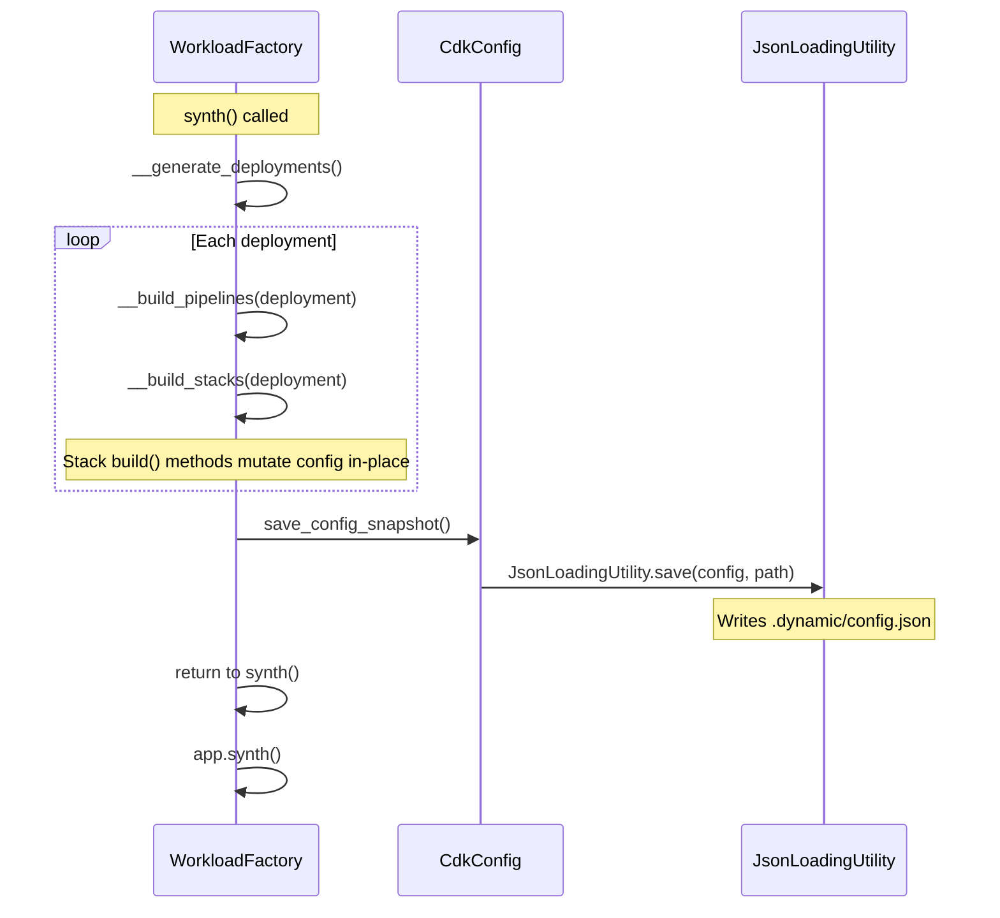

# Design Document: Post-Build Config Snapshot

## Overview

After `CdkConfig.__resolved_config()` saves `.dynamic/config.json`, stack `build()` methods mutate the config dict in-place (e.g., merging `additional_permissions` and `additional_environment_variables` into lambda resource entries). The on-disk snapshot becomes stale — it reflects the pre-build state, not the final resolved state.

This design adds a public `save_config_snapshot()` method to `CdkConfig` that re-saves the current in-memory `config` dict to the same `.dynamic/config.json` path. `WorkloadFactory` calls this method once after all deployments are processed, producing a post-build snapshot that captures runtime mutations.

### Key Design Decisions

1. **Reuse existing save infrastructure** — `save_config_snapshot()` uses the same `_resolved_config_file_path` and `JsonLoadingUtility.save()` that `__resolved_config` already uses. No new file paths or save mechanisms.

2. **Preserve cdk parameters section** — The method writes `config["cdk"]` as-is, consistent with how `__resolved_config` preserves the original `cdk` section after placeholder replacement. Since `save_config_snapshot()` saves the entire `self.config` dict (which already has the preserved `cdk` section from initial load), no special handling is needed.

3. **Guard against uninitialized state** — If `_resolved_config_file_path` is `None` (meaning `__resolved_config` was never called), the method raises `ValueError` rather than silently failing.

4. **Single call site** — `WorkloadFactory.__generate_deployments()` calls `save_config_snapshot()` once after the deployment loop completes, regardless of how many deployments ran or whether any were disabled.

5. **No impact on synthesis** — This is purely a debugging aid. The snapshot is written after all stacks are built but before `app.synth()` returns. It does not affect CDK output.

## Architecture



## Components and Interfaces

### CdkConfig.save_config_snapshot()

**Location:** `src/cdk_factory/configurations/cdk_config.py`

```python
def save_config_snapshot(self) -> None:
    """Re-save the current in-memory config to .dynamic/config.json.

    Call after all stack build() methods have run to capture
    post-mutation state (merged permissions, env vars, etc.).

    Raises:
        ValueError: If the dynamic config file path has not been
                    established (i.e., __resolved_config was not called).
    """
```

**Behavior:**
1. Check that `_resolved_config_file_path` is not `None`. If it is, raise `ValueError`.
2. Compute the `.dynamic/config.json` path using the same logic as `__resolved_config`: `os.path.join(Path(self._resolved_config_file_path).parent, ".dynamic", os.path.basename(self._resolved_config_file_path))`.
3. Call `JsonLoadingUtility.save(self.config, path)`.

**Note:** The save path computation is identical to `__resolved_config`. To avoid duplication, the path can be stored as an instance variable (`_dynamic_config_path`) during `__resolved_config` and reused in `save_config_snapshot()`.

### WorkloadFactory.__generate_deployments() (Updated)

**Location:** `src/cdk_factory/workload/workload_factory.py`

After the existing deployment loop completes, add a single call:

```python
print("📀 Saving post-build config snapshot")
self.cdk_config.save_config_snapshot()
```

This call is placed after the `for deployment in self.workload.deployments:` loop and before the final logger.info "Completed" message. It runs unconditionally — even if no deployments were found or all were disabled.

## Data Models

No new data models. The method operates on the existing `self.config: Dict[str, Any]` dictionary and writes it to the existing `.dynamic/config.json` path using the existing `JsonLoadingUtility.save()` static method.

### Instance Variable Addition

`CdkConfig` gains one new private instance variable:

| Variable | Type | Set By | Used By |
|---|---|---|---|
| `_dynamic_config_path` | `str \| None` | `__resolved_config()` | `save_config_snapshot()` |

This caches the computed `.dynamic/config.json` path so `save_config_snapshot()` doesn't need to recompute it.

## Error Handling

- **`_resolved_config_file_path` is None** — `save_config_snapshot()` raises `ValueError("Cannot save config snapshot: config file path has not been resolved. Ensure CdkConfig was initialized with a valid config path.")`.
- **File write failure** — `JsonLoadingUtility.save()` will raise the underlying `IOError`/`OSError` from `json.dump()`. No additional wrapping needed — this is an unexpected filesystem error.
- **Directory doesn't exist** — The `.dynamic/` directory is already created by `__resolved_config()` during initialization. If somehow missing, `JsonLoadingUtility.save()` will raise `FileNotFoundError`, which is appropriate since it indicates an abnormal state.

## Testing Strategy

### Why Property-Based Testing Does Not Apply

This feature is a side-effect-only operation: it writes an in-memory dict to a JSON file on disk. There are no pure functions with meaningful input variation, no transformations, no parsing, and no business logic that varies across a wide input space. The method either saves correctly or raises an error — there's no input domain to explore with randomized testing.

Unit tests with specific examples are the appropriate strategy.

### Unit Tests (pytest)

**Test file:** `tests/unit/test_config_snapshot.py`

1. **`test_save_config_snapshot_writes_file`** — Create a `CdkConfig` with a known config dict, call `save_config_snapshot()`, read the file back, assert it matches `config`.
2. **`test_save_config_snapshot_preserves_cdk_section`** — Create a config with a `cdk.parameters` section, mutate other parts of the dict, call `save_config_snapshot()`, assert the `cdk` section is present and unchanged.
3. **`test_save_config_snapshot_raises_without_resolved_path`** — Construct a `CdkConfig` where `_dynamic_config_path` is `None`, call `save_config_snapshot()`, assert `ValueError` is raised.
4. **`test_save_config_snapshot_overwrites_previous`** — Call `save_config_snapshot()` twice with different config states, assert the file reflects the second call's state (idempotent overwrite).
5. **`test_save_config_snapshot_captures_mutations`** — Load a config, simulate in-place mutations (like a stack build would do), call `save_config_snapshot()`, assert the file contains the mutated values.
