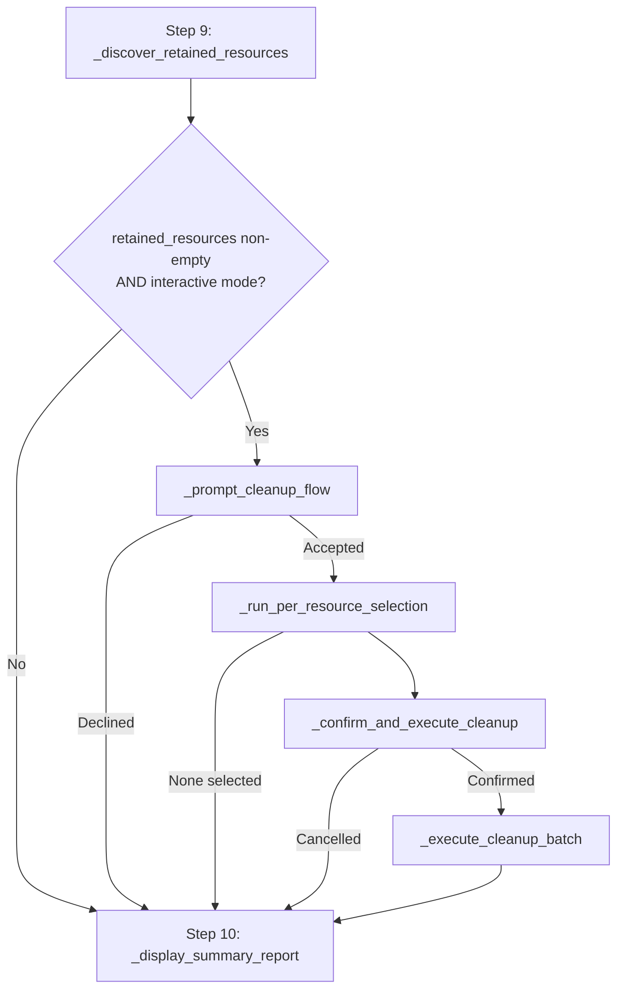
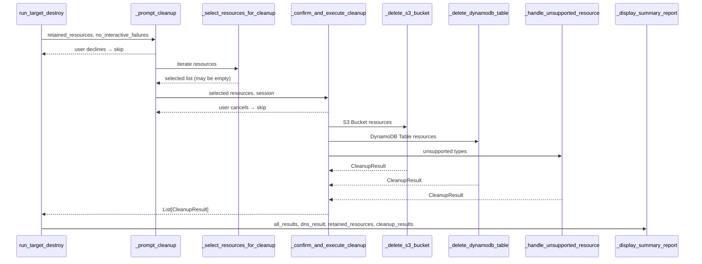

# Design Document: Retained Resource Cleanup

## Overview

This feature adds an interactive post-destruction cleanup flow to `CdkDeploymentCommand.run_target_destroy`. After the existing retained resource discovery (step 9), the system prompts the operator to review and optionally delete each retained resource before the final summary report (step 10).

The cleanup flow handles two supported resource types with full automated deletion (S3 Buckets, DynamoDB Tables) and gracefully reports unsupported types (Cognito User Pools, Route53 Hosted Zones, ECR Repositories) that require manual cleanup. Each deletion is individually error-isolated so a single failure never crashes the entire flow.

The design adds no new files — all new code lives in `deployment_command.py` as methods on `CdkDeploymentCommand` and a new `CleanupResult` dataclass alongside the existing `RetainedResource`.

## Architecture

The cleanup flow is a linear pipeline inserted between steps 9 and 10 of `run_target_destroy`:



All new methods are instance methods on `CdkDeploymentCommand`. The existing boto3 `session` from `run_target_destroy` is threaded through to all cleanup AWS API calls. No subclass changes are needed.

### Method Flow



## Components and Interfaces

### New Dataclass: `CleanupResult`

Defined alongside `RetainedResource` in `deployment_command.py`:

```python
@dataclass
class CleanupResult:
    """Result of a single resource cleanup attempt."""
    resource_type: str
    resource_name: str
    status: str  # "DELETED", "FAILED", "SKIPPED", "UNSUPPORTED"
    error_reason: Optional[str] = None
```

### New Methods on `CdkDeploymentCommand`

| Method | Purpose |
|--------|---------|
| `_prompt_cleanup(retained_resources, no_interactive_failures)` → `Optional[List[CleanupResult]]` | Top-level entry point. Prompts "Would you like to clean up retained resources? (y/N)". Returns `None` if skipped. |
| `_select_resources_for_cleanup(retained_resources)` → `List[RetainedResource]` | Iterates each resource, prompts "Delete {type} '{name}'? (y/N)", returns selected list. |
| `_confirm_and_execute_cleanup(selected, session)` → `List[CleanupResult]` | Shows batch summary, prompts "Proceed with deletion? (y/N)", dispatches to type-specific handlers. |
| `_delete_s3_bucket(session, bucket_name)` → `CleanupResult` | Empties all objects/versions via paginated `list_object_versions` + batch `delete_objects`, then calls `delete_bucket`. |
| `_delete_dynamodb_table(session, table_name)` → `CleanupResult` | Checks `DeletionProtectionEnabled` via `describe_table`. If enabled, prompts to disable. Then calls `delete_table`. |
| `_handle_unsupported_resource(resource)` → `CleanupResult` | Prints manual-deletion message, returns `UNSUPPORTED` status. |
| `_display_cleanup_summary(cleanup_results)` | Prints per-resource success/failure/skipped indicators. |

### Modified Methods

| Method | Change |
|--------|--------|
| `run_target_destroy` | Insert cleanup flow call between step 9 (retained resources) and step 10 (summary report). Pass `cleanup_results` to `_display_summary_report`. |
| `_display_summary_report` | Add optional `cleanup_results` parameter. Render cleanup summary section before the existing retained resources section. |

### Resource Type Dispatch

The `_confirm_and_execute_cleanup` method uses a simple dispatch dict:

```python
_CLEANUP_HANDLERS = {
    "S3 Bucket": self._delete_s3_bucket,
    "DynamoDB Table": self._delete_dynamodb_table,
}
```

Any resource type not in this dict routes to `_handle_unsupported_resource`.

## Data Models

### `CleanupResult` Dataclass

```python
@dataclass
class CleanupResult:
    resource_type: str       # e.g. "S3 Bucket", "DynamoDB Table"
    resource_name: str       # e.g. "my-workload-my-tenant-data-bucket"
    status: str              # "DELETED" | "FAILED" | "SKIPPED" | "UNSUPPORTED"
    error_reason: Optional[str] = None  # populated on FAILED
```

Status values:
- `DELETED` — resource was successfully removed
- `FAILED` — deletion was attempted but an error occurred (reason in `error_reason`)
- `SKIPPED` — user declined deletion or declined to disable DynamoDB deletion protection
- `UNSUPPORTED` — resource type has no automated handler

### `RetainedResource` (existing, unchanged)

```python
@dataclass
class RetainedResource:
    resource_type: str  # "S3 Bucket", "DynamoDB Table", "Cognito User Pool", etc.
    name: str
```

### User Input Parsing

All y/N prompts use the same logic: `response.strip().lower() in ("y", "yes")` → affirmative, everything else (including empty string) → negative. This matches the existing pattern used in `_prompt_dns_cleanup`.

### S3 Deletion Flow

```
1. Create s3 client from session
2. Paginate list_object_versions(Bucket=name)
3. For each page, batch delete_objects (up to 1000 per call)
   - Include both Versions and DeleteMarkers
4. Call delete_bucket(Bucket=name)
5. Return CleanupResult(status="DELETED")
On any exception → CleanupResult(status="FAILED", error_reason=str(e))
```

### DynamoDB Deletion Flow

```
1. Create dynamodb client from session
2. describe_table(TableName=name) → check DeletionProtectionEnabled
3. If protected:
   a. Prompt "Deletion protection is enabled on '{name}'. Disable and delete? (y/N)"
   b. If declined → CleanupResult(status="SKIPPED")
   c. If accepted → update_table(TableName=name, DeletionProtectionEnabled=False)
4. delete_table(TableName=name)
5. Return CleanupResult(status="DELETED")
On any exception → CleanupResult(status="FAILED", error_reason=str(e))
```

### Unsupported Resource Messages

| Resource Type | Message |
|---------------|---------|
| Cognito User Pool | "Automated deletion of Cognito User Pools is not currently supported. Please delete manually or open a GitHub issue." |
| Route53 Hosted Zone | "Automated deletion of Route53 Hosted Zones is not currently supported. Please delete manually or open a GitHub issue." |
| ECR Repository | "Automated deletion of ECR Repositories is not currently supported. Please delete manually or open a GitHub issue." |
| Any other type | "Automated deletion of {resource_type} is not currently supported. Please delete manually or open a GitHub issue/contribution." |


## Correctness Properties

*A property is a characteristic or behavior that should hold true across all valid executions of a system — essentially, a formal statement about what the system should do. Properties serve as the bridge between human-readable specifications and machine-verifiable correctness guarantees.*

### Property 1: Affirmative input acceptance

*For any* string that is a case variation of "y" or "yes" (e.g., "Y", "yEs", "YES", "Yes"), the y/N prompt parser SHALL return True (affirmative).

**Validates: Requirements 1.2, 2.3, 3.3**

### Property 2: Non-affirmative input rejection

*For any* string that is NOT a case-insensitive match for "y" or "yes" (including empty string, "n", "no", "maybe", arbitrary text), the y/N prompt parser SHALL return False (negative).

**Validates: Requirements 1.3, 2.4, 3.4**

### Property 3: S3 bucket emptying completeness

*For any* S3 bucket containing an arbitrary mix of object versions and delete markers (across multiple pages), after `_delete_s3_bucket` completes successfully, every version and delete marker SHALL have been included in a `delete_objects` call before `delete_bucket` is called.

**Validates: Requirements 4.1, 4.2**

### Property 4: Error isolation preserves remaining resource processing

*For any* list of retained resources selected for deletion, if an arbitrary subset of deletions raise exceptions, every resource in the list SHALL still receive a `CleanupResult`, and no unhandled exception SHALL propagate from the cleanup batch execution.

**Validates: Requirements 4.3, 5.6, 8.1, 8.2**

### Property 5: Unsupported resource type handling

*For any* resource type string that is not "S3 Bucket" or "DynamoDB Table", the cleanup handler SHALL return a `CleanupResult` with status `"UNSUPPORTED"` and the displayed message SHALL contain the resource type string.

**Validates: Requirements 6.4, 6.5**

### Property 6: Cleanup summary rendering correctness

*For any* list of `CleanupResult` entries with mixed statuses (DELETED, FAILED, SKIPPED, UNSUPPORTED), the cleanup summary output SHALL contain: a success indicator plus type and name for each DELETED result; a failure indicator plus type, name, and error_reason for each FAILED result; and a skipped indicator plus type and name for each SKIPPED or UNSUPPORTED result.

**Validates: Requirements 7.2, 7.3, 7.4**

## Error Handling

### Per-Resource Error Isolation

Every resource deletion is wrapped in a `try/except Exception` block. On failure:
1. The exception message is captured in `CleanupResult.error_reason`
2. The result status is set to `"FAILED"`
3. The error is printed via `self._print(f"  Error deleting {name}: {e}", "red")`
4. Processing continues to the next resource

This matches the existing pattern in `_delete_stage_stacks` where individual stack failures don't crash the loop.

### S3 Specific Errors

- `NoSuchBucket` during emptying → caught, result is FAILED
- `BucketNotEmpty` on `delete_bucket` (race condition) → caught, result is FAILED
- Pagination errors during `list_object_versions` → caught, result is FAILED

### DynamoDB Specific Errors

- `ResourceNotFoundException` on `describe_table` → caught, result is FAILED (table already gone)
- `ResourceInUseException` on `delete_table` → caught, result is FAILED
- Error during `update_table` (disable protection) → caught, result is FAILED

### Non-Interactive Mode

When `--no-interactive-failures` is set, `_prompt_cleanup` returns `None` immediately without prompting. This prevents the cleanup flow from blocking CI/CD pipelines that cannot provide interactive input.

## Testing Strategy

### Unit Tests (example-based)

| Test | Validates |
|------|-----------|
| Cleanup prompt shown when retained resources exist | 1.1 |
| Cleanup prompt skipped when no retained resources | 1.4 |
| Cleanup prompt skipped when aborted | 1.5 |
| All resources declined → "No resources selected" message | 2.5 |
| Batch confirmation prompt shown after selection | 3.1, 3.2 |
| DynamoDB: describe_table called before deletion | 5.1 |
| DynamoDB: protection enabled → prompt, confirm → disable + delete | 5.3 |
| DynamoDB: protection enabled → decline → SKIPPED | 5.4 |
| DynamoDB: no protection → direct delete | 5.5 |
| Cognito unsupported message | 6.1 |
| Route53 unsupported message | 6.2 |
| ECR unsupported message | 6.3 |
| Cleanup summary displayed after operations | 7.1 |
| Cleanup summary before destruction summary | 7.5 |
| Flow continues after failures | 8.3 |
| CleanupResult importable from module | 9.3 |
| Cleanup called between steps 9 and 10 | 10.1 |
| Cleanup results passed to summary report | 10.2 |
| --no-interactive-failures skips cleanup | 10.3 |
| Session reused from run_target_destroy | 10.4 |

### Property-Based Tests (hypothesis)

| Property | Min Iterations | Validates |
|----------|---------------|-----------|
| Property 1: Affirmative input acceptance | 100 | 1.2, 2.3, 3.3 |
| Property 2: Non-affirmative input rejection | 100 | 1.3, 2.4, 3.4 |
| Property 3: S3 bucket emptying completeness | 100 | 4.1, 4.2 |
| Property 4: Error isolation preserves remaining processing | 100 | 4.3, 5.6, 8.1, 8.2 |
| Property 5: Unsupported resource type handling | 100 | 6.4, 6.5 |
| Property 6: Cleanup summary rendering correctness | 100 | 7.2, 7.3, 7.4 |

Property-based testing library: **hypothesis** (already used in this project — `.hypothesis/` directory exists, and existing PBT tests use `from hypothesis import given, settings`).

Each property test will be tagged with a comment:
```python
# Feature: retained-resource-cleanup, Property {N}: {title}
```

Each test will use `@settings(max_examples=100)` minimum.

### Test File Location

All tests go in `cdk-factory/tests/unit/test_retained_resource_cleanup.py`, following the existing convention of one test file per feature in `tests/unit/`.
