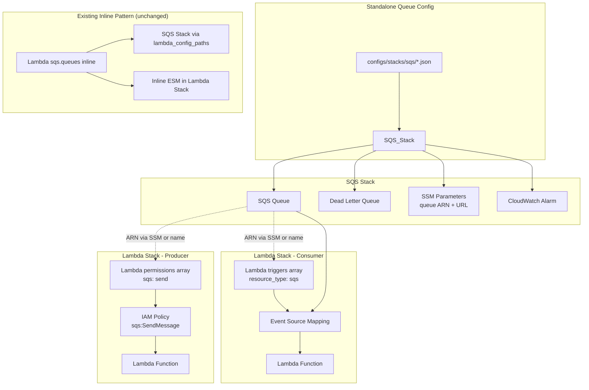

# Design Document: SQS Decoupled Triggers

## Overview

This feature introduces a decoupled SQS integration pattern for cdk-factory. Today, SQS queues are defined inline within Lambda consumer config files and discovered by a centralized `SQS_Stack` via `lambda_config_paths`. This tightly couples queue lifecycle to Lambda consumers.

The new pattern adds three capabilities:
1. **Standalone queue config files** — SQS queues defined in their own JSON files under `configs/stacks/sqs/`, loaded directly by `SQS_Stack`
2. **SQS trigger in Lambda triggers array** — `"resource_type": "sqs"` in a Lambda's `triggers` array creates an Event Source Mapping, wiring the Lambda as a consumer of an externally-defined queue
3. **Structured SQS send permission** — `{"sqs": "send", "queue_name": "..."}` in a Lambda's `permissions` array grants `sqs:SendMessage` without inline producer config

The existing inline pattern (v1) continues to work unchanged. Both patterns can coexist on the same Lambda.

## Architecture



### Key Design Decisions

1. **Queue ARN resolution without live AWS calls** — When a trigger or permission references a queue by name, the ARN is constructed deterministically: `arn:aws:sqs:{region}:{account}:{queue_name}`. When referenced by SSM path, `StringParameter.value_for_string_parameter()` produces a CloudFormation dynamic reference resolved at deploy time.

2. **Separation of concerns** — The SQS_Stack creates queues. The Lambda_Stack wires consumers (Event Source Mapping) and producers (IAM policy). No cross-stack CDK references needed; SSM parameters bridge the gap.

3. **Backward compatibility** — The inline pattern (`sqs.queues` inside Lambda configs) continues to work via `lambda_config_paths` discovery. The new trigger pattern is additive and uses the same `triggers` array mechanism as S3 and EventBridge triggers.

## Components and Interfaces

### 1. LambdaTriggersConfig (Modified)

**File:** `src/cdk_factory/configurations/resources/lambda_triggers.py`

New properties added to support `"resource_type": "sqs"` triggers:

```python
class LambdaTriggersConfig:
    # ... existing properties (name, resource_type, bucket_name, etc.) ...

    @property
    def queue_name(self) -> str:
        """SQS queue name for SQS triggers."""
        if self.__config and isinstance(self.__config, dict):
            return self.__config.get("queue_name", "")
        return ""

    @property
    def queue_ssm_path(self) -> str:
        """SSM parameter path to resolve queue ARN for SQS triggers."""
        if self.__config and isinstance(self.__config, dict):
            return self.__config.get("queue_ssm_path", "")
        return ""

    @property
    def batch_size(self) -> int:
        """Batch size for SQS event source mapping. Default: 1."""
        if self.__config and isinstance(self.__config, dict):
            return int(self.__config.get("batch_size", 1))
        return 1

    @property
    def max_batching_window_seconds(self) -> int:
        """Max batching window in seconds for SQS ESM. Default: 0."""
        if self.__config and isinstance(self.__config, dict):
            return int(self.__config.get("max_batching_window_seconds", 0))
        return 0
```

### 2. Lambda Stack — SQS Trigger Handler (New)

**File:** `src/cdk_factory/stack_library/aws_lambdas/lambda_stack.py`

New `__setup_sqs_trigger()` method and `"sqs"` case in the trigger routing block:

```python
# In the trigger routing block (existing):
elif trigger.resource_type.lower() == "sqs":
    self.__setup_sqs_trigger(
        trigger=trigger,
        lambda_function=lambda_function,
        function_name=f"{function_config.name}-{trigger_id}",
    )

# New method:
def __setup_sqs_trigger(
    self,
    trigger: LambdaTriggersConfig,
    lambda_function: _lambda.Function | _lambda.DockerImageFunction,
    function_name: str,
) -> None:
    """
    Set up an SQS queue event source trigger for a Lambda function.
    Imports an existing queue by ARN (constructed from name or resolved from SSM)
    and creates an EventSourceMapping with configured batch settings.
    """
    # Resolve queue ARN
    queue_arn: str = ""
    if trigger.queue_ssm_path:
        queue_arn = ssm.StringParameter.value_for_string_parameter(
            self, trigger.queue_ssm_path
        )
    elif trigger.queue_name:
        queue_name = self.deployment.build_resource_name(
            trigger.queue_name, ResourceTypes.SQS
        )
        queue_arn = (
            f"arn:aws:sqs:{self.deployment.region}"
            f":{self.deployment.account}:{queue_name}"
        )
    else:
        raise ValueError(
            f"SQS trigger on Lambda '{function_name}' requires either "
            "'queue_name' or 'queue_ssm_path'"
        )

    # Import queue by ARN (no live AWS call)
    queue = sqs.Queue.from_queue_arn(
        self,
        id=f"{function_name}-sqs-trigger",
        queue_arn=queue_arn,
    )

    # Create Event Source Mapping
    _lambda.EventSourceMapping(
        self,
        id=f"{function_name}-sqs-esm",
        target=lambda_function,
        event_source_arn=queue.queue_arn,
        batch_size=trigger.batch_size,
        max_batching_window=aws_cdk.Duration.seconds(
            trigger.max_batching_window_seconds
        ) if trigger.max_batching_window_seconds > 0 else None,
    )

    # Grant consume permissions
    lambda_function.add_to_role_policy(
        iam.PolicyStatement(
            actions=[
                "sqs:ReceiveMessage",
                "sqs:DeleteMessage",
                "sqs:GetQueueAttributes",
            ],
            resources=[queue.queue_arn],
        )
    )
```

### 3. Permission Builder — SQS Send (New)

**File:** `src/cdk_factory/constructs/lambdas/policies/policy_docs.py`

New `"sqs"` case in `_get_structured_permission()`:

```python
# SQS structured permissions
if "sqs" in permission:
    action = permission["sqs"]
    queue_name = permission.get("queue_name", "")
    queue_ssm_path = permission.get("queue_ssm_path", "")

    if not queue_name and not queue_ssm_path:
        raise ValueError(
            f"Structured SQS permission requires 'queue_name' or "
            f"'queue_ssm_path' field: {permission}"
        )

    resolver = self._get_resource_resolver()
    region = resolver.get_aws_region()
    account = resolver.get_aws_account()

    # Resolve queue ARN
    if queue_ssm_path:
        queue_arn = aws_cdk.aws_ssm.StringParameter.value_for_string_parameter(
            self.scope, queue_ssm_path
        )
        resources = [queue_arn]
    else:
        queue_arn = f"arn:aws:sqs:{region}:{account}:{queue_name}"
        resources = [queue_arn]

    action_map = {
        "send": {
            "actions": ["sqs:SendMessage"],
            "sid": "SqsSend",
            "description": "SQS Send Message",
        },
    }

    if action not in action_map:
        raise ValueError(
            f"Unknown SQS action '{action}'. Valid: {list(action_map.keys())}"
        )

    details = action_map[action]
    queue_slug = self._make_sid_slug(queue_name or queue_ssm_path)

    return {
        "name": "SQS",
        "description": f"{details['description']}: {queue_name or queue_ssm_path}",
        "sid": f"{details['sid']}{queue_slug}",
        "actions": details["actions"],
        "resources": resources,
        "nag": {
            "id": "AwsSolutions-IAM5",
            "reason": f"SQS {action} permission for queue: {queue_name or queue_ssm_path}",
            "resources": [f"Resource::{r}" for r in resources],
        },
    }
```

### 4. SQS Stack — Standalone Queue Config Loading (Modified)

**File:** `src/cdk_factory/stack_library/simple_queue_service/sqs_stack.py`

The `SQS_Stack._build()` method is extended to load standalone queue config files from a directory path specified in the stack config:

```python
def _build(self, stack_config, deployment, workload) -> None:
    # ... existing setup ...

    # Load standalone queue configs from directory (new)
    queue_config_dir = stack_config.dictionary.get("queue_config_dir", "")
    if queue_config_dir:
        standalone_configs = self._load_standalone_queue_configs(queue_config_dir)
        for config in standalone_configs:
            resolved = self._resolve_template_variables(config)
            queue_config = SQSConfig(resolved)
            if not queue_config.name:
                raise ValueError(
                    f"Standalone queue config is missing required 'name' field: "
                    f"{config}"
                )
            self.sqs_config.queues.append(queue_config)

    # ... existing queue processing loop (unchanged) ...
```

New helper methods:

```python
def _load_standalone_queue_configs(self, config_dir: str) -> list[dict]:
    """Load all JSON files from the standalone queue config directory."""
    configs = []
    dir_path = Path(config_dir)
    if dir_path.exists():
        for json_file in sorted(dir_path.glob("*.json")):
            with open(json_file, "r") as f:
                config = json.load(f)
                configs.append(config)
    return configs

def _resolve_template_variables(self, config: dict) -> dict:
    """Resolve template variables like {{WORKLOAD_NAME}} in config values."""
    variables = {
        "WORKLOAD_NAME": self.deployment.workload_name,
        "DEPLOYMENT_NAMESPACE": self.deployment.environment,
    }
    config_str = json.dumps(config)
    for key, value in variables.items():
        config_str = config_str.replace(f"{{{{{key}}}}}", value)
    return json.loads(config_str)
```

### 5. Standalone Queue Config Schema

**Location:** `configs/stacks/sqs/{queue-name}.json`

```json
{
  "name": "{{WORKLOAD_NAME}}-{{DEPLOYMENT_NAMESPACE}}-my-queue",
  "description": "Purpose of this queue",
  "type": "standard",
  "visibility_timeout_seconds": 60,
  "message_retention_period_days": 7,
  "delay_seconds": 0,
  "dead_letter_queue": {
    "name": "{{WORKLOAD_NAME}}-{{DEPLOYMENT_NAMESPACE}}-my-queue-dlq",
    "max_receive_count": 5,
    "message_retention_period_days": 14
  },
  "ssm_parameters": {
    "namespace": "my-app/{{DEPLOYMENT_NAMESPACE}}/sqs"
  }
}
```

For FIFO queues:
```json
{
  "name": "{{WORKLOAD_NAME}}-{{DEPLOYMENT_NAMESPACE}}-my-queue.fifo",
  "type": "fifo",
  "visibility_timeout_seconds": 30,
  "message_retention_period_days": 4
}
```

### 6. Lambda Config — Consumer Example

```json
{
  "name": "my-consumer-lambda",
  "triggers": [
    {
      "name": "queue-consumer",
      "resource_type": "sqs",
      "queue_name": "{{WORKLOAD_NAME}}-{{DEPLOYMENT_NAMESPACE}}-my-queue",
      "batch_size": 5,
      "max_batching_window_seconds": 30
    }
  ]
}
```

### 7. Lambda Config — Producer Example

```json
{
  "name": "my-producer-lambda",
  "permissions": [
    {
      "sqs": "send",
      "queue_name": "{{WORKLOAD_NAME}}-{{DEPLOYMENT_NAMESPACE}}-my-queue"
    }
  ]
}
```

## Data Models

### Standalone Queue Config (Input Schema)

| Field | Type | Required | Default | Description |
|-------|------|----------|---------|-------------|
| `name` | string | Yes | — | Queue name (supports template variables) |
| `description` | string | No | "" | Human-readable description |
| `type` | string | No | "standard" | "standard" or "fifo" |
| `visibility_timeout_seconds` | int | No | 30 | Message invisibility timeout |
| `message_retention_period_days` | int | No | 4 | How long messages are retained |
| `delay_seconds` | int | No | 0 | Delivery delay |
| `dead_letter_queue` | object | No | null | DLQ configuration |
| `dead_letter_queue.name` | string | Yes (if DLQ) | — | DLQ queue name |
| `dead_letter_queue.max_receive_count` | int | No | 5 | Retries before DLQ |
| `dead_letter_queue.message_retention_period_days` | int | No | 14 | DLQ retention |
| `ssm_parameters` | object | No | null | SSM export configuration |
| `ssm_parameters.namespace` | string | Yes (if SSM) | — | SSM path prefix |

### SQS Trigger Config (in Lambda triggers array)

| Field | Type | Required | Default | Description |
|-------|------|----------|---------|-------------|
| `name` | string | No | "" | Trigger name (for reference) |
| `resource_type` | string | Yes | — | Must be `"sqs"` |
| `queue_name` | string | Conditional | "" | Queue name (mutually exclusive with queue_ssm_path) |
| `queue_ssm_path` | string | Conditional | "" | SSM path to queue ARN |
| `batch_size` | int | No | 1 | Messages per batch (1–10000) |
| `max_batching_window_seconds` | int | No | 0 | Batching window (0–300) |

### SQS Send Permission (in Lambda permissions array)

| Field | Type | Required | Default | Description |
|-------|------|----------|---------|-------------|
| `sqs` | string | Yes | — | Must be `"send"` |
| `queue_name` | string | Conditional | "" | Queue name |
| `queue_ssm_path` | string | Conditional | "" | SSM path to queue ARN |

## Correctness Properties

*A property is a characteristic or behavior that should hold true across all valid executions of a system — essentially, a formal statement about what the system should do. Properties serve as the bridge between human-readable specifications and machine-verifiable correctness guarantees.*

### Property 1: LambdaTriggersConfig property round-trip

*For any* valid config dictionary containing SQS-related keys (`queue_name`, `queue_ssm_path`, `batch_size`, `max_batching_window_seconds`), constructing a `LambdaTriggersConfig` and reading the corresponding properties SHALL return the exact configured values. For missing keys, defaults SHALL be returned (`""` for strings, `1` for batch_size, `0` for max_batching_window_seconds).

**Validates: Requirements 5.1, 5.2, 5.3, 5.4**

### Property 2: Queue ARN construction

*For any* valid queue name, AWS region, and AWS account ID, the constructed queue ARN SHALL equal `arn:aws:sqs:{region}:{account}:{queue_name}`. This applies to both the SQS trigger handler and the SQS send permission builder.

**Validates: Requirements 2.2, 3.2**

### Property 3: SQS trigger Event Source Mapping configuration

*For any* valid SQS trigger config with a resolvable queue reference and valid batch settings, the synthesized CloudFormation template SHALL contain an EventSourceMapping resource with `BatchSize` matching the configured `batch_size` and `MaximumBatchingWindowInSeconds` matching the configured `max_batching_window_seconds`.

**Validates: Requirements 2.1, 2.4, 2.5**

### Property 4: SQS trigger grants consume permissions

*For any* Lambda function with an SQS trigger, the synthesized CloudFormation template SHALL include an IAM policy statement granting `sqs:ReceiveMessage`, `sqs:DeleteMessage`, and `sqs:GetQueueAttributes` on the referenced queue ARN.

**Validates: Requirements 2.6**

### Property 5: SQS send permission grants SendMessage

*For any* structured permission with `"sqs": "send"` and a valid queue identifier, the permission builder SHALL return a policy containing the `sqs:SendMessage` action targeting the resolved queue ARN.

**Validates: Requirements 3.1**

### Property 6: TLS policy invariant

*For any* queue created by the SQS_Stack (whether from standalone config or inline discovery), the synthesized CloudFormation template SHALL include an SQS queue policy enforcing TLS (denying requests where `aws:SecureTransport` is `false`).

**Validates: Requirements 1.4**

### Property 7: DLQ alarm invariant

*For any* queue configuration that specifies `add_dead_letter_queue: true` (or includes a `dead_letter_queue` object), the synthesized CloudFormation template SHALL contain a CloudWatch Alarm targeting the DLQ's `ApproximateNumberOfMessagesVisible` metric.

**Validates: Requirements 1.5**

### Property 8: Missing name validation

*For any* standalone queue config dictionary that omits the `name` field or provides an empty string for `name`, the SQS_Stack SHALL raise a `ValueError` during synthesis.

**Validates: Requirements 1.6**

### Property 9: FIFO suffix enforcement

*For any* queue configuration where `type` is `"fifo"`, the physical queue name used in CloudFormation SHALL end with the `.fifo` suffix.

**Validates: Requirements 6.2**

### Property 10: Template variable resolution

*For any* standalone queue config containing template variables (`{{WORKLOAD_NAME}}`, `{{DEPLOYMENT_NAMESPACE}}`), after resolution all occurrences SHALL be replaced with the deployment's actual workload name and environment values, and no unresolved `{{...}}` placeholders SHALL remain in the output.

**Validates: Requirements 6.4**

## Error Handling

| Scenario | Behavior | Error Type |
|----------|----------|------------|
| SQS trigger missing both `queue_name` and `queue_ssm_path` | Raise during synthesis | `ValueError` |
| SQS send permission missing both identifiers | Raise during synthesis | `ValueError` |
| Standalone queue config missing `name` | Raise during synthesis | `ValueError` |
| Unknown SQS permission action (not "send") | Raise during synthesis | `ValueError` |
| Invalid batch_size (non-integer) | Raise during config parsing | `ValueError` |
| Standalone queue config directory doesn't exist | Silently skip (no queues loaded) | None |
| Template variable not recognized | Left as-is in string (no error) | None |

All validation errors are raised at synthesis time, ensuring fast feedback before any deployment attempt.

## Testing Strategy

### Unit Tests

**Config model tests** (`tests/unit/test_lambda_triggers_config.py`):
- `LambdaTriggersConfig.queue_name` returns correct value
- `LambdaTriggersConfig.queue_ssm_path` returns correct value
- `LambdaTriggersConfig.batch_size` returns configured value and default
- `LambdaTriggersConfig.max_batching_window_seconds` returns configured value and default
- Empty/missing config dict returns defaults

**Permission builder tests** (`tests/unit/test_policy_docs_sqs.py`):
- `{"sqs": "send", "queue_name": "..."}` produces correct IAM actions and ARN
- `{"sqs": "send", "queue_ssm_path": "..."}` uses CDK token resolution
- Missing queue identifier raises `ValueError`
- Unknown SQS action raises `ValueError`

**Validation tests** (`tests/unit/test_sqs_validation.py`):
- Missing name in standalone config raises error
- SQS trigger without queue reference raises error

### Property-Based Tests

**Library:** [Hypothesis](https://hypothesis.readthedocs.io/) (Python)

Each property test runs a minimum of 100 iterations and is tagged with its design property reference.

| Property | Test File | Strategy |
|----------|-----------|----------|
| Property 1 | `tests/properties/test_lambda_triggers_config_props.py` | Generate random config dicts, verify property round-trip |
| Property 2 | `tests/properties/test_arn_construction_props.py` | Generate random (name, region, account) tuples, verify ARN format |
| Property 5 | `tests/properties/test_permission_builder_props.py` | Generate random queue names, verify SendMessage action in output |
| Property 8 | `tests/properties/test_sqs_validation_props.py` | Generate configs without name, verify ValueError |
| Property 10 | `tests/properties/test_template_resolution_props.py` | Generate random workload/namespace strings, verify resolution |

**Tag format:** `# Feature: sqs-decoupled-triggers, Property {N}: {description}`

### Synthesis Tests

**CDK synthesis tests** (`tests/unit/test_sqs_trigger_synth.py`):
- Synthesize a Lambda stack with SQS trigger, assert EventSourceMapping in template
- Synthesize a Lambda stack with SQS send permission, assert IAM policy in template
- Synthesize SQS_Stack with standalone config, assert queue + DLQ + alarm + SSM in template
- Synthesize with both inline and trigger patterns on same Lambda, assert no conflicts

### Integration Tests

- Existing inline configs continue to synthesize identically (regression)
- `lambda_config_paths` discovery still works with existing configs
- Both inline and decoupled patterns on the same Lambda produce valid CF
