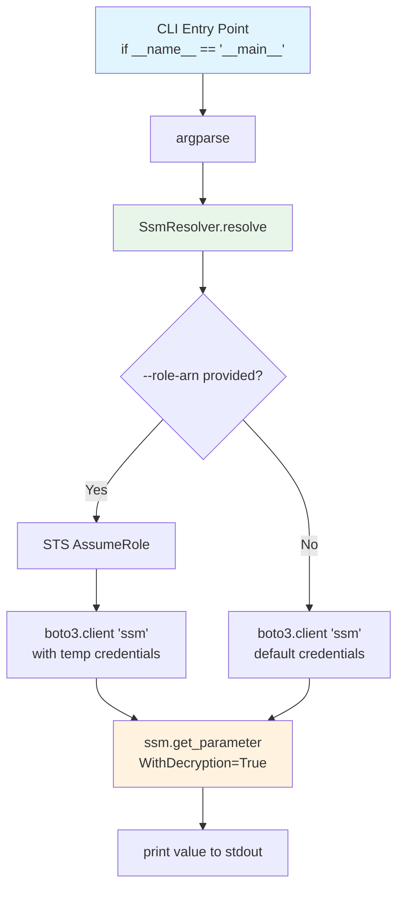

# Design Document: SSM Parameter Resolver CLI

## Overview

A generic, reusable CLI utility (`cdk_factory.utilities.ssm_resolver`) that resolves AWS SSM Parameter Store values and prints them to stdout. It supports optional cross-account role assumption via STS and optional region override, enabling pipeline scripts to replace multi-line bash credential juggling with a clean one-liner like:

```bash
export VAR=$(python -m cdk_factory.utilities.ssm_resolver --parameter-name "/path" --role-arn "arn:...")
```

The utility follows the same cross-account client pattern established by `route53_delegation.py`, is importable as a library, and directs all diagnostic output to stderr so stdout remains clean for shell command substitution.

## Architecture

The module lives at `cdk_factory/utilities/ssm_resolver.py` — a single file containing both the library class and the CLI entry point, mirroring the structure of `route53_delegation.py`.



### Data Flow

1. CLI parses `--parameter-name` (required), `--role-arn` (optional), `--region` (optional)
2. `SsmResolver._get_client("ssm", role_arn, region)` creates a boto3 SSM client — assuming a role first if `role_arn` is provided
3. `ssm.get_parameter(Name=parameter_name, WithDecryption=True)` retrieves the value
4. The resolved value is printed to stdout via `print()`; all logging goes to stderr
5. Exit code 0 on success, 1 on any failure

## Components and Interfaces

### SsmResolver Class

```python
class SsmResolver:
    """Resolves AWS SSM Parameter Store values, optionally via cross-account role assumption."""

    def _get_client(self, service: str, role_arn: str | None = None, region: str | None = None) -> boto3.client:
        """
        Create a boto3 client for the given service.
        If role_arn is provided, assumes the role via STS first.
        If region is provided, the client targets that region.
        Mirrors the pattern in Route53Delegation._get_client.
        """
        ...

    def resolve(self, parameter_name: str, role_arn: str | None = None, region: str | None = None) -> str:
        """
        Resolve an SSM parameter value by name.

        Args:
            parameter_name: The SSM parameter path (e.g., "/aplos-nca-saas/beta/route53/hosted-zone-id")
            role_arn: Optional IAM role ARN for cross-account access
            region: Optional AWS region override

        Returns:
            The parameter value as a string.

        Raises:
            SystemExit: On ParameterNotFound, STS failure, or unexpected AWS errors.
        """
        ...
```

### CLI Entry Point (`main()`)

```python
def main() -> None:
    """CLI entry point. Parses args, resolves parameter, prints to stdout."""
    ...

if __name__ == "__main__":
    main()
```

### Public API Summary

| Component | Type | Purpose |
|---|---|---|
| `SsmResolver` | Class | Library-level SSM resolution with optional cross-account support |
| `SsmResolver.resolve()` | Method | Core resolve logic — returns the parameter value as a string |
| `SsmResolver._get_client()` | Method | Creates boto3 client with optional STS role assumption |
| `main()` | Function | CLI entry point — argparse, resolve, print to stdout |

### CLI Arguments

| Argument | Required | Description |
|---|---|---|
| `--parameter-name` | Yes | SSM parameter path to resolve |
| `--role-arn` | No | IAM role ARN for cross-account STS assumption |
| `--region` | No | AWS region for the SSM API call |

## Data Models

This utility is stateless and does not persist data. The key data structures are:

### Input (CLI Arguments)

```python
@dataclass
class ResolverArgs:
    parameter_name: str       # Required: SSM parameter path
    role_arn: str | None      # Optional: IAM role ARN for cross-account
    region: str | None        # Optional: AWS region override
```

> Note: This is a conceptual model — the actual implementation uses `argparse.Namespace` directly, consistent with the existing `commandline_args.py` pattern.

### Output

- **stdout**: The raw parameter value string (no formatting, no trailing whitespace beyond `print()` default)
- **stderr**: All log messages, warnings, and error messages
- **Exit code**: `0` on success, `1` on failure

### Error Context

All error messages include the parameter name for pipeline log traceability, following the pattern:

```
ERROR: SSM parameter not found: /aplos-nca-saas/beta/route53/hosted-zone-id
```


## Correctness Properties

*A property is a characteristic or behavior that should hold true across all valid executions of a system — essentially, a formal statement about what the system should do. Properties serve as the bridge between human-readable specifications and machine-verifiable correctness guarantees.*

### Property 1: Resolve value round-trip (stdout purity)

*For any* valid SSM parameter name and *for any* string value stored in that parameter, when the resolver succeeds, stdout SHALL contain exactly that value and nothing else — no labels, no formatting, no extra whitespace — and all diagnostic output SHALL appear only on stderr.

**Validates: Requirements 1.1, 1.3, 1.4, 7.2, 7.3**

### Property 2: Cross-account role assumption is triggered by --role-arn

*For any* valid IAM role ARN string and *for any* parameter name, when `--role-arn` is provided, the resolver SHALL call STS `AssumeRole` with that ARN and a session name prefixed with `ssm-resolver` before making the SSM `GetParameter` call.

**Validates: Requirements 2.1, 2.3**

### Property 3: Parameter-not-found error includes parameter name

*For any* parameter name that does not exist in SSM, the resolver SHALL exit with code 1 and the stderr output SHALL contain the parameter name.

**Validates: Requirements 4.1, 4.4**

### Property 4: STS failure error includes parameter name

*For any* role ARN that causes an STS `AssumeRole` failure and *for any* parameter name, the resolver SHALL exit with code 1 and the stderr output SHALL contain the parameter name.

**Validates: Requirements 4.2, 4.4**

## Error Handling

### Error Categories and Behavior

| Error Condition | Source | stderr Message | Exit Code |
|---|---|---|---|
| Missing `--parameter-name` | argparse | Usage error (argparse default) | 2 (argparse default) |
| SSM `ParameterNotFound` | `botocore.exceptions.ClientError` | `ERROR: SSM parameter not found: {parameter_name}` | 1 |
| STS `AssumeRole` failure | `botocore.exceptions.ClientError` | `ERROR: Failed to assume role {role_arn} for parameter {parameter_name}: {error}` | 1 |
| Unexpected AWS API error | `botocore.exceptions.ClientError` | `ERROR: Failed to resolve parameter {parameter_name}: {error}` | 1 |
| Unexpected exception | `Exception` | `ERROR: Unexpected error resolving {parameter_name}: {error}` | 1 |

### Error Handling Strategy

- **argparse errors**: Handled automatically by argparse — prints usage to stderr, exits with code 2. No custom handling needed.
- **AWS ClientError**: Caught in `resolve()`. The error code is inspected to provide specific messages for `ParameterNotFound` vs. generic AWS errors. The parameter name is always included.
- **STS errors**: Caught in `_get_client()` when assuming a role. Re-raised or wrapped with context so `resolve()` can include the parameter name in the message.
- **All errors print to stderr**: Using `print(..., file=sys.stderr)` consistent with the `route53_delegation.py` pattern.
- **Logging**: `logging.basicConfig` configured with `stream=sys.stderr` in `main()` so any `logger.info/warning` calls go to stderr.

## Testing Strategy

### Unit Tests (pytest + unittest.mock)

Unit tests follow the existing pattern in `test_route53_delegation.py` — mock boto3 clients and verify behavior:

| Test | Validates |
|---|---|
| Happy path: resolve with ambient credentials | Req 1.1, 2.2, 7.1 |
| Happy path: resolve with cross-account role | Req 2.1, 2.3 |
| WithDecryption=True is always passed | Req 1.2 |
| `--region` is forwarded to boto3 client | Req 3.3 |
| Default region when `--region` omitted | Req 3.4 |
| Missing `--parameter-name` exits non-zero | Req 3.5 |
| ParameterNotFound exits 1 with message | Req 4.1 |
| STS failure exits 1 with message | Req 4.2 |
| Unexpected ClientError exits 1 | Req 4.3 |
| Library import and programmatic call | Req 6.2 |
| Module invocation via `python -m` | Req 5.1, 5.2, 5.3 |

### Property-Based Tests (Hypothesis)

The project uses Python 3.10+ and pytest. [Hypothesis](https://hypothesis.readthedocs.io/) is the standard PBT library for Python.

Each property test runs a minimum of 100 iterations with generated inputs and mocked AWS clients.

| Property Test | Design Property | Tag |
|---|---|---|
| Stdout contains exactly the resolved value | Property 1 | `Feature: ssm-parameter-resolver-cli, Property 1: Resolve value round-trip` |
| STS AssumeRole called when role_arn provided | Property 2 | `Feature: ssm-parameter-resolver-cli, Property 2: Cross-account role assumption` |
| ParameterNotFound error contains param name | Property 3 | `Feature: ssm-parameter-resolver-cli, Property 3: Parameter-not-found error includes parameter name` |
| STS failure error contains param name | Property 4 | `Feature: ssm-parameter-resolver-cli, Property 4: STS failure error includes parameter name` |

### Test Configuration

- **Framework**: pytest (already configured in `pyproject.toml`)
- **PBT Library**: Hypothesis (to be added as a dev dependency)
- **Mocking**: `unittest.mock.patch` / `MagicMock` (consistent with existing tests)
- **Test location**: `cdk-factory/tests/unit/test_ssm_resolver.py`
- **Minimum PBT iterations**: 100 per property (`@settings(max_examples=100)`)
