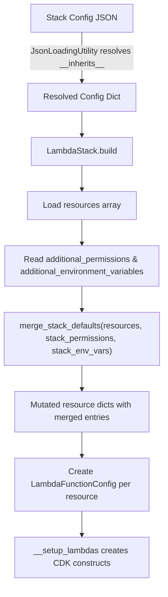

# Design Document: Stack-Level Lambda Defaults

## Overview

This feature adds two optional fields — `additional_permissions` and `additional_environment_variables` — to the root of a Lambda stack config JSON. When present, these fields are merged into every resource config dict in the `resources` array during `LambdaStack.build()`, before `LambdaFunctionConfig` objects are instantiated.

The merge is a pure dict/list operation: iterate each resource dict, append stack-level entries that don't already exist at the resource level. Resource-level entries always take precedence. The merge function is extracted as a standalone, testable utility so it can be validated with property-based tests independent of CDK.

## Architecture

The feature introduces a single merge step in the `LambdaStack.build()` method. No new classes or modules are required beyond a small utility function.



The merge happens at the raw dict level — before `LambdaFunctionConfig` is instantiated — so the rest of the pipeline (policy generation, environment loading) sees the merged config transparently.

## Components and Interfaces

### 1. Merge Utility Functions

A new module `cdk_factory/utilities/merge_defaults.py` containing two pure functions:

```python
def merge_permissions(
    resource_permissions: list[dict | str],
    stack_permissions: list[dict | str],
) -> list[dict | str]:
    """Return resource_permissions + stack_permissions entries that don't match any resource entry."""

def merge_environment_variables(
    resource_env_vars: list[dict],
    stack_env_vars: list[dict],
) -> list[dict]:
    """Return resource_env_vars + stack_env_vars entries whose 'name' doesn't exist in resource_env_vars."""

def merge_stack_defaults_into_resources(
    resources: list[dict],
    additional_permissions: list[dict | str],
    additional_environment_variables: list[dict],
) -> None:
    """Mutate each resource dict in-place, merging stack-level defaults.
    Skips resources where skip_stack_defaults is true."""
```

### 2. Permission Matching Logic

Two permissions "match" (are considered duplicates) when they share the same structural key:

| Format | Match Key |
|--------|-----------|
| Structured DynamoDB: `{"dynamodb": "read", "table": "t"}` | `(dynamodb_action, table)` tuple |
| Structured S3: `{"s3": "write", "bucket": "b"}` | `(s3_action, bucket)` tuple |
| String: `"parameter_store_read"` | The string itself |
| Inline IAM: `{"actions": [...], "resources": [...]}` | `(frozenset(actions), frozenset(resources))` tuple |

A helper function `permission_key(entry: dict | str)` extracts this key for comparison.

### 3. Environment Variable Matching Logic

Two env var entries match when they have the same `name` field. This is a simple string comparison on `entry["name"]`.

### 4. StackConfig Property (Optional Convenience)

Add two properties to `StackConfig`:

```python
@property
def additional_permissions(self) -> list:
    return self.dictionary.get("additional_permissions", [])

@property
def additional_environment_variables(self) -> list:
    return self.dictionary.get("additional_environment_variables", [])
```

### 5. LambdaStack.build() Integration

In `LambdaStack.build()`, after loading the `resources` list and before the `LambdaFunctionConfig` loop:

```python
from cdk_factory.utilities.merge_defaults import merge_stack_defaults_into_resources

# existing code: resources = stack_config.dictionary.get("resources", [])
additional_permissions = stack_config.dictionary.get("additional_permissions", [])
additional_env_vars = stack_config.dictionary.get("additional_environment_variables", [])

merge_stack_defaults_into_resources(resources, additional_permissions, additional_env_vars)

# existing code continues: for resource in resources: ...
```

## Data Models

### Stack Config JSON (with new fields)

```json
{
  "name": "my-lambda-stack",
  "module": "lambda_stack",
  "enabled": true,
  "additional_permissions": [
    {"dynamodb": "read", "table": "shared-table"},
    "parameter_store_read"
  ],
  "additional_environment_variables": [
    {"name": "ENVIRONMENT", "value": "dev"},
    {"name": "SHARED_TABLE", "ssm_parameter": "/app/table-name"}
  ],
  "resources": [
    {
      "name": "my-function",
      "permissions": [
        {"dynamodb": "write", "table": "shared-table"}
      ],
      "environment_variables": [
        {"name": "ENVIRONMENT", "value": "staging"}
      ]
    }
  ]
}
```

After merge, the resource dict becomes:

```json
{
  "name": "my-function",
  "permissions": [
    {"dynamodb": "write", "table": "shared-table"},
    {"dynamodb": "read", "table": "shared-table"},
    "parameter_store_read"
  ],
  "environment_variables": [
    {"name": "ENVIRONMENT", "value": "staging"},
    {"name": "SHARED_TABLE", "ssm_parameter": "/app/table-name"}
  ]
}
```

Note: `{"dynamodb": "read", "table": "shared-table"}` is added because it doesn't match the existing `{"dynamodb": "write", "table": "shared-table"}` (different action). The `ENVIRONMENT` env var is NOT added from stack-level because the resource already defines one with the same name.

### Permission Entry Types

```python
# Structured DynamoDB
{"dynamodb": "read" | "write" | "delete", "table": str}

# Structured S3
{"s3": "read" | "write" | "delete", "bucket": str}

# String key
"parameter_store_read" | "cognito_admin" | ...

# Inline IAM
{"name": str, "sid": str, "actions": list[str], "resources": list[str]}
```

### Environment Variable Entry Types

```python
# Value-based
{"name": str, "value": str}

# SSM parameter-based
{"name": str, "ssm_parameter": str}

# Fallback-based
{"name": str, "fallback_value": str}
```

## Correctness Properties

*A property is a characteristic or behavior that should hold true across all valid executions of a system — essentially, a formal statement about what the system should do. Properties serve as the bridge between human-readable specifications and machine-verifiable correctness guarantees.*

### Property 1: Permissions merge with resource-level precedence

*For any* list of resource config dicts and any list of stack-level permission entries, after merging, each resource's `permissions` list SHALL contain all of its original permissions unchanged, plus exactly those stack-level permissions whose permission key does not match any original resource-level permission key.

**Validates: Requirements 1.1, 1.2, 3.1, 3.3**

### Property 2: Environment variables merge with name-based precedence

*For any* list of resource config dicts and any list of stack-level environment variable entries, after merging, each resource's `environment_variables` list SHALL contain all of its original environment variables unchanged, plus exactly those stack-level entries whose `name` does not match any original resource-level entry's `name`.

**Validates: Requirements 2.1, 2.2, 3.2, 3.4**

### Property 3: Absent or empty stack-level fields are a no-op

*For any* list of resource config dicts, merging with absent (defaulting to `[]`) or explicitly empty `additional_permissions` and `additional_environment_variables` SHALL produce resource dicts identical to the originals.

**Validates: Requirements 1.3, 2.3, 4.1, 4.2, 4.3, 4.4**

### Property 4: All permission formats are supported in merge

*For any* mix of structured DynamoDB permissions, structured S3 permissions, string permissions, and inline IAM permissions at the stack level, the merge function SHALL correctly compute the permission key for each format and apply the deduplication logic without errors.

**Validates: Requirements 1.4**

### Property 5: skip_stack_defaults opt-out is honored

*For any* resource config dict where `skip_stack_defaults` is `true`, and any non-empty stack-level `additional_permissions` and `additional_environment_variables`, after merging, the resource's `permissions` and `environment_variables` SHALL be identical to their original values (no stack-level entries added).

**Validates: Requirements 4.1, 4.2, 4.3**

## Error Handling

| Scenario | Behavior |
|----------|----------|
| `additional_permissions` is missing from config | Default to `[]`, no merge performed |
| `additional_environment_variables` is missing from config | Default to `[]`, no merge performed |
| `additional_permissions` is an empty array | No-op, resources unchanged |
| `additional_environment_variables` is an empty array | No-op, resources unchanged |
| A resource dict has no `permissions` key | Initialize to `[]` before merging stack-level permissions |
| A resource dict has no `environment_variables` key | Initialize to `[]` before merging stack-level env vars |
| A resource dict has `"skip_stack_defaults": true` | Skip merge entirely for that resource — no stack-level permissions or env vars are added |
| `additional_permissions` contains an unrecognized format | Pass it through to the resource — `PolicyDocuments.get_permission_details` will raise `ValueError` at CDK construct time (existing behavior) |
| `__inherits__` resolution fails | `JsonLoadingUtility` handles this before our code runs (existing `sys.exit(1)` behavior) |

## Testing Strategy

### Property-Based Tests (Hypothesis)

The merge logic is pure list/dict manipulation with no CDK dependencies, making it ideal for property-based testing. Hypothesis will be used to generate random permission entries, environment variable entries, and resource config dicts.

**Library**: [Hypothesis](https://hypothesis.readthedocs.io/) for Python
**Minimum iterations**: 100 per property test
**Tag format**: `Feature: stack-level-lambda-defaults, Property {N}: {title}`

Each correctness property maps to a single Hypothesis test in `tests/unit/test_merge_defaults.py`:

- **Property 1** → `test_permissions_merge_with_precedence` — Generates random resource dicts with permissions and random stack-level permissions. Verifies the merged result contains all originals plus only non-matching stack-level entries.
- **Property 2** → `test_env_vars_merge_with_name_precedence` — Generates random resource dicts with env vars and random stack-level env vars. Verifies merged result contains all originals plus only entries with new names.
- **Property 3** → `test_empty_fields_are_noop` — Generates random resource dicts. Merges with empty/absent fields. Verifies output equals input.
- **Property 4** → `test_all_permission_formats_supported` — Generates permissions of all four formats. Verifies merge completes without error and deduplication works across formats.

### Unit Tests (Example-Based)

Focused example tests in `tests/unit/test_merge_defaults.py` for:

- Specific duplicate scenarios (same DynamoDB action+table, same S3 action+bucket, same string key)
- Mixed format merging (structured + string + inline in same merge)
- `StackConfig.additional_permissions` and `StackConfig.additional_environment_variables` property accessors
- Edge case: resource with no `permissions` or `environment_variables` key at all

### Integration Tests

- CDK synthesis test: build a `LambdaStack` with `additional_permissions` and `additional_environment_variables` in the stack config, synthesize, and verify the CloudFormation template contains the expected IAM policies and environment variables on each Lambda function.
- Verify merge timing: confirm that `LambdaFunctionConfig` receives the already-merged dict.
