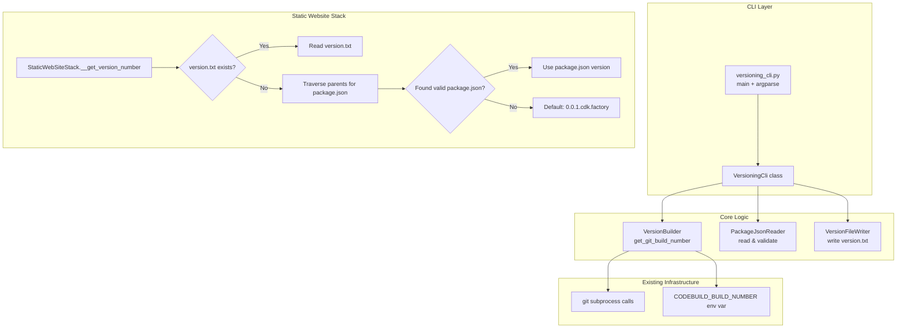
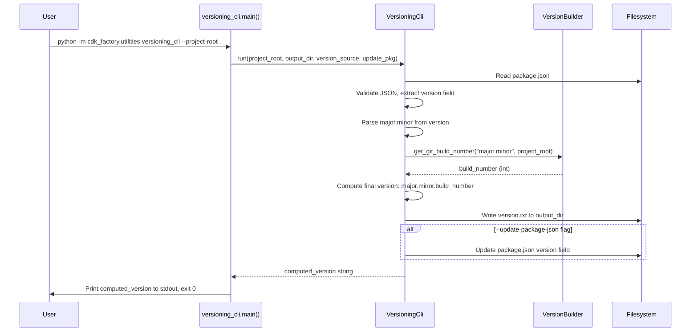

# Design Document: Versioning CLI

## Overview

The Versioning CLI adds a standalone CLI module (`cdk_factory.utilities.versioning_cli`) to cdk-factory that reads version information from a Node.js project's `package.json`, computes a build number using git commit history via the existing `VersionBuilder` class, and writes a `version.txt` file. It also enhances the `StaticWebSiteStack.__get_version_number` method to fall back to reading `package.json` when `version.txt` is absent.

The design follows the established CLI pattern from `ssm_resolver.py`: a class encapsulating the core logic (usable as a library), a `main()` function with `argparse` for CLI usage, and a `if __name__ == "__main__"` guard enabling `python -m cdk_factory.utilities.versioning_cli` invocation.

### Design Decisions

1. **Reuse `VersionBuilder`** — All git commit counting and tag-based build number computation is delegated to the existing `VersionBuilder.get_git_build_number` method. The CLI does not reimplement any of that logic.
2. **Add `PACKAGE_JSON` to `VersionSource` enum** — This extends the existing enum to explicitly represent the new source type, keeping the codebase consistent.
3. **Parent-directory traversal for package.json fallback** — The static website stack searches upward from the assets directory (up to 10 levels) to find `package.json`, matching the common pattern where assets are in a subdirectory of the project root.
4. **Preserve package.json formatting** — When `--update-package-json` is used, the CLI reads the original file's indentation and preserves it during write-back using `json.dumps` with a detected indent level.

## Architecture



### Module Invocation Flow



## Components and Interfaces

### 1. `VersioningCli` Class

Located at `src/cdk_factory/utilities/versioning_cli.py`.

```python
class VersioningCli:
    """Reads version from package.json, computes build number, writes version.txt."""

    def __init__(self, project_root: str, output_dir: Optional[str] = None):
        """
        Args:
            project_root: Path to the Node.js project root containing package.json.
            output_dir: Directory to write version.txt. Defaults to project_root.
        """
        ...

    def read_package_json_version(self) -> str:
        """Read and validate the version field from package.json.
        
        Returns:
            The raw version string (e.g., "1.2.0").
            
        Raises:
            SystemExit: If package.json is missing, invalid JSON, missing version,
                       or version is not valid semver.
        """
        ...

    def compute_version(self, version_source: str = "package-json") -> str:
        """Compute the final version string.
        
        Args:
            version_source: Either "package-json" or "git-tag".
            
        Returns:
            Computed version string (e.g., "1.2.42").
        """
        ...

    def write_version_file(self, version: str) -> None:
        """Write version string to version.txt in output_dir.
        
        Creates output_dir and parent directories if they don't exist.
        
        Raises:
            SystemExit: If write fails due to filesystem error.
        """
        ...

    def update_package_json(self, version: str) -> None:
        """Update the version field in package.json, preserving formatting.
        
        Raises:
            SystemExit: If package.json doesn't exist or write fails.
        """
        ...
```

### 2. `VersionSource` Enum Extension

The existing `VersionSource` enum in `version_builder.py` gains a new member:

```python
class VersionSource(Enum):
    FILE = "file"
    GIT_TAG = "git_tag"
    PACKAGE_JSON = "package_json"  # New: read from package.json
```

### 3. Enhanced `StaticWebSiteStack.__get_version_number`

The method is updated to include a package.json fallback:

```python
def __get_version_number(self, assets_path: str) -> str:
    """Get version number with fallback chain: version.txt → package.json → default."""
    ...
```

### 4. CLI Entry Point (`main()`)

```python
def main() -> None:
    """CLI entry point. Parses args, computes version, writes output."""
    parser = argparse.ArgumentParser(
        description="Compute version from package.json and git history"
    )
    parser.add_argument("--project-root", default=".", help="...")
    parser.add_argument("--output-dir", default=None, help="...")
    parser.add_argument("--update-package-json", action="store_true", help="...")
    parser.add_argument("--version-source", default="package-json",
                       choices=["package-json", "git-tag"], help="...")
    ...
```

## Data Models

### Input: package.json (relevant fields)

```json
{
  "name": "my-project",
  "version": "1.2.0",
  ...
}
```

**Validation rules:**
- File must exist and be valid JSON
- Must contain a `"version"` field
- Version must match `MAJOR.MINOR.PATCH` where each is a non-negative integer

### Output: version.txt

Plain text file containing only the computed version string with no trailing newline:

```
1.2.42
```

### CLI Arguments Model

| Argument | Type | Default | Description |
|----------|------|---------|-------------|
| `--project-root` | str | `.` (cwd) | Path to project root containing package.json |
| `--output-dir` | str | value of `--project-root` | Directory to write version.txt |
| `--update-package-json` | flag | `False` | Whether to update package.json version |
| `--version-source` | choice | `package-json` | Source for base version: `package-json` or `git-tag` |

### Version Computation Logic

```
Input:  package.json version = "1.2.0"
        → Extract major.minor = "1.2"
        → Call VersionBuilder.get_git_build_number("1.2", project_root)
        → Returns: 42 (commits since v1.2.* tag)
Output: "1.2.42"
```

### Error Exit Codes

| Condition | Exit Code | stderr Output |
|-----------|-----------|---------------|
| package.json not found | 1 | `ERROR: package.json not found at {path}` |
| Invalid JSON in package.json | 1 | `ERROR: Failed to parse package.json: {detail}` |
| Missing version field | 1 | `ERROR: package.json does not contain a "version" field` |
| Invalid semver format | 1 | `ERROR: Invalid version "{value}" in package.json. Expected MAJOR.MINOR.PATCH` |
| Invalid --project-root | 1 | `ERROR: --project-root path does not exist or is not a directory: {path}` |
| Filesystem write error | 1 | `ERROR: Failed to write version.txt: {detail}` |
| Success | 0 | (nothing on stderr) |

## Correctness Properties

*A property is a characteristic or behavior that should hold true across all valid executions of a system — essentially, a formal statement about what the system should do. Properties serve as the bridge between human-readable specifications and machine-verifiable correctness guarantees.*

### Property 1: Version file write round-trip

*For any* valid computed version string (matching `MAJOR.MINOR.PATCH` format where each component is a non-negative integer), writing it via `write_version_file` and reading the resulting `version.txt` back SHALL produce an identical string with no trailing newline, and the stdout output of the CLI SHALL equal the same version string exactly.

**Validates: Requirements 3.1, 3.6**

### Property 2: Invalid package.json content rejection

*For any* `package.json` file content that either (a) is not valid JSON, (b) does not contain a `"version"` field, or (c) contains a `"version"` field that does not match the `MAJOR.MINOR.PATCH` format (non-negative integers), the CLI SHALL exit with a non-zero status code and produce an error message on stderr.

**Validates: Requirements 1.4, 1.5, 1.6**

### Property 3: package.json update preserves structure

*For any* valid `package.json` file containing arbitrary JSON fields and a valid `"version"` field, updating the version via `--update-package-json` SHALL change only the `"version"` field value to the computed version while preserving all other fields, their values, key ordering, and indentation style.

**Validates: Requirements 4.1, 4.3**

### Property 4: package.json unchanged without update flag

*For any* valid `package.json` file content, running the CLI without the `--update-package-json` flag SHALL leave the file byte-for-byte identical to its original content.

**Validates: Requirements 4.2**

### Property 5: Parent directory traversal finds package.json

*For any* directory depth `d` (1 ≤ d ≤ 10) and any valid `package.json` containing a valid semver `"version"` field placed at an ancestor directory `d` levels above the assets path, the `StaticWebSiteStack.__get_version_number` method SHALL return that version value when `version.txt` does not exist.

**Validates: Requirements 6.2, 6.3**

## Error Handling

### CLI Error Strategy

All errors follow the same pattern established by `ssm_resolver.py`:
- Print a descriptive error message to **stderr** (never stdout)
- Exit with code **1**
- stdout remains empty on error (enabling safe shell variable capture)

### Error Categories

| Category | Handling |
|----------|----------|
| Missing files (package.json, invalid --project-root) | Immediate exit with descriptive path in error |
| Parse errors (invalid JSON, invalid semver) | Exit with the problematic value quoted in error |
| Filesystem write failures | Exit with OS error detail in message |
| Git failures | Delegated to VersionBuilder (falls back to CODEBUILD_BUILD_NUMBER or 0) |

### Static Website Stack Fallback Errors

The stack uses a graceful degradation strategy:
- **No version.txt + no package.json** → Default version `"0.0.1.cdk.factory"` + warning log
- **Invalid package.json** → Treat as not found, use default + warning log
- **No exception is raised** — the stack must synthesize successfully even without version information

### Logging

- CLI: Uses `logging` to stderr (same as `ssm_resolver.py`) with `%(levelname)s: %(message)s` format
- Static Website Stack: Uses existing `aws_lambda_powertools.Logger` for warnings about missing version sources

## Testing Strategy

### Property-Based Tests (Hypothesis)

The project already uses [Hypothesis](https://hypothesis.readthedocs.io/) for property-based testing (see `tests/properties/pipeline/test_version_roundtrip_properties.py`). New property tests will follow the same pattern.

**Configuration:**
- Minimum 100 examples per property (`@settings(max_examples=100)`)
- Each test class docstring references the design property
- Tag format: `Feature: versioning-cli, Property {N}: {title}`

**Test file:** `tests/properties/versioning_cli/test_versioning_cli_properties.py`

**Properties to implement:**
1. Version file write round-trip — generate random `MAJOR.MINOR.PATCH` strings, write via `write_version_file`, read back, assert exact match
2. Invalid input rejection — generate invalid JSON and invalid semver strings, assert non-zero exit
3. package.json update preserves structure — generate random package.json objects, update version, assert other fields preserved
4. package.json unchanged without flag — generate random package.json, run without flag, assert file unchanged
5. Parent directory traversal — generate random depths (1-10), place package.json at ancestor, assert version found

### Unit Tests (pytest)

**Test file:** `tests/unit/utilities/test_versioning_cli.py`

Example-based tests covering:
- CLI argument parsing (all combinations)
- Default project-root to cwd behavior
- `--version-source git-tag` delegates to VersionBuilder with GIT_TAG
- Error messages contain expected path/value information
- Exit code 0 on success

### Integration Tests

**Test file:** `tests/integration/test_versioning_cli_integration.py`

- End-to-end CLI invocation via `subprocess.run(["python", "-m", "cdk_factory.utilities.versioning_cli", ...])`
- Integration with real git repository (temp git repo with tags)
- VersionBuilder delegation verification (mock-based)

### Static Website Stack Tests

**Test file:** `tests/unit/stack_library/test_static_website_version_fallback.py`

- version.txt present → uses it (existing behavior preserved)
- version.txt absent, package.json at parent → uses package.json version
- version.txt absent, no package.json → uses default
- Invalid package.json → uses default with warning

