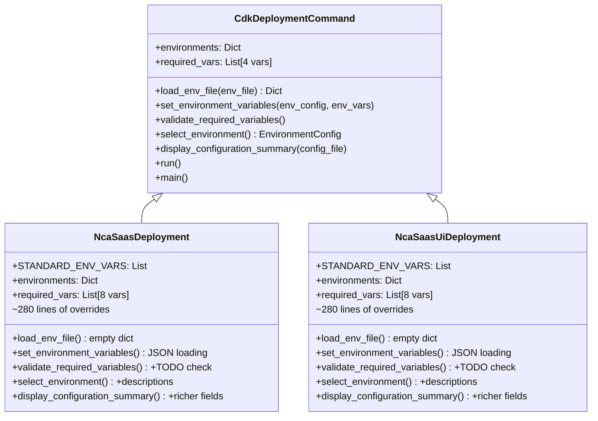
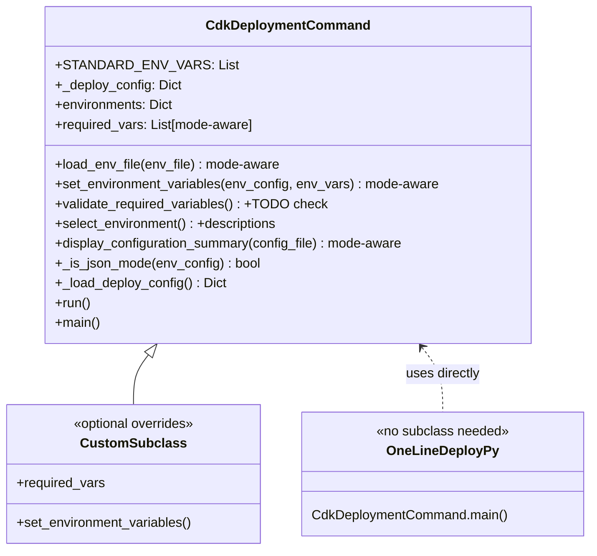

# Design Document: Zero-Config Deployment CLI

## Overview

This feature absorbs the duplicated JSON-based deployment logic from consuming project subclasses (`NcaSaasDeployment`, `NcaSaasUiDeployment`) into the `CdkDeploymentCommand` base class. Both projects currently have ~280-line subclasses that override 7 methods with 95%+ identical code. After this change, a consuming project with `deployment.*.json` files becomes a one-liner:

```python
#!/usr/bin/env python3
from cdk_factory.commands.deployment_command import CdkDeploymentCommand
if __name__ == "__main__":
    CdkDeploymentCommand.main()
```

The core design principle is **mode detection**: if a selected `EnvironmentConfig.extra` dict contains a `parameters` key, the base class activates JSON mode. Otherwise it falls back to the existing `.env` file loading. This single check drives all behavioral differences across `set_environment_variables`, `load_env_file`, `required_vars`, `validate_required_variables`, `select_environment`, and `display_configuration_summary`.

An optional `deploy.config.json` file provides project-specific overrides (custom `required_vars`, `standard_env_vars`, `stage_keywords`) without requiring a Python subclass.

### Key Design Decisions

1. **Mode detection is per-environment, not global** — The `_is_json_mode()` helper checks `env_config.extra.get("parameters")` on the selected environment. This means a project could theoretically mix JSON and env-file environments, though in practice all environments in a project use the same mode.
2. **STANDARD_ENV_VARS becomes a class attribute** — The mapping of top-level JSON keys to env var names (`aws_account` → `AWS_ACCOUNT`, etc.) moves from the subclasses to a class-level constant on `CdkDeploymentCommand`, overridable by subclass or `deploy.config.json`.
3. **deploy.config.json is loaded once at `__init__`** — Parsed into `self._deploy_config` dict. Properties like `required_vars` check this dict before falling back to built-in defaults. Subclass overrides take precedence via Python's MRO.
4. **No new dependencies** — All logic uses `os`, `re`, `json`, `pathlib` which are already imported. No new third-party packages needed.
5. **Backward compatibility via MRO** — If a subclass overrides `set_environment_variables`, Python's method resolution order ensures the subclass version is called. The base class never needs to check "am I being overridden?"

## Architecture

### Before (Current State)



### After (Target State)



## Components and Interfaces

### Mode Detection

A single private helper determines the deployment mode:

```python
def _is_json_mode(self, env_config: EnvironmentConfig) -> bool:
    """Return True if this environment uses JSON-based parameter loading."""
    return bool(env_config.extra.get("parameters"))
```

This is called by `set_environment_variables`, `load_env_file`, `display_configuration_summary`, and the `required_vars` property (indirectly, since `required_vars` has no env_config argument — see below).

### Modified Methods

#### 1. `set_environment_variables(env_config, env_vars)`

The base class method gains a JSON-mode branch at the top. If `_is_json_mode(env_config)` is True, it executes the JSON loading logic (currently duplicated in both subclasses). Otherwise, it falls through to the existing env-file logic.

```python
def set_environment_variables(self, env_config, env_vars):
    if self._is_json_mode(env_config):
        self._set_json_environment_variables(env_config)
        return
    # ... existing env-file logic unchanged ...
```

The JSON loading is extracted into `_set_json_environment_variables(env_config)`:

```python
def _set_json_environment_variables(self, env_config: EnvironmentConfig) -> None:
    config = env_config.extra

    # 1. ENVIRONMENT from deployment name
    os.environ["ENVIRONMENT"] = config.get("name", env_config.name)

    # 2. Parameters block — source of truth
    for key, value in config.get("parameters", {}).items():
        os.environ[key] = str(value)

    # 3. Standard top-level fields (STANDARD_ENV_VARS mapping)
    for json_key, env_key in self.STANDARD_ENV_VARS:
        value = config.get(json_key, "")
        if value:
            os.environ[env_key] = str(value)

    # 4. Code repository
    repo = config.get("code_repository", {})
    if repo.get("name"):
        os.environ["CODE_REPOSITORY_NAME"] = str(repo["name"])
    if repo.get("connector_arn"):
        os.environ["CODE_REPOSITORY_ARN"] = str(repo["connector_arn"])

    # 5. Management account
    mgmt = config.get("management", {})
    if mgmt.get("account"):
        os.environ["MANAGEMENT_ACCOUNT"] = str(mgmt["account"])
    if mgmt.get("cross_account_role_arn"):
        os.environ["MANAGEMENT_ACCOUNT_ROLE_ARN"] = str(mgmt["cross_account_role_arn"])
    if mgmt.get("hosted_zone_id"):
        os.environ["MGMT_R53_HOSTED_ZONE_ID"] = str(mgmt["hosted_zone_id"])

    # 6. Config.json defaults for unset vars
    config_json_path = self.script_dir / "config.json"
    if config_json_path.exists():
        with open(config_json_path, "r", encoding="utf-8") as fh:
            main_config = json.load(fh)
        for param in main_config.get("cdk", {}).get("parameters", []):
            env_var = param.get("env_var_name", "")
            default_value = param.get("value")
            if env_var and default_value and env_var not in os.environ:
                os.environ[env_var] = str(default_value)

    # 7. Default DEPLOYMENT_NAMESPACE to TENANT_NAME
    if "DEPLOYMENT_NAMESPACE" not in os.environ:
        os.environ["DEPLOYMENT_NAMESPACE"] = os.environ.get("TENANT_NAME", "")

    # 8. Resolve {{PLACEHOLDER}} references (max 5 passes)
    placeholder_re = re.compile(r"\{\{([A-Za-z_][A-Za-z0-9_]*)\}\}")
    changed = True
    max_passes = 5
    passes = 0
    while changed and passes < max_passes:
        changed = False
        passes += 1
        for key in list(os.environ.keys()):
            value = os.environ[key]
            if "{{" in value:
                resolved = placeholder_re.sub(
                    lambda m: os.environ.get(m.group(1), m.group(0)), value
                )
                if resolved != value:
                    os.environ[key] = resolved
                    changed = True
```

#### 2. `load_env_file(env_file)`

The method checks if the current environment is JSON mode. Since `load_env_file` is called from `run()` after environment selection, we store the selected env_config on the instance during `run()` so `load_env_file` can check it:

```python
def load_env_file(self, env_file: str) -> Dict[str, str]:
    # In JSON mode, env vars come from the deployment JSON, not .env files
    if hasattr(self, "_current_env_config") and self._is_json_mode(self._current_env_config):
        return {}
    # ... existing .env file loading logic ...
```

In `run()`, before calling `load_env_file`:
```python
self._current_env_config = env_config
env_vars = self.load_env_file(env_config.env_file)
```

#### 3. `required_vars` property

The property becomes mode-aware. Since `required_vars` is called after environment selection in `validate_required_variables()`, it checks `_current_env_config`:

```python
@property
def required_vars(self) -> List[Tuple[str, str]]:
    # deploy.config.json overrides take first priority
    if self._deploy_config.get("required_vars"):
        return [tuple(pair) for pair in self._deploy_config["required_vars"]]

    # JSON mode defaults (8 vars)
    if hasattr(self, "_current_env_config") and self._is_json_mode(self._current_env_config):
        return [
            ("AWS_ACCOUNT", "AWS Account ID"),
            ("AWS_REGION", "AWS Region"),
            ("WORKLOAD_NAME", "Workload Name"),
            ("ENVIRONMENT", "Environment name"),
            ("TENANT_NAME", "Tenant name. Required for namespaces"),
            ("GIT_BRANCH", "Git branch"),
            ("CODE_REPOSITORY_NAME", "Code repository name"),
            ("CODE_REPOSITORY_ARN", "Code repository ARN"),
        ]

    # Env-file mode defaults (4 vars)
    return [
        ("AWS_ACCOUNT", "AWS Account ID"),
        ("AWS_REGION", "AWS Region"),
        ("AWS_PROFILE", "AWS CLI Profile"),
        ("WORKLOAD_NAME", "Workload Name"),
    ]
```

#### 4. `validate_required_variables()`

The base class gains the `<TODO>` placeholder check after the existing validation:

```python
def validate_required_variables(self) -> None:
    # Existing required var check
    self._print("Validating configuration...", "blue")
    missing = [
        f"  - {name} ({desc})"
        for name, desc in self.required_vars
        if not os.environ.get(name) or os.environ[name].startswith("YOUR_")
    ]
    if missing:
        self._print("Missing required configuration variables:", "red")
        for m in missing:
            print(m)
        self._print("Please update your environment file.", "yellow")
        sys.exit(1)
    self._print("Configuration validated", "green")

    # NEW: <TODO> placeholder detection
    todos = [key for key, value in os.environ.items() if value == "<TODO>"]
    if todos:
        self._print("", "white")
        self._print(
            f"Found {len(todos)} unresolved <TODO> placeholder(s) in deployment config:",
            "red",
        )
        for key in sorted(todos):
            self._print(f"  {key} = <TODO>", "yellow")
        self._print("", "white")
        self._print(
            "These values must be set before CDK can synthesize or deploy.", "red"
        )
        self._print(
            "Update your deployment JSON: deployments/deployment.*.json", "yellow"
        )
        sys.exit(1)
```

#### 5. `select_environment()`

The base class version is enhanced to show descriptions from deployment configs:

```python
def select_environment(self) -> EnvironmentConfig:
    envs = self.environments
    keys = list(envs.keys())
    options = []
    for key in keys:
        config = self._deployment_configs.get(key, {})
        description = config.get("description", "")
        if description:
            options.append(f"{key}: {description}")
        else:
            options.append(key)
    idx = self._interactive_select("Select deployment environment:", options)
    name = keys[idx]
    self._print(f"Using {name.upper()} environment...", "blue")
    return envs[name]
```

#### 6. `display_configuration_summary(config_file)`

The base class gains a JSON-mode branch with the richer display:

```python
def display_configuration_summary(self, config_file: str) -> None:
    self._print("", "white")
    if hasattr(self, "_current_env_config") and self._is_json_mode(self._current_env_config):
        self._print("Deployment Configuration", "blue")
        self._print(f"  Environment  : {os.environ.get('ENVIRONMENT', 'N/A')}", "white")
        self._print(f"  Account      : {os.environ.get('AWS_ACCOUNT', 'N/A')}", "white")
        self._print(f"  Region       : {os.environ.get('AWS_REGION', 'N/A')}", "white")
        self._print(f"  Profile      : {os.environ.get('AWS_PROFILE', 'N/A')}", "white")
        self._print(f"  Workload     : {os.environ.get('WORKLOAD_NAME', 'N/A')}", "white")
        self._print(f"  Git Branch   : {os.environ.get('GIT_BRANCH', 'N/A')}", "white")
        self._print(f"  Config File  : {config_file}", "white")
    else:
        self._print("Configuration Summary", "blue")
        self._print(f"  Config file : {config_file}", "white")
        self._print(f"  Environment : {os.environ.get('ENVIRONMENT', 'N/A')}", "white")
        self._print(f"  AWS Account : {os.environ.get('AWS_ACCOUNT', 'N/A')}", "white")
        self._print(f"  AWS Region  : {os.environ.get('AWS_REGION', 'N/A')}", "white")
        self._print(f"  Git Branch  : {os.environ.get('GIT_BRANCH', 'N/A')}", "white")
    self._print("", "white")
```

### New: deploy.config.json Loading

Loaded during `__init__` into `self._deploy_config`:

```python
def __init__(self, script_dir=None):
    self.script_dir = script_dir or Path.cwd()
    self._deployment_configs: Dict[str, dict] = {}
    self._deploy_config: Dict[str, Any] = {}
    self._auto_discover_deployments()
    self._load_deploy_config()

def _load_deploy_config(self) -> None:
    """Load optional deploy.config.json for project-specific overrides."""
    config_path = self.script_dir / "deploy.config.json"
    if config_path.exists():
        with open(config_path, "r", encoding="utf-8") as fh:
            self._deploy_config = json.load(fh)
```

### New: STANDARD_ENV_VARS Class Attribute

```python
class CdkDeploymentCommand:
    STANDARD_ENV_VARS = [
        ("aws_account", "AWS_ACCOUNT"),
        ("aws_region", "AWS_REGION"),
        ("aws_profile", "AWS_PROFILE"),
        ("git_branch", "GIT_BRANCH"),
        ("workload_name", "WORKLOAD_NAME"),
        ("tenant_name", "TENANT_NAME"),
    ]
```

If `deploy.config.json` provides `standard_env_vars`, the `_set_json_environment_variables` method uses those instead:

```python
env_var_mapping = self._deploy_config.get("standard_env_vars", self.STANDARD_ENV_VARS)
for json_key, env_key in env_var_mapping:
    ...
```

Similarly for `STAGE_KEYWORDS`:
```python
if self._deploy_config.get("stage_keywords"):
    self.STAGE_KEYWORDS = self._deploy_config["stage_keywords"]
```

### Modified `run()` Method

The `run()` method stores `_current_env_config` before calling `load_env_file` and `set_environment_variables`:

```python
def run(self, config_file=None, environment_name=None, operation=None, dry_run=False):
    # Select environment
    if environment_name:
        ...
        env_config = self.environments[environment_name]
    else:
        env_config = self.select_environment()

    # Store for mode-aware methods
    self._current_env_config = env_config

    # Load and apply env file (returns {} in JSON mode)
    env_vars = self.load_env_file(env_config.env_file)
    self.set_environment_variables(env_config, env_vars)

    # ... rest unchanged ...
```


## Data Models

### deploy.config.json Schema

The optional `deploy.config.json` file supports the following structure:

```json
{
  "required_vars": [
    ["AWS_ACCOUNT", "AWS Account ID"],
    ["AWS_REGION", "AWS Region"],
    ["WORKLOAD_NAME", "Workload Name"],
    ["ENVIRONMENT", "Environment name"],
    ["TENANT_NAME", "Tenant name"],
    ["GIT_BRANCH", "Git branch"],
    ["CODE_REPOSITORY_NAME", "Code repository name"],
    ["CODE_REPOSITORY_ARN", "Code repository ARN"]
  ],
  "standard_env_vars": [
    ["aws_account", "AWS_ACCOUNT"],
    ["aws_region", "AWS_REGION"],
    ["aws_profile", "AWS_PROFILE"],
    ["git_branch", "GIT_BRANCH"],
    ["workload_name", "WORKLOAD_NAME"],
    ["tenant_name", "TENANT_NAME"]
  ],
  "stage_keywords": {
    "persistent-resources": ["dynamodb", "s3-", "cognito", "route53"],
    "queues": ["sqs"],
    "compute": ["lambda", "docker"],
    "network": ["api-gateway", "cloudfront"]
  }
}
```

All fields are optional. When absent, built-in defaults are used.

### EnvironmentConfig (Unchanged)

The existing `EnvironmentConfig` dataclass is not modified:

```python
@dataclass
class EnvironmentConfig:
    name: str
    env_file: str
    git_branch: str
    extra: Dict[str, Any] = field(default_factory=dict)
```

The `extra` dict is the key to mode detection — in JSON mode it contains the full deployment JSON including the `parameters` block. In env-file mode it's empty or has no `parameters` key.

### Instance State

New instance attributes added to `CdkDeploymentCommand`:

| Attribute | Type | Set In | Purpose |
|---|---|---|---|
| `_deploy_config` | `Dict[str, Any]` | `__init__` via `_load_deploy_config()` | Parsed `deploy.config.json` contents (empty dict if file absent) |
| `_current_env_config` | `EnvironmentConfig` | `run()` after environment selection | Stored so mode-aware methods (`load_env_file`, `required_vars`, `display_configuration_summary`) can check the mode without receiving `env_config` as a parameter |

### One-Liner deploy.py (Target)

After this feature, both consuming projects reduce to:

```python
#!/usr/bin/env python3
from cdk_factory.commands.deployment_command import CdkDeploymentCommand
if __name__ == "__main__":
    CdkDeploymentCommand.main()
```

No subclass, no overrides, no imports beyond the base class. The base class auto-discovers `deployments/deployment.*.json`, detects JSON mode, loads env vars, validates, and runs CDK operations.

### Validation Project File Structure (Unchanged)

Both projects keep their existing file structure — only `deploy.py` changes:

```
project/
├── deploy.py                          # One-liner
├── config.json                        # CDK parameter definitions (existing)
├── deploy.config.json                 # Optional overrides (new, not needed for standard projects)
├── deployments/
│   ├── deployment.dev.json            # Existing
│   ├── deployment.uat.json            # Existing
│   └── deployment.prod.json           # Existing
├── app.py                             # CDK app entry point (existing)
└── configs/                           # Stack configs (existing)
```

## Correctness Properties

*A property is a characteristic or behavior that should hold true across all valid executions of a system — essentially, a formal statement about what the system should do. Properties serve as the bridge between human-readable specifications and machine-verifiable correctness guarantees.*

### Property 1: Mode detection is determined by parameters key presence

*For any* `EnvironmentConfig` with an `extra` dict, `_is_json_mode` SHALL return `True` if and only if `extra` contains a `"parameters"` key with a truthy value (non-empty dict). For any `extra` dict without a `"parameters"` key, or with an empty/falsy `"parameters"` value, `_is_json_mode` SHALL return `False`.

**Validates: Requirements 1.1, 1.2, 1.4**

### Property 2: JSON loading sets all parameters as environment variables

*For any* valid deployment config dict containing a `"parameters"` block with string key-value pairs, a `"name"` field, and optional standard top-level fields (`aws_account`, `aws_region`, `aws_profile`, `git_branch`, `workload_name`, `tenant_name`), calling `_set_json_environment_variables` SHALL result in: (a) every key-value pair from `parameters` appearing in `os.environ`, (b) `ENVIRONMENT` being set to the config's `name` value, and (c) each non-empty standard top-level field being mapped to its corresponding env var via `STANDARD_ENV_VARS`.

**Validates: Requirements 2.1, 2.2, 2.3**

### Property 3: Placeholder resolution is idempotent and bounded

*For any* set of environment variables where some values contain `{{KEY}}` references to other environment variable names, running placeholder resolution SHALL: (a) resolve all references where the referenced key exists in the environment, (b) leave `{{KEY}}` unchanged when the referenced key does not exist, (c) terminate within 5 passes regardless of circular references, and (d) produce the same result if run a second time (idempotence after convergence).

**Validates: Requirements 2.8**

### Property 4: TODO placeholder detection finds all unresolved TODOs

*For any* set of environment variables where zero or more values equal the string `"<TODO>"`, the TODO detection logic SHALL identify exactly the set of keys whose values equal `"<TODO>"` — no false positives and no false negatives.

**Validates: Requirements 4.1, 4.2**

### Property 5: Environment selection options include description iff present

*For any* set of deployment configs where each config may or may not have a `"description"` field, the generated selection option strings SHALL be `"{name}: {description}"` when description is present and non-empty, and `"{name}"` when description is absent or empty.

**Validates: Requirements 5.1, 5.2**

### Property 6: deploy.config.json overrides replace built-in defaults

*For any* `deploy.config.json` content containing a `"required_vars"` array of `[var_name, description]` pairs, the `required_vars` property SHALL return exactly those pairs (converted to tuples). *For any* `deploy.config.json` content containing a `"standard_env_vars"` array of `[json_key, env_key]` pairs, the JSON loading SHALL use those mappings instead of the class-level `STANDARD_ENV_VARS` default.

**Validates: Requirements 7.2, 7.3**

### Property 7: load_env_file returns empty dict in JSON mode

*For any* `EnvironmentConfig` where `_is_json_mode` returns `True`, calling `load_env_file` SHALL return an empty dict without attempting to read any file from disk.

**Validates: Requirements 8.1**

## Error Handling

### Mode Detection Errors

| Scenario | Handling |
|---|---|
| `extra` is `None` | `_is_json_mode` returns `False` (env-file mode) — `extra.get("parameters")` would fail, so check `extra` first |
| `parameters` is empty dict `{}` | `_is_json_mode` returns `False` (falsy) — treated as env-file mode |

### JSON Loading Errors

| Scenario | Handling |
|---|---|
| `config.json` missing | Silently skip config.json default loading (file is optional) |
| `config.json` malformed JSON | Let `json.load` raise `JSONDecodeError` — fail fast, don't silently ignore |
| `deploy.config.json` missing | `_deploy_config` stays as empty dict — all defaults used |
| `deploy.config.json` malformed JSON | Let `json.load` raise `JSONDecodeError` — fail fast |
| Circular `{{PLACEHOLDER}}` references | Resolution loop terminates after 5 passes — unresolved placeholders remain as `{{KEY}}` strings |
| Parameter value is not a string (bool, int) | `str(value)` coercion ensures all env var values are strings |

### Validation Errors

| Scenario | Handling |
|---|---|
| Required var missing | Print missing vars list, `sys.exit(1)` |
| Required var starts with `YOUR_` | Treated as missing (existing behavior) |
| `<TODO>` placeholder found | Print count + list of TODO vars, `sys.exit(1)` — runs after required var check |
| Both missing vars and TODOs | Required var check fires first (exits before TODO check runs) |

### Backward Compatibility Errors

| Scenario | Handling |
|---|---|
| Subclass overrides `set_environment_variables` | Python MRO calls subclass version — no special handling needed |
| Subclass calls `super().set_environment_variables()` | Base class JSON-mode logic runs, then subclass can add custom logic |
| `_current_env_config` not set (method called outside `run()`) | `hasattr` check returns `False` — falls back to env-file mode defaults |

## Testing Strategy

### Property-Based Tests (Hypothesis)

The project uses Python, so **Hypothesis** is the property-based testing library. Each property test runs a minimum of 100 iterations.

| Property | Test Description | Tag |
|---|---|---|
| Property 1 | Generate random `extra` dicts (with/without `parameters` key, empty/non-empty values), verify `_is_json_mode` correctness | `Feature: zero-config-deployment-cli, Property 1: Mode detection is determined by parameters key presence` |
| Property 2 | Generate random deployment configs with parameters, name, and standard fields, call `_set_json_environment_variables`, verify all expected env vars are set | `Feature: zero-config-deployment-cli, Property 2: JSON loading sets all parameters as environment variables` |
| Property 3 | Generate random env var dicts with `{{KEY}}` references (including chains and circular refs), run resolution, verify idempotence and bounded termination | `Feature: zero-config-deployment-cli, Property 3: Placeholder resolution is idempotent and bounded` |
| Property 4 | Generate random env var dicts with some values set to `"<TODO>"`, run TODO detection, verify exact match of detected keys | `Feature: zero-config-deployment-cli, Property 4: TODO placeholder detection finds all unresolved TODOs` |
| Property 5 | Generate random deployment config dicts with/without description fields, build option strings, verify format | `Feature: zero-config-deployment-cli, Property 5: Environment selection options include description iff present` |
| Property 6 | Generate random `deploy.config.json` contents with `required_vars` and `standard_env_vars` arrays, verify they override defaults | `Feature: zero-config-deployment-cli, Property 6: deploy.config.json overrides replace built-in defaults` |
| Property 7 | Generate random JSON-mode EnvironmentConfigs, verify `load_env_file` returns `{}` | `Feature: zero-config-deployment-cli, Property 7: load_env_file returns empty dict in JSON mode` |

### Unit Tests (Example-Based)

| Area | Tests |
|---|---|
| Mode detection edge cases | `extra=None`, `extra={}`, `extra={"parameters": {}}`, `extra={"parameters": {"KEY": "val"}}` |
| JSON loading — code_repository | Config with/without `code_repository.name` and `code_repository.connector_arn` |
| JSON loading — management | Config with/without `management.account`, `management.cross_account_role_arn`, `management.hosted_zone_id` |
| JSON loading — DEPLOYMENT_NAMESPACE default | Config without DEPLOYMENT_NAMESPACE, verify it defaults to TENANT_NAME |
| required_vars — JSON mode | Verify 8-var list returned |
| required_vars — env-file mode | Verify 4-var list returned |
| required_vars — subclass override | Subclass with custom list, verify MRO precedence |
| required_vars — deploy.config.json | Config file with custom list, verify it's used |
| validate — ordering | Missing required var + TODO present → required var error fires first |
| display_configuration_summary — JSON mode | Verify all 7 fields in output |
| display_configuration_summary — env-file mode | Verify existing 5-field format |
| EnvironmentConfig interface | Verify instantiation with (name, env_file, git_branch) — no new required fields |
| CLI arguments | Verify all existing args are accepted when using base class directly |

### Integration Tests (Mock-Based)

| Area | Tests |
|---|---|
| config.json default loading | Temp config.json with parameters, verify defaults loaded for unset vars, not for already-set vars |
| deploy.config.json loading | Temp file with all three override keys, verify `_deploy_config` populated |
| deploy.config.json absent | No file, verify `_deploy_config` is empty dict |
| Full JSON-mode flow | Temp directory with deployment JSONs + config.json, call `run()` with `--dry-run`, verify env vars set correctly |
| Full env-file flow | Temp directory with .env file, call `run()` with `--dry-run`, verify existing behavior preserved |
| One-liner validation | Call `CdkDeploymentCommand.main()` directly (no subclass) with deployment JSONs, verify full flow |
| No deployment files | Call `CdkDeploymentCommand.main()` with empty directory, verify `NotImplementedError` |
